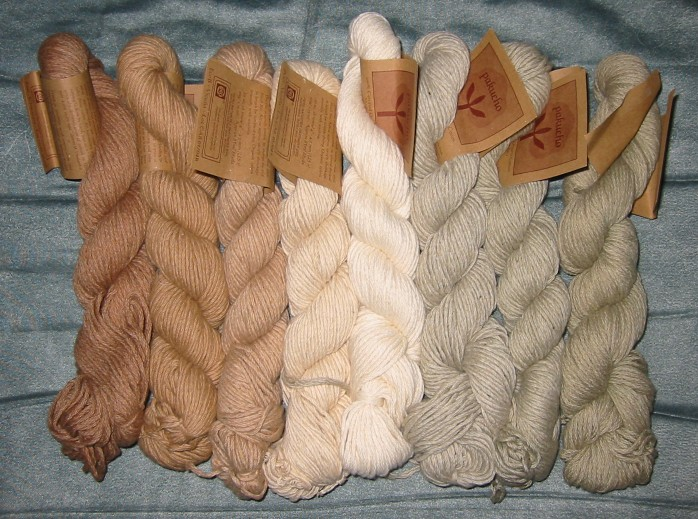
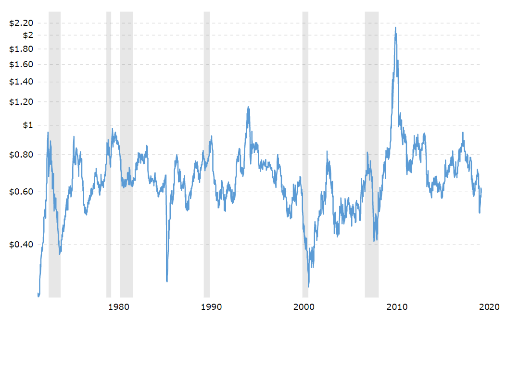
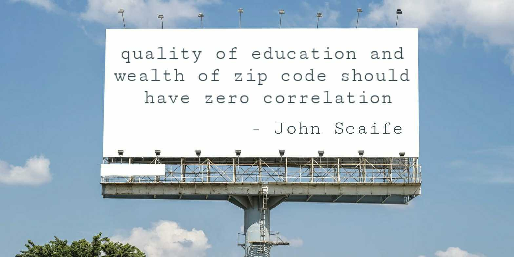
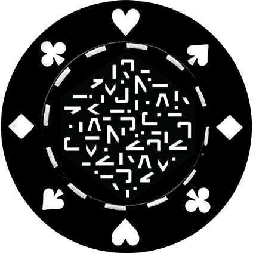
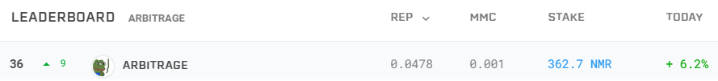

# OHwA S02E03

For Season 2 Episode 3, Arbitrage interviewed tournament data scientist [John Scaife](https://numer.ai/johnscaife_):

**Arbitrage:** So, let's get to it. Where do you live?

**John:** My wife and I live in Stamford, Connecticut. We've been here for three years now, but prior to that I lived for ten years in New York City and a year in Boston to work at a startup. But I would say that I prefer a view overlooking the beach in South Florida, so you're the smartest guy in the room.

**Arbitrage:** Well it's funny you say that, I don't look over the beach but I do live 4 1/2 miles from the beach. But almost everybody in Florida does. From the stadium at my university, at the top row, you actually can see the ocean. Some of our dorm rooms, almost an entire side of the building _does_ look at the ocean. 

**John:** Wow, that's cool.

**Arbitrage:** Yeah, it's pretty dope, not gonna lie. But today I had to ask [Anson](https://twitter.com/ansonschu), who graciously gave me a backstop here, I said to him, "I may lose power, I got a bad lightning storm and I don't know what to do,' but he was like, 'I got you, fam.'

**Slyfox:** I'm ready for it!

**Arbitrage:** So if I just drop out, basically Anson's in charge. That's the way this is going to work. Well ... he's in charge anyway so that's not really a shock. John, what do you do for a living?

**John:** Just want to bump in there real quick - we all know [NJ](https://twitter.com/tasha_jade) is in charge. 

**Slyfox:** True story.

**John:** I'm a middle school math and science teacher. I just finished up my first year. Next year I'm probably going to lean towards just teaching math rather than science, but I'm open to both. The bulk of my career was spent as a cotton options market maker. First independently, and then on a team of three - I was in my mid-twenties and this group of veteran traders in their 40's signed me on. . 

**John cont:** But career priorities shift, right? I told my wife that if Numerai goes really well, I would consider going back to school because recently I've been hooked on [Carlo Rovelli's](http://www.cpt.univ-mrs.fr/~rovelli/#about-me) exploration of quantum theory. It's an avenue that really fascinates me. Pending success financially and other avenues, I would consider going back to school.

**Arbitrage:** Don't do it, John. I went back to school. Don't do it. And all the other PhD's in the room are going to tell you, 'don't do it.' Stay in industry. You can read the papers just the same way I can, and you can make money while you're reading. That's my small aside. You should do what makes you happy, that's my ultimate answer.

**John:** That's a good policy. 

**Arbitrage:** So you have varied interests. You're very high-finance, which I'm very much a fan of \(clearly\). But, how would your parents describe what you do for a living? How do we explain it to the normal folks out there?

**John:** In terms of teaching, right?

**Arbitrage:** Well, sure, teaching. And what else do you do? How would your parents explain that part of your life?

**John:** I come from a family of public servants, teachers, my dad was a corrections officer, my brother works for the US post office, so now that I've joined an at-risk school district as a teacher, there's a sense of pride. So there was no real connection \[in my family\] to Wall Street. My sister used to make fun of me, saying, "go put on your Wall Street glasses and hang out with the yuppies.'

**Arbitrage:** I resemble that comment.

**John:** My parents are proud, and I have to say I've never felt such an awesome responsibility as looking 25 kids in the face knowing I need to prepare them for the future. In general, my parents and my wife make me laugh because they say that, for lack of a better word, I'm unemployable because I have a distaste for rules and institutions. At school I don't feel that way because I feel the importance of being a role model to the kids - it just dissipates out of there.

**Arbitrage:** Is that a Title I school? Is that what that is?

**John:** I don't know if Connecticut refers to it as a Title I school. 

**Arbitrage:** I wanted to see if the titling was correct. My girlfriend works at a school like that, she's a 3rd grade teacher, and most of the students are English language learners.

**John:** Yes - in Connecticut we call it a school with a high ELL population. Which, for those watching, is English as a second language.

**Arbitrage:** I intimately know what she talks about and the challenges she faces, and so I can just vouch for how important it is what you're doing. Incredibly important. Even more reason to not go back to school!

**John:** Yeah, I go back and forth about that. But that's a good point, I appreciate that. 

**Arbitrage:** What do you do for fun? 

**John:** Living in the city for all those years, we love to go explore new food joints. Especially in New York City and Boston. I like fishing, I like the beach, I like ping pong, and recently I've become addicted to audiobooks. I kind of resisted jumping on the bandwagon, and now I can't get the earbuds out of my ears.

**Arbitrage:** I can't listen to people talk, I need to see them talk. It's always been a challenge for me to listen to that kind of stuff so I would rather read it. Something about a physical book, too. I don't know, maybe it's because I'm 36 and I'm just on that edge of, 'I grew up with the tech change.' My grandmother had a rotary phone - so I know how to use a rotary phone but anybody who's two or three years younger than I am don't have any idea how to use a rotary phone.

**John:** So I'm your age, I'm 36, and I remember going to my grandma's and using one to call my mom.

**Arbitrage:** Wait if you're my age, and [Rudi](https://numer.ai/themicon)'s my Gemini twin, does that mean that Rudi is... also 36?

**Rudi**: Slightly higher than that - I'm 40.

**Arbitrage:** Close enough - same decade! We're going to count it. So let's get on to Numerai - how did you find out about Numerai and when did you start participating?

**John:** I don't remember exactly - I think it popped up on [Medium](https://medium.com/numerai) or something like that. Or it was some online search related to hedge funds that trade crypto. I was sort of casting my line to see what's out there, what's new, what's going on, are there any new data science competitions, things like that. 

**Arbitrage:** Around what time of year was that? 

**John:** Right, sorry about that. I think the first time I submitted something was round 168. I think I just toyed around with a logistic regression with [Numerox](https://github.com/numerai/numerox) in round 168. Then I did it again in round 171. I iterated over a couple ideas then took something like five rounds off, just kind of put it to the side. Then as I started to look more and more into it, and finally start to grasp the concept, that's when I said 'wow, there's some pretty big upside here if I'm reading this correctly.' 

**Arbitrage:** What do you wish you had known when your started out?

**John:** Definitely the power of the example predictions, putting context with strategies that I was using, and that goes for moving forward, too. It's obvious that the variance in my strategy is pretty wild. It definitely has a lot more feature exposure than I'm comfortable with, compared to my other strategies. One of the mistakes I made, especially in the 190 rounds \(like 194-197\), was overfitting using XGBoost. Overfitting parameters with XGBoost lead to really poor performance. I realized I needed to take a step back and look at more of the macro picture. More hypothesis testing rather than focusing on optimization right now.

**Arbitrage:** That's really good - I appreciate you telling us what you wish you had known. Many people believe the tournament is so challenging that it's overwhelming and it's too much to handle. Why do you think people believe that?

**John:** I think that for this tournament, you have to leave your ego at the door. Part of the reason why I made my username [my name](https://numer.ai/johnscaife_) was free marketing, but also because I want to be exposed. If my model sucks, let the world see. I have nothing to hide, right? If you fail, you just get back up and try it again and iterate over it. I'm fortunate to have played baseball my whole life where failure is deemed successful, but risk tolerance is relative. I think that's really what it comes down to: risk tolerance.

**Arbitrage:** I'm just going to interject for one second because that was really a golden nugget that I want to hold on to. You've just independently verified what I've been saying for months: **risk is relative.** That comes up a lot. Didn't mean to interrupt, but I had to tag that.

**John:** Not at all, and I appreciate you pointing that out because it is. It's the most crucial component for mental health. If you compare this tournament, even the variance I'm experiencing right now with [Rock o Run](https://numer.ai/rockorun), to the stress and pressure of the trading pit during the cotton squeezes of 2008 and 2011, this variance is a vacation. You want to talk about pure insanity? I have more than enough stories to tell \(for another time\). I always have a game plan and a stop-loss in place. Lately I've become obsessed with the problem, and I can see how people can go overboard. But I know I'm enjoying myself. How do I know that? Every day when school was still in the classroom, I would go pick up my wife when we got home I would empty my pockets full of post its with ideas. 

**Arbitrage:** That's wonderful!

**John:** It got to the point where every time I would pick her up, she would say, "how many post its today?" That's how I knew - my mind is constantly thinking about this. I'm really enjoying myself.

**Arbitrage:** That's great. People say it's overwhelming and too much to handle and you think it's because their risk tolerance is different?

**John:** Yeah, I'm sure risk tolerance plays a part of it, but \(and I don't want to beat a dead horse\) the noise in this data set is insane. Trying to find a signal, or MMC, I say you have to think like a right angle. How do you do that? I'm trying to figure it out too... Can you imagine if I tied emotion to it when I was trading cotton? We're talking about an illiquid market with wide markets and I'm holding hundreds of thousands of contracts. You can imagine the mark to market there. It takes a lot to rattle me. 

**Arbitrage:** That's a good point, and something I talk about in chat too with [Sorios](https://numer.ai/sorios). That account is swinging houses around, and personally I couldn't do that. Not where I am now as a PhD student \(which is another reason why you shouldn't go back to school\). But yeah he's swinging houses around and I just couldn't tell my girlfriend, "hey, I lost a house today." That's just me - risk is relative. Thank you for mentioning that - I think it's important to have this discussion in front of other people so they can understand what I mean by that. A little bit about your workflow - what programming language do you use and why do you use it? 

**John:** Honestly I almost messaged you and said to just remove this question because I really have nothing to add here. I'm a one-trick pony: I know Python. I might know a little bit of C++. There's no real great story other than I went online and every site pointed to Python as the go-to for data science so lo and behold.

**Arbitrage:** That's as good of an answer as anybody else has given so far. Except for [Bor](https://numer.ai/bor1). I have to pick on Bor because he's my friend so I can. He prefers to use [languages that nobody's heard of](../office-hours-recaps/ohwa-5.md) and in fact I think he invented the language and that's why he uses it.

**John:** Sounds about right. I remember when he mentioned it, I was like, 'what the heck is that?' 

**Arbitrage:** Exactly! Gotta love Bor. What are your top three tips for the tournament?

**John:** One is don't take tips from me, I'm still a newbie. You're the veteran, take tips from Jon. With the 'n' and no 'h'. 

**Arbitrage:** But, you are John.

**John:** No 'h'.

**Arbitrage:** Ahh there it is. My parents couldn't afford the 'h'.

_Author's note: Arbitrage occasionally goes by the irl handle Jon._

**John:** So don't take tips from me ... Two: focus more on developing and testing hypotheses and worry less about optimization. Very important: keep a journal with your thoughts each week. I made the mistake of thinking I'll remember why I included a variable or something only to realize the next week that I need to find out why again. Then it takes me a month to figure out and I say, 'ugh, why didn't I keep a diary.' 

**Arbitrage:** I dare you to show one page!

**John:** Alright. It's chicken scratch, you can't really read it, there's a coffee stain...

**Arbitrage:** Different colored inks because you never have the same pen around.

**Arbitrage:** You're definitely not ready to go back to school if you're using different colored ink. I can't have you in a PhD program switching pens around trying to trigger my like that.

\*\*\*\*[**JRB**](https://numer.ai/jrb)**:** I've got a couple of Moleskine notebooks just like yours.

**Arbitrage:** Man, if I showed you guys all of my notebooks, you would just lose your mind.

**John:** I guess we all think alike.

**Arbitrage:** I got a Bloomberg notebook, a red & black ... Oh! You're a finance guy so you know about red & black. 

**John:** Oh yeah!

**Arbitrage:** I just buy notebooks and write stuff. It's all disorganized- my academic ideas blend in with my Numerai ideas, and then I don't even look at my notes so you know what? You probably shouldn't take my advice either. 

**John:** Take Bor's advice. Let's just default to Bor.

**Arbitrage:** Bor and [this guy](https://numer.ai/themicon). \[gestures\]

**John:** Last tip, and this really came out of nowhere: I started thinking about this when I was off the record bitching, and Richard directed me to focus on feature exposure. When he said that, it really clicked, and I said to myself, 'I need to focus on this right now and try to get my correlation with the meta-model as low as possible.' My last tip, and this has been the most beneficial for me, is: like what Richard said about what the market is inefficient with respect to, what about the data set is inefficient with respect to the market? That's how I think.

**Arbitrage:** Hmm. 

**John:** It's kind of like flipping it. That's kind of where I have to leave it ...

**Arbitrage:** Well, you're up 22% today and I'm down like 1.5% so, you're doing something right. We'll see if it holds. I gotta egg you on a little bit because you're volatility is so high. You're doing okay today, but what's tomorrow going to look like? But you're targeting a different thing. I'm going after stable, top 100 performance. That's it. I don't care about [MMC](https://forum.numer.ai/t/metamodel-contribution-live/449) right now. You're doing something different and unique and I think it's important. You and I know, and [Keno](https://numer.ai/wander) knows, all of our finance bros know, we know how important MMC is overall to the long term strategic goal we're all hoping for. So I applaud your efforts sir and wish you the best of luck. Here's a fun one: if you could have a billboard with anything on it, what would it be and why?

**John:** As a new teacher, my billboard would say: "quality of education and wealth of zip code should have 0 correlation." Otherwise, we might miss the next Einstein. Like [what Richard would say](https://twitter.com/richardcraib/status/1260533528405532672). 

**Arbitrage:** Yeah - that's a good one. Ant, make sure you write that down, that's a good one.

**Arbitrage:** This one is always controversial. I'm sorry, I don't mean to be controversial for your first time with us. Who is your favorite team member?

**John:** Do I have to pick one?

**Arbitrage:** You can _only_ pick one. And yes, you do have to pick.

**John:** Oh man, I love everybody. I've had nothing but positive interactions with the Numerai team from you, Jon, to [Anson](https://twitter.com/ansonschu), to [NJ](https://twitter.com/tasha_jade), to [Richard](https://twitter.com/richardcraib), to [Jonathan](https://twitter.com/jonathansidego) ... everyone is just so approachable and friendly. I think that's such an important characteristic of a startup. Approachability is so important because in the hedge fund space we see a lack of that. So I don't have a tally for who won each week or the total count but I think I'll give Jonathan a shout out because he totally taught me a phrase called **conspicuous consumption** which is basically calling out baby boomers for needing to keep up with the Joneses. We were talking about the diamond market.

**Arbitrage:** DeBeers makes a lot of money for selling little rocks.

**John:** I'm lucky my wife is okay with moissanite. I would never buy \[a diamond\]. 

**Arbitrage:** What's your number one feature request or tournament improvement?

**John:** I don't have a complaint, per se: I see more stability and upside in NMR if external investment is allowed. Now external investment is allowed with Example Predictions - anyone can go just download the zip file and just upload those example predictions. But I think that if you open up to the masses you have another layer of data. It would be investor data, or retail investor data, but I see more stability in NMR and more upside in terms of income for participants. So external investment directly with the participants, or them capturing a percentage of those gains - I would like to see that. But I do understand the argument for both sides.

**Arbitrage:** So do you have ten models now?

**John:** As of now, yes. My tenth model is spelled like this: \[in chat\] [big\_joe](https://numer.ai/big_joe). I have four staked accounts, and now six other accounts that are just for testing. Big Joe is the last one. I think Big Joe is a slightly better \(only slightly better\) version of [Rock o Run](https://numer.ai/rockorun), but I'm going to be testing because it is different.

**Arbitrage:** Yeah, I just staked on all ten of my accounts now, so I'm out of testing and I'm doing it live, fam. That started today, so we'll see how it goes. John I would just encourage you to put a small amount on every one of them. ****I put 25 NMR at risk, took some out of my main account and moved it into those test accounts. They seem to be doing okay. I would say, don't be afraid to test it in production. Here's where I get the confidence to say that: if you have a main model you're staking on, you're very unlikely to make such a tragic mistake that you burn every single week at 25%. You've already proven to yourself that you know enough about the data not to make a tragic error. Once you cross that threshold, then, I think, you have enough confidence in yourself that you can put a little skin in the game, if you will. 

**John:** For sure.

**Arbitrage:** I also think it holds you a little more accountable, too. I was screwing around on [Arbitrage 4](https://numer.ai/arbitrage_4) before but now that I've staked on it, I have to be careful. 

**John:** I'm finding similarities in the way I approach this competition to the early, Wild West days of online poker in the early 2000's. The only difference is MMC is one million times harder than it was figuring out how to exploit uneducated poker players back in the day. But my stake strategy is sort of similar. Back in those days, in order to move up in stakes you had to take calculated risk. Say I had a bankroll of $1,000 and I'm risking 5% of that bankroll every time I'm playing whatever limits I was playing. There will come a time where, if you're getting more confident in your game, or you want to try to maximize your reward, where you're going to need to take risks if you want to accelerate your growth. That was my approach to online poker in the early 2000's, and it's a similar approach to what I'm doing now. 

I cut off my risk for a period of time as I was grinding back from that drawdown; I reached a percentage above my original investment in terms of NMR \(not total dollar amount\), and I said to myself, 'I reached the threshold, now it's risk-on again.' If I get burned, it's risk-off, we're going to grind again, we have to be X% above the high watermark to be risk-on again. That's kind of the process that I follow.

**Arbitrage:** That's a very finance bro process.  So I resemble that very, very much, and I agree. Here's another fun question for you: if you could turn back time, talk to you 18-year-old self, what would you say?

**John:** Avoid partying so much in your 20's and learn a programming language sooner than later. I regret not learning a programming language sooner.

**Arbitrage:** Likewise.

_Author's note: Same._

**Arbitrage:** I would also tell myself to long Bitcoin when it was like a penny.

**John:** Is that really true?

**Arbitrage:** I think it was down around there at some point in the very early days. I think I've said this before, but I was mining on Slush pool in 2013 with my gaming computer at the time. It was an old, old GPU. Just before the ASICs came out. I calculated that if I just ran my GPU overnight, I could pay for my apartment's electric bill, just by mining. I thought it was fantastic, I couldn't game while I was sleeping anyway. So what advice would you give to someone who wants to become a data scientist?

**John:** I don't think I'm qualified to give that advice, but nonetheless, I would say find an area of data science that interests you the most, focus exclusively on it without disregarding the fundamentals. I made the mistake of trying to learn Python to start on Quantopian. That was a very bad idea.

**Arbitrage:** Me too!

**John:** It was bad.

**Arbitrage:** Yeah it was rough.

**John:** So we both learned the hard way. What am I missing? You would never even deal with learning how to implement a class on Quantopian. So, don't get bogged down by a million directions, focus on what your passion is, and let it run.

**Arbitrage:** That's great. Before we finish out, this is like a catch-all question: If you could step into my shoes, what would you ask yourself that I didn't?

**John:** I would probably ask a couple things like, what's your happy place? And, do you have any crazy career stories?

**Arbitrage:** So John, what's your happy place?

**John:** I knew this was coming! My happy place will make you smile, Jon. It's on Miami Beach or in South Florida, listening to music or an audiobook, walking the beach in the early morning.

**Arbitrage:** Sunrise is a very special time in South Florida. Dawn patrol, baby! Get out on a long board and just ride. That's what I used to do. I skipped a lot of high school to go surfing. My parents were like, "it was a miracle you graduated high school- don't do that again." Then I went to college, flunked out the first time because I was partying too much, so I closely resemble what you said earlier about not partying so much. But that's life, right? Look where I am now.

**Arbitrage:** I think I'm alright. And you're doing well, too, so it all works out. And the other one you said was, 'interesting career story' - give us one!

**John:** I actually didn't prepare for this one ... 

**Arbitrage:** I gave you this question! You walked into your own trap!

**John:** You know, what? The craziest story, I mean I have a million from when I was in the pit, but one of the craziest was when I was a trading assistant. I worked for two traders. It was one to start, and then a guy who took time off came back. One was a dream, one was a complete sociopath. Then cotton went nuts, and it was bedlam like I had never seen before. As a trading assistant, it was my job to keep track of his trades, let him know what his deltas were, all that stuff. He was all over the place, out of control, throwing trades left and right. 

**John cont:** It got to the point where his book was so messed up that I literally could not reconcile his positions. During this chaotic time, people are very angry and don't want to be bothered. As a young kid, I'm running around trying to get information, 'did he make this trade?' Long story short, he was so stressed out, I said, "I think we're long X amount of deltas and have these spreads on." As a trading assistant I'm doing this. He's like, "just do what you need to do." 

**John:** So as a 23-year-old kid, I'm saying to myself, "he wants me to go execute 400 futures and 500 spreads? What do I do?" And then he started yelling, "go do it! Go do it!" So, I calculated his position and I executed it and ended up saving a ton of money, which he was grateful for. That was a very unique and stressful experience as a young trading assistant.

**Arbitrage:** When you told me you were an open pit options trader, it made me think of a person in my cohort in my PhD program who traded options in Chicago but was on the floor for 9/11. He said, "We had to open the market, but how do we set pricing? We just pressed the button and went live and then we just raised the spreads." He said it was surreal, and I'm sure he has significantly more stories to tell but I'm going to ask you directly: have you been in a fist fight over your floor trading partners?

**John:** With each other or against other people?

**Arbitrage:** Whichever.

**John:** Oh, no. My two former partners actually still trade cotton. Always got along, great relationship. The pit- when things were crazy it went from Jekyll to Hyde. Never got into a fist fight, but you can imagine you have to turn on the switch where you go from smiling and high-fiving and handshaking to turning into an absolute nightmare. That's who succeeded: the people who had no fear and weren't afraid to fight because you're literally fighting over trades all day. You have a million brokers screaming out for quotes and you're trying to listen in and focus. You want to talk about a high stress environment and capitalism at its purest? That's it.

**Arbitrage:** I love open trading pits and the research around that. Tyler Shumway has a [great journal article](https://www.jstor.org/stable/3094570?seq=1) on that about the weather effecting pit trading. It's brilliant. John, thank you so much for coming on today and taking some of my questions. Really appreciate it. We're at time for questions, but if you can stick around, maybe we can circle back and talk about some of your models if you want to talk about that? We mentioned the 22% swing today and you wanted to speak to that. Let me pull up the questions. Did you see Slyfox's question about what books are you reading or listening to?

**John:** Oh, I did not, sorry. I'll type those in right now. \[In chat\] [Reality is not What it Seems](https://www.penguinrandomhouse.com/books/549244/reality-is-not-what-it-seems-by-carlo-rovelli/) & [The Order of Time](https://www.amazon.com/The-Order-of-Time-Benedict-Cumberbatch/dp/B07B4JS88Q/ref=sr_1_2?dchild=1&keywords=the+order+of+time&qid=1592931493&s=books&sr=1-2). 

### Questions from Slido

**How do I stop my models from being MMC toxic?**

**Slyfox:** Get good.

**JRB:** Make good, unique predictions, then you'll have a non-MMC toxic model.

**How well do you think our models would do in a hypothetical late summer market downturn and bear market thereafter? Are we neutral enough?** 

[Keno](https://numer.ai/wander) brought up some emerging research suggesting that the market will see another drawdown near the end of the summer and subsequent bear market. His question was getting at whether or not Numerai was happy with the data scientists' performance overall or if they should start preparing models for this possible change in the market. 

To Keno's point about being neutral enough, Arbitrage suggested that if the data scientists were neutral enough to volatility, their models wouldn't care whether or not they were in a bear market. He added that he would welcome a burn period, citing lack of information about how his models perform under tougher conditions. 

Keno had a follow-up question about [Numerai Signals](https://signals.numer.ai/tournament) \(the tournament formerly known as Quant\): he started submitting to that tournament but is worried about the time frame of his predictions, as some stocks may drop out of the Signals universe. Fortunately, Jason was in the audience and assured us that for the time being, turnover doesn't matter because the team is unsure of it's ideal place as a scoring metric for Signals.

**What are some suggested ways to explore and develop decent MMC models?**

John explained a bit of his approach to MMC models: when looking at the data set, if we're thinking about quintiles, are those quintiles representative of numerical edges? For example, if he's looking at the fourth quintile, somewhere in the 0.75 range, if he puts a basket of data within that quintile, what does it look like? If something is in the 81st percentile versus the 99th percentile. Those are bucketed into the same quintile. 

> "Is there a way for me to exploit the numerical edges; is the stock that is in the 81st percentile a momentum, and the stock in the 99th percentile mean reverting, but I'm putting them into the same category?" - John Scaife

**Arbitrage:** Cool man, I appreciate you taking that question because I couldn't answer it, I don't have any ways of exploiting MMC. 

**Can one measure potential MMC before going 'live'? If not, how many live rounds are needed to evaluate an MMC model?**

Arbitrage pointed out that there are good proxies for the meta-model: [Example Predictions](https://numer.ai/integration_test) are around 95% correlated with the meta-model almost all the time. He suggested starting there and then going orthogonal to a different model type, like XGBoost. That should give you positive correlation and MMC.

> "If you're 95% of the way there, there's not much left for you to be wrong about." - Arbitrage

**Is the MMC payout incentive appropriate and high enough?**

> "I'd say with the leverage, it is. But it works both ways: up and down." - Arbitrage

Arbitrage floated an idea: what if there was leverage on the upside but not on the downside? 

**Mike P \[in chat\]:** No boo asymmetry

**NJ asks John: Besides the Disney World example, any other fun childhood applications of game theory you can share with us that help frame the way you see the world?**

**John:** The first application I can remember: my uncle owned a baseball card store, and there was mania for this one card called the Mickey Mantle refractor. There was a surge in demand for this card and people were paying absurd prices for it. One day I'm in my uncle's store looking at it and I realize it looks thicker than the other cards. I said, "why don't we compress the wrapper so we can see the width of the packs?" Lo and behold, it worked. So I'm going through hundreds of packs with my uncle until my father came in and said, "you've got better things to do." 

**Arbitrage:** Is that game theory though? Or just entrepreneurial?

**John:** Good question.

**Arbitrage**: Game theory is the hardest class I've ever took in my life and I shudder a bit when I see game theory. So I''m going to go right to the next question!

**What is the cutoff time in PTI for increasing or decreasing your stake?**

**Mike P:** I don't know off the top of my head, so I'm hoping Anson ...

**Slyfox:** I also don't know ... Jason can correct me if I'm wrong because I think Jason is the closest to The Truth here. We have a scheduled job that syncs all of the changes, but we don't have a hard deadline where you have to make changes. 

**Jason:** Um. That's incorrect. The hard deadline is Thursday at 10:00 am PST \(17:00 UTC\). The time when the Round opens is the hard cutoff. But the job can be done before then, so it's a little weird. So actually you're right. Like you said, there's not a hard cutoff. 

**Slyfox:** I do want to talk a little bit about time zones, though. For those that have been around for a long time, we've had a lot of different time zone issues with daylight savings and all that stuff. We don't do Pacific Time anymore, everything is in UTC. It's better for an international community. 

**Is it just me, or have some people underestimated the difficulty of achieving a good MMC?** 

> "It ain't just you, pal, I think everybody has underestimated it." - Arbitrage

Arbitrage's strategy has been to stay away from MMC and see what happens as other people experiment with it. "It's really hard," he said, pointing out that [Sorios](https://numer.ai/sorios), one of the accounts with the largest stake, flipped from MMC back to correlation. 

John said that he decided to turn risk on for MMC around Round 214 and has stuck with it, adding that he's going to try not to flip back to correlation. "I'll try not to, but you have to take risk into consideration, too, and I have my hard stops in place," John said.

**Arbitrage:** Yeah, it's difficult. I'm hoping that at the Fireside Chat we can go into the weeds about it and discuss it some more. 

**Why is MMC somewhat volatile? Or is it that once you go over a certain MMC threshold, is it no longer volatile? Like the ones at the top \[of the leaderboard\].**

Mike P took this question on. He said that if someone has a model similar to Integration Test, when you become orthogonal to Integration Test what you're left with is random noise. He explained that your MMC is going to be volatile because you're not generating good signal independent of the meta-model. If a data scientist were to make a model that's _completely_ orthogonal to the meta-model, Mike said you could expect it to be as volatile on live data as you would see in your own out of sample tests. 

Arbitrage added that he noticed some people are getting their correlation with the meta-model down to zero, and he's curious about what methods they're using to achieve that and how volatile those models will prove to be. 

**Does attention in neural nets have a place in the Numerai data set?**

Resident neural net master [JRB](https://numer.ai/jrb) graciously volunteered to answer this question. He suggested [multi-head attention](https://towardsdatascience.com/attention-and-its-different-forms-7fc3674d14dc) as a method that's been very successful in the field of natural language processing, but pointed out that attention mechanisms require significant volumes of data. 

> "We'd probably need a lot more training data to properly train attention. Not that I haven't tried!" - JRB

**Keno asks JRB: What's the difference between an attention mechanism and a loss function?**

Using NLP as an example, JRB explained that attention mechanisms basically take three inputs, which are essentially linear projections: _K, v, Q,_ for key, value, and question. Attention mechanisms try to weight the output of the NLP program with a softmax on the linear projections. "It's the neural net equivalent of having `eval` in a programming language," JRB said, "Your neural net can dynamically gate itself at runtime. That's what makes it really powerful. It just takes a lot of data to train." 

**Mike P asks JRB: Do you think our time series structure even allows for this attention idea? Without having consistent rows from era to era?**

JRB said that if you were to add a multi-head attention mechanism to a simple neural network, you're essentially making your model dynamic, and he thinks that would work. "We just need a lot more data," he said.

\*\*\*\*[**MyTwoCents**](https://numer.ai/mytwocents) **asks: Why is it that training data is monthly and the test data is weekly? Is that because of the overlapping rounds? Can you say anything about how you implement the overlapping rounds in practice? I.e. is there an overlap between the predictions from round 215 and round 216 and the assets your trading?**

Mike P explained that in the training data, there is no overlapping specifically so data scientists don't have to deal with the overlapping problem. But the reason the rounds overlap in the test data and real life is because Numerai does want to reevaluate their position weekly. "We handle the overlapping so you guys can just train models and not have to deal with the challenges that come with it," Mike said. 

_If you’re passionate about finance, machine learning, or data science and you’re not competing in_[ _the most challenging data science tournament in the world_](https://numer.ai/tournament)_, what are you waiting for?  
  
Don’t miss the next Office Hours with Arbitrage : follow_[ _Numerai on Twitter_](http://twitter.com/numerai) _or join the discussion on_[ _Rocket.Chat_](https://community.numer.ai/home) _for the next time and date.  
  
Thank you to_ [_Jason_](https://numer.ai/rockorun)_,_ [_Mike P,_](https://twitter.com/easymikep) __[_JRB,_](https://numer.ai/jrb) _and_ [_Slyfox_](https://twitter.com/ansonschu) _for contributing to answers during this Office Hours, to_ [_John Scaife_](https://numer.ai/johnscaife_) _for being interviewed, and to_ [_Arbitrage_](https://numer.ai/arbitrage) _for hosting._

\*\*\*\*

