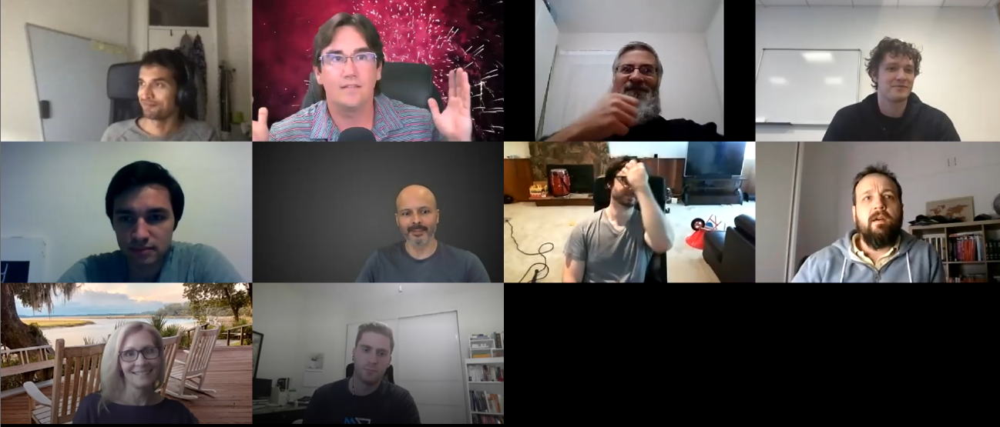
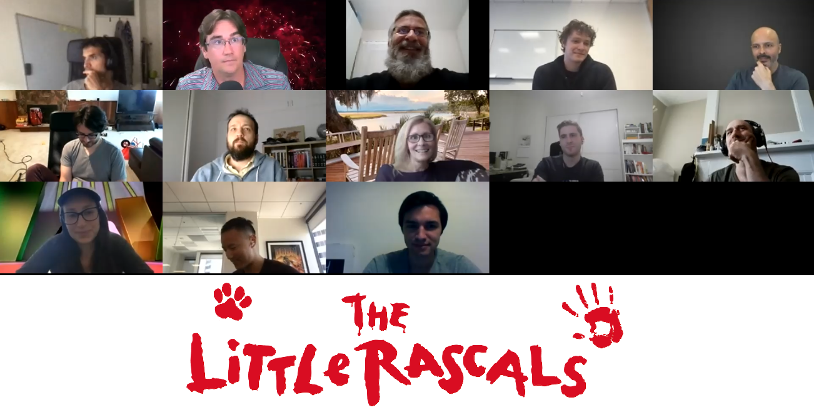
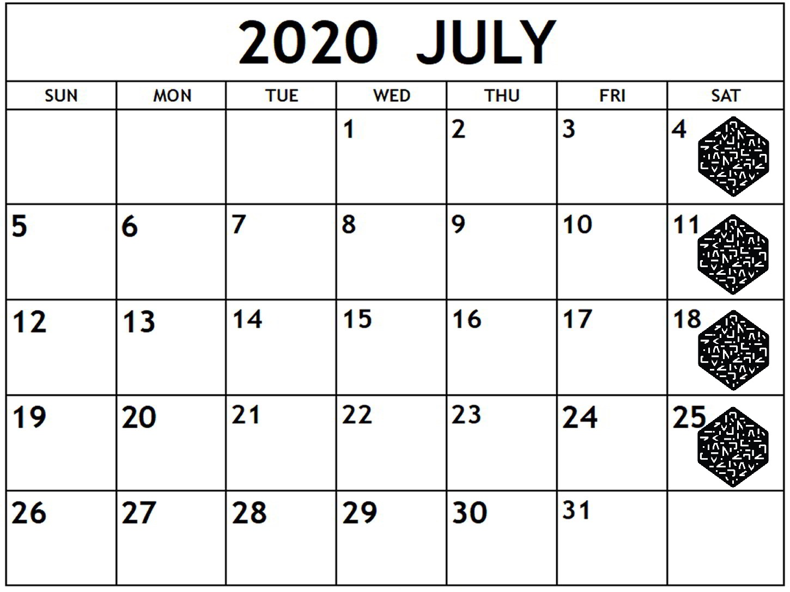

# OHwA S02E06

Arbitrage had a special surprise for Episode 06 with the [Master Key](https://numer.ai/master\_key) himself Mike P joining in the hot seat.

You can check out [the full interview after the questions from Slido below](ohwa-s02e06.md#interview-with-mike-p).

### Questions from Slido

**When Corr + MMC?**

**Mike P:** I want to do it this quarter. I just got it approved with the team in the last day, basically. We still have to announce it and we don't want to switch to it and have people saying they only want to do MMC, not MMC and Corr. Anything with payouts we have to be really careful about how long it takes to change it from the time we announce it. I'm hoping within the next couple of months.

**Arbitrage:** So soonish, cool. I would like very much if you could calculate our performance and show the delta between what we have earn and what we could have earned under that system so we can better understand what that looks like.

**Mike P:** Yeah, I think it would actually be really good to just go ahead and put it as a leaderboard metric, at least. I think it should be the main leaderboard metric, instead of having a correlation and MMC leaderboard seperate. It's really the closes thing to what we would be envisioning for those.

**Slyfox (in chat):** One true leaderboard.

**Arbitrage:** What do you mean by that?

**Slyfox (using voice):** When we added MMC to the current leaderboard, internally we had this discussion around what should we sort it by? Corr? MMC? Have two leaderboards? I also like the idea of merging Corr and MMC together and having one true metric. You know where people stand, you know?

**Arbitrage:** Maybe there's 10 leaderboards and you pick where you stand based on the metric? Who knows, there's many ways to slice this onion. But you're right ultimately there's gotta be one thing that's the official rank, because if we're going to say participation in this tournament is beneficial for job interviews, it helps for you all to tell us what that score is so we can chase it.

**wigglemuse (in chat)** : MMC doesn't have skipped/missing round penalties so it isn't apples to apples with CORR even now -- gotta make the rankings mean same thing for all users.

**Arbitrage:** Good point. There's a person who asked a question on Slido, don't know if they're in Zoom but I really want them to be and that's [Sorios](https://numer.ai/sorios).

**Sorios asks Michael Oliver: why have your main accounts (**[**MDO**](https://numer.ai/mdo)**,** [**NMRO**](https://numer.ai/nmro)**, and** [**NIAM**](https://numer.ai/niam)**) never staked on MMC? Was it internal backtests?**

███████ ██████ ███ ██ ███ ████████ ███ █████████ ██ ██████ ████████ ██████████ ██ ████ ██████ ██████ ██ ████ ████████ ███ █████ ███ ██████ ██████ ██ ████ ██ ███ ███████████ ███████ \*\*\*\*

_Redacted at host's request to be revealed when Sorios joins Office Hours._

**When is the last payment date for the reputation bonus? Can we extend it for another 12 months?**

September 30th.

**Mike P:** We're not extending it.

**Could you give us a quick rundown on how you use the different metrics (sortino / max drawdown / etc) to select models with good MMC potential?**

Arbitrage explained that MMC is a moving target so there isn't really a good answer for that, but the remaining metrics are essentially portfolio theory. Max drawdown is very important because you have to climb out of the hole; if you drawdown less than whatever benchmark you establish, you're inherently building alpha. You can have the same positive scores, but if you just drawdown less once, you've earned alpha. That means limiting the downside is very important.

He said that really what you want to look at is to compare your models' per-era validation performance to [Integration Test](https://numer.ai/integration\_test):

> "Download Integration Test's validation predictions, put it through that [notebook](https://github.com/numerai/example-scripts/blob/master/making-your-first-submission-on-numerai.ipynb), save the outputs, then put your model through. Then do a side by side comparison. Use a snipping tool and look at the metrics. When you had a really good era, did you out perform Integration Test? Or were you slightly below? Then the next era, what happened?" - Arbitrage

Ultimately, Arbitrage said that you want to try to drawdown less than Integration Test. "You'll have a higher sharpe ratio if you have the exact same positive but slightly less drawdown," he said. Looking at submissions in a relative sense, he said annualized sharpe is a reasonable metric to use, which is why he's leaning heavily on it for now. He mentioned that Richard wants data scientists to consider the auto-correlation of the returns, because week-to-week repeat predictions cause problems. "Try to keep you auto-correlation to zero," Arbitrage said.

**Are there any updates on Signals?**

Jason said that they're not ready to fully share what they've been working on, but mentioned that they're trying to make the targets as close to the Numerai tournament's as possible so that it's immediately useful for the meta-model.

**How did Mike P realize the model he used looked good but actually wasn't?**

**Mike P:** Day one I got here and looked at my test set and realized it was low-performing. That's all. It's built for sharpe, so it looks like a poor performer if you look at it from a maximizing mean perspective. But there's only two models right now that haven't had a down week in the last \~20 weeks and [Master Key](https://numer.ai/master\_key) is one of them so it's doing it's job of not losing money ever. But it just doesn't make money either.

**How uncorrelated is too uncorrelated? I have a feeling that when correlation is too low, the model is no good.**

Mike P agreed that it seems really difficult to have high Correlation if you have lower correlated models. But, he pointed out the model [Xyhyss](https://numer.ai/Xyhyss) which has 30% correlation with the meta-model but also very high MMC and Correlation. Mike pointed out that he's the other user that has no negative rounds over the last 20 rounds.

### Interview with Mike P

**Arbitrage:** So why don't you tell the folks- you started out as a participant, and you lived where?

**Mike P:** I was in Atlanta for like, three years before joining Numerai. I was working for another startup doing data science full time there and was a Numerai participant. Then, I ended up moving out here in January.

**Arbitrage:** How has that transition been for you? Hell of a time to make a cross country move.

**Mike P:** It was great for the first three months, not I'm not really leaving my place much. But we're starting to get back to the office, so I like it a lot more now.

**Arbitrage:** I understand that. So what's your title now?

**Mike P:** Anson, is my title Software Engineer? I think?

**Slyfox:** It is on the contract.

**Mike P:** Data scientist software engineer.

**Slyfox:** Yeah.

**Arbitrage:** Check with the boss - that's a great strategy when you're not sure. Mike, how would your parents describe what you do for a living?

**Mike P:** So fun surprise, Elaine here is actually my mom.

**Arbitrage:** Whoa!

**Mike P:** I got her on to answer this question for us.

**Arbitrage:** That's _wonderful!_ That's a great idea!

**Elaine:** I really didn't prep for this so I have no idea. I'm going to tell you what I've heard; it doesn't mean I know what it means and it doesn't mean it's right.

**Arbitrage:** This is wonderful. We're going to actually hear from the parent for the first time. This is awesome.

**Elaine:** Yeah, I have no idea about what he does. I'm his mom so I think he's really smart, but I would say that no matter what he did. I think it's some combination of game theory and data analytics to make predictions. I don't really know what game theory is.

**Arbitrage:** That's okay. You're out at a dinner party in Buckhead. And you're talking to my friends who live in Buckhead and they're like, "Oh, what does your son do for a living?" Your answer is:

**Elaine:** And I say that ☝ and they don't understand it either so I get crickets, right? Then we start talking about what wine we're ordering for dinner. That's how life goes.

**Arbitrage:** That makes perfect sense. Use words that are super smart sounding that you're not sure you understand and you know for sure other people don't understand. That's a perfect strategy. Thank you so much for joining. You know you have to come back now. You're like the Zoom Marm making sure that we behave. All these people here are a bunch of rascals.

**Elaine:** Well life is less fun if you're constantly behaving.

**Arbitrage:** Cool cool, I like it. Well thanks again for joining us and answering that question. We may have more for you! I'd stick around if I were you.

**Mike P:** She's very busy. She's working full time and everything.

**Elaine:** I think that's my cue to leave. Nice to meet you guys, maybe he'll send me a copy of this.

**Arbitrage:** You can definitely read the summary and I promise you'll be in it. So now we're back on you Mike. Your mom described what you do as game theory and some other statistical analysis.

**Mike P:** I think she wasn't letting on as much as she knows. She knows it's on the stock market and the hedge fund and all that kind of stuff.

**Arbitrage:** For sure. I could tell she was being nice to you.

**Mike P:** My parents ask pretty good questions. I talk to my dad and mom a lot about what we do, and they read blog posts and ask good questions. I think they do a good job.

**Arbitrage:** That's great that they keep up on you, too. My parents are pretty cool but they have _no clue_ what I do. I try to tell them, like, "I'm even doing this web series now, it's really fun!" And they'll say, "hey that's great, when are you coming to the lake house?" 🙄🙄🙄 Mike what do you do for fun?

**Mike P:** My main go-to's are running and exercise. I like to play random sports when I can. I get out and play tennis or golf or whatever's available.

**Arbitrage:** Oh, you golf?

**Mike P:** Yeah, we should get around sometime.

**Arbitrage:** Game on, my friend! I think there should be an ErasureCon golf tournament.

**Mike P:** That's a great idea!

**Arbitrage:** I think so. I think we should do that.

**Mike P:** We can stake on it.

**Arbitrage:** Ooooohhh!! Yeah! But I'm bad though, so I don't know. Mike, when did you start participating in the tournament prior to being hired?

**Mike:** It was actually only in April of 2019, so I'm a pretty recent participant. I got sucked in pretty quick and came to ErasureCon soon after.

**Arbitrage:** So you had like six months of development and evaluation prior to meeting everybody and then two months later they hired you?

**Mike P:** January, yeah.

**Arbitrage:** I remember: I usually spend New Year's in Atlanta and I told you I was coming up but you said you were driving to San Francisco at the time.

**Mike P:** Yeah, that's right.

**Arbitrage:** Wow that was six months ago. Time flies. How did you find out about Numerai?

**Mike P:** One of my friends sent me an article. I think it was the Erasure unstoppable marketplace blog post from like, 2018 I think.



**Mike P:** That was my first exposure to Numerai and I always keep it in mind because it's like, the only thing I really know about blockchain. Then in 2019 I somehow found myself in the crypto rabbit hole and I had to Google around a bit like, "what's that information marketplace thing I read about a while back?" That's when I came back to it and found Numerai specifically. It just makes a lot of sense, the intersection between science and blockchain. There's actually not that much of overlap between crypto and data science and machine learning. So this is a very natural place to go if you have interest in both those things.

**Arbitrage:** I agree, you're definitely right about that. So that's how you found out about Numerai. Many people believe the tournament is challenging to the point that it becomes overwhelming and too much to handle. Why do you think people believe that it's overwhelming?

**Mike P:** I can see how the rules could be overwhelming, especially when our docs weren't as nice as they are now. Anson when through and cleaned up the docs recently to make them a lot less overwhelming. But overall, ultimately it's a tournament that you can but as much or as little effort into as you want. So if you're feeling overwhelmed, yeah, you can just submit the [example script](https://github.com/numerai/example-scripts/blob/master/example\_model.py) and let it run and just come back and improve it if you want to. It doesn't feel like it should be overwhelming as long as you understand that you don't have to be a genius to be good at it.

**Arbitrage:** Yeah, I mean somehow I'm still around so that's definitely true. I don't remember if you've told me this before, but what programming language do you use and why?

**Mike P:** I use Python, like a lot of people. The 'why' is because I actually kind of hate tools in computer science in a lot of ways. I really believe in ideas, that's my favorite part of what computer science and data science is. Python to me is ... okay it might not be the fastest or the most powerful at some things, but there's nothing better that lets you get from zero to something running and handling all that stuff and letting you focus on iterating on ideas and testing them very easily. It's just the best to focus on what you care about.

**Arbitrage:** Can I tell people where you told me you went to college?

**Mike P:** Yeah yeah, that's fine.

**Arbitrage:** So you went to Georgia Tech, which is a fantastic school, probably the best tech-oriented school in the south. Did you study computer science?

**Mike P:** I actually went to Auburn for undergrad and studied computer science there but I didn't really like it. I kind of wanted to do data science the whole time, but I didn't really know the difference to be honest. Then I got my master's in data science so I could start doing what I wanted to do.

**Arbitrage:** Okay that's cool, that's what I was trying to figure out, your path to that. So you studied computer science and you still choose Python?

**Mike P:** Yeah. I was doing data science in high school, and then there's no data science undergrad degree really, so I took the closest thing I could find.

**Arbitrage:** I think that's changing. My university just launched a data science undergrad program and you can pick from different schools to build out your expertise. I think the university system is turning around and making it possible to do that as an undergrad. I think that's essential to the long-term. We see it here in [Rocket.Chat](https://community.numer.ai), right? We've got the pure computer science guys and the pure finance guys and we often can't agree on things and I think that's because we don't have a common language. This is question is complicated, right? You used to be a participant, but now you're behind the veil, so to speak, but: what are your top three tips for the tournament?

**Mike P:** I think my first one is that reading all kinds of different things is helpful for creativity. So reading not only the [forum](https://forum.numer.ai), but papers from other domains, Marcos' [book](https://www.wiley.com/en-us/Advances+in+Financial+Machine+Learning-p-9781119482086), other books, [Rocket.Chat](https://community.numer.ai) ... I used to always want to create everything myself and not want to hear anyone else's ideas because it brought me more satisfaction. But it turns out that if you're exposed to these other ideas, you might not implement them the same way or it might not be clear how you're using it, but it stirs up your mind a lot and might give you your own eureka moment and make you look at things from another perspective. I think it's super important to read a lot of other ideas from other people. So that's tip one.

**Mike P cont:** Tip two is: take the time to set up [Compute](https://docs.numer.ai/tournament/compute). I think part of what makes the tournament seem overwhelming is that submitting every week feels like a burden. It makes people not want to add more models. It's easy to give up and feel like it's not worth your time to iterate on your model because it means you might not be submitting every week anyway. But if you have something running every week and you can count on it, it takes a lot of the stress off of it and you can work on improving it whenever you want. Especially if you have ten models, it's way better to have some kind of automation set up.

**Arbitrage:** Were you around pre-Compute?

**Mike P:** When I showed up, they just finished Computer. Maybe I was like, one month before Compute.

**Arbitrage:** I remember many, many Saturdays lost to the vapor of waiting for the data. Yeah, I definitely think people should use Compute. Big fan. Love having my weekends back. So what's your third one, my friend?

**Mike P:** Third one is a little more technical. I think people should test their models in a lot more different ways and measure more metrics. I hear people talking about how they train on train, test on Validation, and whichever has the highest mean, that's the model they use. I think it's important to do different types of cross validation: do walk-forward to make sure there's no problems there, try different types of holdout, and don't just measure the mean. Keep track of your sharpe, your mean, your drawdown, any metrics you might care about. When you experiment in that way, you learn so much more about your model. Your not just getting one perspective of what's good, and you can learn a lot about, for example, why your mean is low because of a drawdown, and it might point you down another path of exploration measuring all of these different things in different ways. It's really the [key](https://numer.ai/master\_key) to understanding your model and how to improve it. People really should invest more time into how they measure their models.

**Arbitrage:** I completely agree. I'm embarrassed to admit that until three or four weeks ago, I only cared about average correlation. I didn't even care how it did per-era. And I really believe I just got lucky in my model design. And this is what I teach, right? Have a good approach prior to even looking at the data. Set up in your head how you're going to go about this, and then at the end, if it's good, run with it. I think I just got lucky, and I'm not afraid to admit that. I'll take my six in the top 50 staked and run with that for now. We'll see how these new iterations come about. So here's a fun one: if you could have a billboard with anything on it, what would it say and why?

**Mike P:** Yeah this is the hardest question by far. I decided, I think, has everyone seen the meta-model contribution art that Jonathan did that's at the top of the [blog post I put out](https://blog.numer.ai/a-new-data-science-competition-where-being-different-pays)? [Jonathan](https://twitter.com/jonathansidego) did that art and it's insane. I talked to him before about what the meta-model logo should look like, and it was always this idea of multiple things coming together in some powerful way. He put it in the Numerai style. Basically it's three panes of glass that overlap and in the center is the Numerai logo and it's more opaque because they're overlapping. It was _exactly_ what I think it should look like. I was blown away by that and want to stick that on a giant billboard somewhere.

**Arbitrage:** Cool man. It's your billboard, you can do anything you want with it.

**Mike P:** I'd just stick Jonathan's art on it.

**Arbitrage:** So the 'why' is because it represents to you the perfect representation of the meta-model?

**Mike P:** Yeah. And it's just awesome art. Everybody should have to look at it when they drive to work.

**Arbitrage:** I'll buy into that, I like that. So that's your billboard. I don't even know if I should ask this next question. I hemmed and hawed before I started recording about what to do with this one. We're doing it live. Mike P, who's your favorite team member? See he's trapped because if I asked him who his favorite participant was and he didn't pick me, I'd kick him right out of Zoom. And if he doesn't pick Richard, he's going to get fired, so it's lose-lose. It's not fair, but let's do it anyway.

**Mike P:** I'm going to exclude Richard as a team member and claim Richard is a manager, or something. I think my favorite team member lately is Jason. Recently I had a question about some AWS cloud stuff, and I had been working on it and had three other people looking at it and trying to solve it. And Jason just comes over and tells me to type all of these commands and I don't know what any of them do. He just solves it in five minutes by backseat driving on my computer. I was laughing the whole time. It never gets old how fast his brain works. It's unbelievable.

**Arbitrage:** I gotta vouch for Jason's ability to solve problems. I try not to ping him because I feel like I'm embarrassing myself, to be frank. He really is very quick on that. So yeah, Jason with the vote, well earned... This is another one because you're behind the veil, but here it is: what's your number one feature request or improvement for the tournament?

**Mike P:** I was thinking that a longer-term, stable leaderboard could add a lot of value. If you think about how with other data science competitions, you can almost include them on your resume because everyone knows that if you're number one, it's prestigious. If we had some sort of badge system, or over the last 50 weeks, this person has helped the meta-model the most and they get a gold badge next to their name or something. We can start adding value to participants outside of just what we're doing now. It's a completely new way to add value for people because it's a career builder. I think that would be kind of cool.

**Arbitrage:** Let me ask the audience: has anyone applied for a job in the last three years and listed your participation in the tournament as part of your skillset? Not yet? Okay.

**Mike P:** We need to change that.

**Arbitrage:** I think we should change that, too. I told my students they absolutely should list even just that they've participated. At this stage of their careers it's extremely valuable because it shows a potential employer that they have the ability to work with big data. So Mike, I hope you don't have ten models but how many models do you have right now?

**Mike P:** I just have two models. [Master Key](https://numer.ai/master\_key) and [Apprentice Key](https://numer.ai/apprentice\_key).

**Arbitrage:** You said in chat that your Master Key model is very similar to the neural net that I divulged [last week](ohwa-s02e05.md).

**Mike P:** Yeah, I think it uses a similar library. It has one more layer and some other stuff on it, but I didn't come up with some super deep neural net layer like I was expecting it to.

**Arbitrage:** Alright, so two models. If you could turn back time and talk to your 18 year old self, what would you say?

**Mike P:** With respect to investing, buy and hold more. It's really easy to try to time exits. There's been a ton of cases where I'd buy something because I think it's a really good investment, and then I sell it because it 2x's. But then a month later it's 10x. It's dumb to try to time those things if you don't have a ton of information, so I wish I had just bought and held a lot more of my past investments.

**Arbitrage:** Yeah, maybe, 'get a little more discipline' if I could distill that down into a wisdom nugget. What advice would you give to someone who wants to become a data scientist?

**Mike P:** You have to spend time learning to code. You'll be really inhibited if you don't, like if you're not very comfortable with Python or whatever toolkit you want to use. You'll waste a lot of time not working on what you should be working on. By learning to code, you actually save yourself a ton of time on data science. That's the main thing.

**Arbitrage:** Okay, learn to code soon. What about, do you believe in a project-based path or do you believe in more of the formal, rigorous curriculum?

**Mike P:** I think it depends on who you are. If you feel overwhelmed by just starting a project from scratch, you should know that about yourself and take an appropriate learning path. But I get in, hack stuff together, and then fix it after I break it. For me, I had no idea how to code, and just tried to build a neural net from scratch and fiddled with it for six months. Everybody's different.

**Arbitrage:** Do you think you had an advantage studying computer science first? Or would you have studied something else if you could go back and start over?

**Mike P:** I actually studied computer science after I already knew how to code. I was doing some data science stuff in high school, and then decided it made sense to also study computer science in college. Most people's first coding problem is how to make a list or a `for` loop. Mine was how to slice a numpy array with extra dimensions, so it was totally the wrong way to learn it.

**Arbitrage:** I know I've said this a few times, but pick a project in your domain and do it in code. Because you know the data, and that's going to help because you'll know what the results should look like. If you could step into my shoes, Mike, what would you ask yourself that I didn't?

**Mike P:** I would ask about my models a little bit more. We'll talk about them more during Slido, I'm sure, but I'll explain what [Master Key](https://numer.ai/master\_key) is. A lot of it is similar to stuff [Bor](https://numer.ai/bor1)'s talked about where you basically give a genetic algorithm an objective function and let it do everything. I wrote the genetic algorithm that I use just for fun, and I gave it a bunch of different pre-processing steps, algorithms, transformations, hyper-parameters, all these feature selection options, as many options as I could think of. I let that churn for like, two weeks.

**Arbitrage:** Two weeks?

**Mike P:** Yeah, you have to train and test tens of thousands of versions of genetic algorithms to pick good models. I'm sure there are much better ways to do it, but this was a fun way for me. It dropped a few features in the beginning that it didn't like, ran a principle component analysis and took some of the principle components, a few of the minor and a few of the major, and used basically your neural net model for the actual algorithm with some different era-boosting behaviors to handle eras differently. It's optimized for sharpe, so after all these different things it ends up with the best cross-validated sharpe.

**Arbitrage:** Would you say that it's overfit?

**Mike P:** Yeah, definitely the feature part and PCA part are the most prone to overfitting. That's something that I didn't really understand, not being in a financial domain beforehand. That's like, in the training if the Charisma features never fail, the my algorithm is going to think that you should always keep all of the Charisma features and drop everything else. But in real life, it's going to be the Charisma ones that fail and everything else does well. You kind of have to think about the whole regime idea completely differently. We'll get more into it in the Slido.

**Arbitrage:** So you had a [big write up](https://blog.numer.ai/a-new-data-science-competition-where-being-different-pays), want to talk about that a little bit then we'll dive into the questions?

**Mike P:** So that wasn't really for current participants. I'm glad you all read it and enjoyed it, but I feel like it was stuff that you all already knew and we've talked about a lot. I kind of wrote it with the purpose of introducing people to Numerai and why I think meta-model contribution makes data science tournaments a lot more interesting. It's kind of a pitch to get new users in a way. I really do think that it's totally different. We've always said that it's different from all the other data science tournaments, and it is in a lot of ways, but I think the meta-model contribution idea can, if we do it correctly (which we're still trying to improve, obviously), can be super appealing to people who are bored with other competitions. That was the purpose of it.

**Arbitrage:** Yeah. And I'm so glad everybody comes back, but Office Hours is to help people learn and improve. So that's why I want to specifically talk about your write up because people always have questions: how can I participate and how can I move forward? The tips and tricks, and the discussion that happens here, is geared towards the same audience. We just happen to have a really smart and stick audience that hangs out and I'm really glad. And I know everybody here has questions, especially about the Correlation + MMC.

_If you’re passionate about finance, machine learning, or data science and you’re not competing in_[ _the most challenging data science tournament in the world_](https://numer.ai/tournament)\_, what are you waiting for?

Don’t miss the next Office Hours with Arbitrage : follow\_[ _Numerai on Twitter_](http://twitter.com/numerai) _or join the discussion on_[ _Rocket.Chat_](https://community.numer.ai/home) \_for the next time and date.

Thank you to Jason,\_ [_Michael Oliver_](https://numer.ai/mdo)_,_ [_JRB_](https://numer.ai/jrb)_, and_ [_Slyfox_](https://twitter.com/ansonschu) _for contributing to answers during this Office Hours, to_ [_Yuki_](https://numer.ai/uki) _for being interviewed, and to_ [_Arbitrage_](https://numer.ai/arbitrage) _for hosting._
