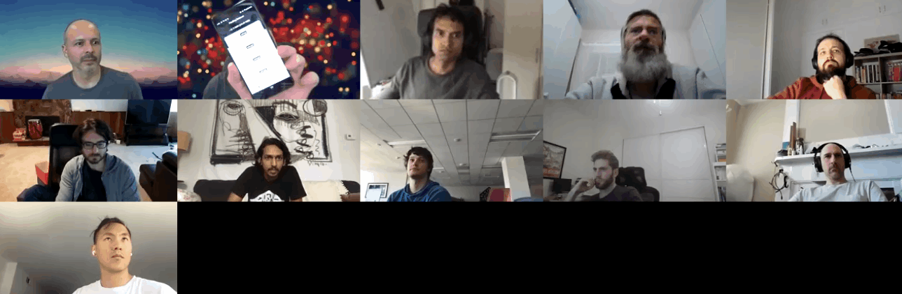

# OHwA S02E07

For this episode, Arbitrage had a jam-packed agenda including an interview with Harsh, Numerai team member and designer extraordinaire, Mike P discussed his recent forum post, and Arbitrage had a special preview for the audience.

Check out the [full transcript of Harsh's interview](ohwa-s02e07.md#interview-with-harsh), [Mike's discussion](ohwa-s02e07.md#discussion-with-mike-p), and [Arbitrage's preview](ohwa-s02e07.md#office-hours-exclusive-preview) after the Slido questions below.

## Questions from Slido

**I watched as** [**Madmin's**](https://numer.ai/madmin) **rank plummeted from prior to June 27 to July 8. Could Numerai tell us if something radically changed with the meta-model in the last two weeks?**

The Intrepid Mike P stepped up to answer, saying that he did notice Madmin and two associated models all experienced a sharp drop in correlation with the meta-model, but it wasn't the result of any changes to the meta-model.

Arbitrage added that because all participants are judged against the same stocks, if Madmin's decline was because of a change in the meta-model, it would have impacted everyone.

**How can I switch my model to MMC+Corr? Shall I just switch it to MMC now?**

Arbitrage said to wait until Saturday (July 25) for the new round to open (Round 222). When Round 222 begins, staking on MMC will automatically include exposure to Correlation.

**Do the eras have time gaps between them to limit data leakage between eras?**

This is something that Arbitrage has always wondered (and therefore couldn't answer). Mike P, however, could. He told us that the training data is non-overlapping so there's no leakage across eras, they should be independent, and they're not putting any time buffers in between them. [Joakim](https://numer.ai/joakim_arvidsson) suggested there could still be a risk of data leakage without a buffer.

**Richard:** It depends on how bad the auto-correlation is in your data. I don't think one era to another era is significant enough, but if, for example, we had daily data and daily targets, I would be very concerned about this and would want to have some gaps but it's monthly, and the features themselves are monthly or much longer.

**Joakim:** Would you then recommend us doing purging and embargoing (a [method of cross validation](http://www.quantresearch.org/Innovations.htm) discussed by Numerai Science Advisor Marcos Lopze de Prado in _Advances in Financial Machine Learning)_?

**Richard:** I think it's cool if you do it if you think it helps you. But if you don't think it's helping you, don't do it just for fun. I think it's possible that if you have a model that's very geared towards features that are very fast, like some features change quickly. Maybe those would be dangerous and you'd want this purge cross validation. But for most people, I don't think it's something they need. We don't put it in the example predictions- we don't think it's significant enough to say, "everyone must do this."

**Can you explain the validation part of the tournament data set? What happens if you train on it?**

Keno was specifically looking for something from Arbitrage and the team to help with interpreting the validation data regarding the time period and what would happen if you were to train on the data set.

Arbitrage pointed out that the validation data has to be the same time frame as the training data. Otherwise, as Arbitrage said, you would have an "invalid validation." His assumption is that it's the same kind of distribution regarding time.

"Yes, there were weeks that flowed, but they selected **a** week to represent the monthly era," Arbitrage said, "so for July with four trading weeks, you pick one of those weeks to represent the month - am I on the right path?"

Arbitrage elected [Michael Oliver](https://twitter.com/the_moliver) to tackle this question: with the new validation data that rolls in, live results are weeks that take one month to resolve, but when they enter the validation set it's no longer a week- it represents a month, which Michael Oliver confirmed.

**Michael Oliver:** Yes.

Regarding training on the validation data, if you train on all of the validation data then you have to wait until you get your results on the live data to figure out what's going on. "It takes a really long time to figure out if the model's any good," Arbitrage said, adding, "it's absolutely paramount to set the parameters in such a way to limit the ability of the model to accidentally overfit."

Ultimately, training on the validation data means you don't get any out of sample validation, you have to wait for live performance results, which is risky.

> "I wouldn't take a whole new methodology that you've never previously used and feed it all of the data because then you don't know for sure that it's not too overfit." - Arbitrage

Arbitrage added that [Arbitrage](https://numer.ai/arbitrage) is the same model as [Arbitrage 2](https://numer.ai/arbitrage2), the only difference being that Arbitrage 2 is trained on the training, validation, and validation 2 data sets whereas Arbitrage Prime is trained solely on the training data.

**Joakim:** If you have the same model and you're training on less data, why would that perform better than a model that's trained on more?

**Arbitrage:** Detective, you're asking the right questions.

He explained that his Arbitrage model will be more overfit than Arbitrage 2, which is trained on training, validation, and validation 2.

\*\*\*\*[**JRB**](https://numer.ai/jrb)**:** If you train a model on less data, it would be a weaker fit to the data. Which is what you want, it's the opposite of overfit.

**Why not have the staked leaderboard be the default one? Seems more valuable to the meta-model, less noisy, and more difficult so it's a bigger achievement to climb.**

Arbitrage gave [Slyfox](https://twitter.com/ansonschu) the floor, since he hadn't yet answered a question.

**Slyfox:** We've discussed this internally a lot. Only showing staked models on the leaderboard would kind of make it cooler for the stakers. But, when we first designed it, we wanted people to be able to see where they stand without having to stake, and hopefully their position on the leaderboard would convince them they should be staking.

Richard added that Mike P is working on revamping the leaderboards. Richard believes that there should be one leaderboard, and that basing it on MMC + Correlation (like the new payout scheme) is a move in the direction of what Numerai is looking for.

**If a model has an average correlation of 0.01 net friction, does that mean it has a 51% chance of making a profitable risk-free trade for each independent bet?**

**Richard:** It does, yeah, that's kind of true.

**Arbitrage:** Alright, there's your answer.

**Joakim:** Cool.

**Does this signal (pun intended) the start of a new burn period? Do you think we have better tools to handle a burn period these days?**

Arbitrage does think we're going into a burn period based on the current live results. He also believes the tournament participants have better tools to handle burn periods because of the additional validation data set. The Validation 2 set includes several burn periods, so evaluating models on those rounds does provide some information.

Richard said there's been some unusual market activity, including a high degree of volatility in certain sectors like energy and technoloy. He also added that Michael Oliver did some research and concluded that looking at a model's max feature exposure is slightly more informative than the number Numerai provides on the website (which is a standard deviation of the feature exposure). "Just try to keep your max low," Richard said, "that tends to be a really good idea."

## Interview with Harsh

You already might be familiar with some of Harsh's work:

**Arbitrage:** Harsh, tell us what else you've done so people are aware of your contributions to the project.

**Harsh:** We just launched the Compute badge on the website, that's a nice, cool badge.

**Arbitrage:** \[scrolling through the [leaderboard](https://numer.ai)] Oh, I see it now! When did that go live?

**Harsh:** Like two minutes ago.

**Arbitrage:** Woo! Another debut on Office Hours with Arbitrage! Thank you. That's pretty dope. So every model that uses Compute has this badge, right?

**Harsh:** Right.

**Arbitrage:** Sweet. Harsh, I did want to run through my famous set of questions. You pre-warned me, you said, "I don't really do the data science." I feel like that doesn't matter, I think you have a lot to add. You've been with the team for how long now?

**Harsh:** I started interning last year in June, then I went back to college earlier this year for a few months. In total, it's probably been eight or nine months.

**Arbitrage:** You've made a big impact so far. It's hard to remember, but about a year ago the site was redesigned, and _you_ did that.

**Harsh:** Yeah it was during the internship that I did a lot of that frontend programming.

**Arbitrage:** Well you did a good job. Where do you live?

**Harsh:** Right now I'm in Savannah, Georgia.

**Arbitrage:** Oh that's so cool! There's somebody else that's near there. [Wigglemuse](https://numer.ai/wigglemuse) that's you, right?

**Wigglemuse:** Yes, also in Savannah, Georgia. I'm in the historic district.

**Harsh:** Me too!

**Wigglemuse:** Price and Taylor-ish?

**Harsh:** Gotcha, nice I'm near the Kroger.

**Arbitrage:** Alright you guys gotta meet up for beer or coffee or something because otherwise that's a wasted opportunity.

**Wigglemuse:** If there wasn't a pandemic, I would leave my camera now and appear on his in about 10 minutes. I could walk there in a few minutes.

**Arbitrage:** I love that kind of stuff- it's such a small world. Harsh, you were in the Bay Area before, right?

**Harsh:** Yeah, and I'm moving to the Bay Area again in about a month. I'm moving in with [Richard](https://twitter.com/richardcraib).

**Arbitrage:** You're going to live with who???

**Harsh:** With Richard for a couple of months hopefully.

**Arbitrage:** Oh cool!

**Arbitrage:** Harsh, what do you do for a living? What is your profession / title?

**Harsh:** I graduated with a degree in user experience design.

**Arbitrage:** Really? I didn't know that was a formal thing, that's so amazing. Pardon my ignorance.

**Harsh:** It is pretty up-and-coming. It's the new data science of the design world.

**Arbitrage:** Wow - tell me more.

**Harsh:** There are different levels to it. In its purest form, it's about designing experiences of anything: a service, a car, anything with which people interact and feel things and experience things. We design that experience. In today's world, it's restricted to websites, especially for beginners, but I think as you grow in the field it applies to anything and everything (which I'm really excited about).

**Arbitrage:** That's fascinating!

**Harsh:** Even architecture - there are firms that hire UX people for architecture or other fields.

**Arbitrage:** I saw this comic once that showed the difference between design intention and actual use, and it was people cutting the corners and walking on the grass instead of taking this winding sidewalk that was really pretty. I think of that when you mention the UX stuff.

**Harsh:** A good example would be Apple. They take a design and UX-first approach; it's not an engineering-first company, it's a design-first company. Google is cool, but they're an engineering-first company and their design is not as good as Apple.

**Arbitrage:** I take it you have an iPhone?

**Harsh:** I do. And a Mac.

**Arbitrage:** How would your parents describe what you do for a living?

**Harsh:** They'd say I do something with computers.

**Arbitrage:** Sometimes that's good enough. What do you do for fun?

**Harsh:** I watch way too many movies. I'd say I watch at least three or four movies each week. It's a good escape from things. I'm also into cinematography. I worked on movies before becoming a UX designer, so I know cinematography and camera angles and stuff like that.

**Arbitrage:** So you know about camera angles but I believe we're looking up at you right now. 🤔

**Harsh:** I launched the Compute badge two minutes ago, took one minute to change my shirt, and one minute to put my computer down.

**Arbitrage:** Just in time, right? Just ship it. So you like movies - what else?

**Harsh:** I have a motorcycle. I drive it around a lot in Savannah.

**Arbitrage:** Sweet! What kind of motorcycle?

**Harsh:** It's a Kawasaki Ninja.

**Arbitrage:** Ah so you like sport bikes. Nice. My girlfriend won't let me get a motorcycle.

**Harsh:** My mom isn't very happy about it either. 🤷♂

**Arbitrage:** Have you ever participated in the tournament?

**Harsh:** I created an account to test my designs. That's basically it. The only predictions I've submitted are the [example predictions](https://github.com/numerai/example-scripts/blob/master/example_model.py).

**Arbitrage:** Did you _stake_ on the example predictions?

**Harsh:** I did- 0.1 NMR.

**Arbitrage:** Ahhhhh see!? There it is! I knew it. Somebody was going to fess up someday. That's cool, it's a [good model](https://numer.ai/integration_test). I only beat it recently, and there's not that many people that can consistently stay above Example Predictions. Here's an interesting question: how did you find out about Numerai?

**Harsh:** They found me, actually. 😎

**Arbitrage:** Oh really? This is something I want to hear.

**Harsh:** I got a call from [Jonathan](https://twitter.com/jonathansidego) one day. I was at an event in college where you put up your work and employers come to see it. Then I got a call from Jonathan who said, "I like your work, you do film and design and graphic design, you program - seems like a good fit." That's when I joined. I looked at the website and it seemed like really cool work. I think they found me [through my website](https://docs.google.com/presentation/d/1e8Uk_cOh_W0s6n9AbMUToJe7-6SLxqPlvWczAs3FjmY/pub?start=true\&loop=false\&delayms=60000\&slide=id.p).

**Arbitrage:** Usually it's like, they have to throw us all out because they can't get rid of us, but they _found_ you so I don't know how that push-pull relationship works there. I think you can answer this question, I'm going to reframe it a little bit. The question is 'what do you wish you had known when you started out,' but instead, since you're not a participant, I'd like you to comment on what you think people should know **when** they start out.

**Harsh:** "It's tough," right? I think it should be written on the website: **It's tough.** I would tell them to stick with it and [Rocket.Chat](https://community.numer.ai) is really useful - you guys have some really meaningful conversations and you can learn a lot there. It's a long game.

**Arbitrage:** So basically just take a chill pill and hang out.

**Harsh:** Stick with it. Good things take time.

**Arbitrage:** Good things come to those who wait. So Numerai found you, people should stick it out, and it's tough. You kind of answered the next question with that. "It's tough," and so people get overwhelmed because it's tough. How would you recommend somebody overcomes that as a challenge?

**Harsh:** As far as any tough thing in life, community really helps. You guys really help each other, and for newcomers I think you guys are the greatest resource. We try to help as much as we can, but there are so many users and we're building things. I think community is the greatest resource, and I'm really glad we're more active on [the forum](https://forum.numer.ai) now. We had this chat internally: so many important things get lost in Rocket.Chat, and the forum enables us to keep a record of these things so people can look back.

**Arbitrage:** I agree. At some point, maybe, it would be nice to have somebody go through and maybe archive Rocket.Chat a little bit.

**Harsh:** We'd have to pay them a lot of money.

**Arbitrage:** Or we just build an NLP to pull out important words and see how it does. If we can find those topics... Do you program outside of webdev stuff?

**Harsh:** In high school I did a bunch of Java programming and made a bunch of library management systems for my school, but that was a long time ago. Right now I just do webdev stuff. I've been trying to learn more Python and data science to understand the users better and get in their mindset even more, but that's about it.

**Arbitrage:** Okay, so you're dabbling in Python, primarily write CSS??

**Harsh:** Yeah, CSS, HTML, JavaScript.

**Arbitrage:** So you do use JavaScript for that, too?

**Harsh:** Yeah.

**Arbitrage:** Okay. I said earlier that I was getting into Selenium a little bit and it's like a world of hurt that I never knew existed, but it's a great learning experience. In fact, my script failed like 15 minutes ago, but oh well. This is where it gets a little difficult because you don't technically participate, but do you have three tips for people starting out?

**Harsh:** Yeah, and I did write them down. One is ask questions and talk in [Rocket.Chat](https://community.numer.ai); second is use [Compute](../../../numerai-tournament/compute.md#introduction) and don't miss submissions; and third is stake more money. More skin in the game means you'll work harder, perform better, and earn more money.

**Arbitrage:** You know, I think you're the first person to touch on that. It's true: if you have money on the line, you're going to be more protective of it. I think that's completely right. Here's the billboard question: if you could have a billboard with anything on it, what would it be and why?

**Harsh:** It's a tough one. I thought about it when you sent the questions and I don't know. It's a tough one. Either I can go a funny way and put a joke on it, or I could try to put whatever my life philosophy is right now on it. I don't think I have a great answer for that.

**Arbitrage:** I think we should just take that entire paragraph you just said and put that on the billboard. Like, "I don't know, I'm not sure, I could do this or I could do that," and that's your billboard.

**Harsh:** I'm sure that would produce a lot of accidents on the road.

**Arbitrage:** Don't try to read it while you're driving, yeah. So Harsh, who's your favorite team member?

**Harsh:** That's a hard one too.

**Arbitrage:** You better pick your roommate.

**Harsh:** This is tough because I've had so many good times with everyone at the company. I've really enjoyed working here: [Anson](https://twitter.com/ansonschu)'s cool, Jonathan I have a lot of fun with, Richard's cool, haven't really met Michael in person yet but I'm sure he's cool too. [NJ](https://twitter.com/tasha_jade) and I are really good friends, too. It's like picking one out of your group of best friends.

**Arbitrage:** I'm going to save you a lot of trouble and count your vote for Richard. I think that's the safe play here. I don't want to cause any trouble at home. So you just pushed an improvement to the website (Compute badges) - what else are you working on?

**Harsh:** We have a lot of things coming up this quarter. A feature that I'm really excited about, that we might or might not have (it hasn't been decided yet), might be more information about the models and more feedback about how the models are doing. Right now, we give you data, you make something, and you have to do your own research into whether it's doing well or not. I think it would be good to provide some benchmarks besides just the leaderboard and the score but a more in-depth view of where you should improve.

**Arbitrage:** Cool, so you're talking about more metrics on the models. I know I made [a big post on the forum](https://forum.numer.ai/t/more-metrics-for-ya/636) and threw a bunch of sloppy code up there ([Michael Oliver](https://twitter.com/the_moliver) found a mistake, thank you for finding that). I assume it's something related to that, so we're going to see more metrics on sharpe performance and other cool stuff. Are there any specific things that you can tell us?

**Harsh:** We haven't decided completely yet. We've been looking at other references and gathering ideas for what can be done, given that we don't actually know what your model is. It's still in the ideation phase.

**Arbitrage:** Okay - what kind of rollout timeline do you think we're looking at?

**Harsh:** This quarter, for sure. Before that, we have a few more tutorials we're working on that will come out. Maybe in a month, month and a half. I can't say for sure, Anson probably knows better.

**Arbitrage:** So if you could turn back time and talk to yourself six years ago, what would you say?

**Harsh:** There's not much to say, really. I don't think I would say anything. Maybe I could tell myself to start designing a year earlier so I would be better at it when I start at Numerai. I wouldn't say much, I think I'm in a pretty good spot.

**Arbitrage:** Awesome awesome, I like it. What advice would you give to someone who wants to get into UX?

**Harsh:** Start with traditional graphic design and learn the principles of design: typography, how shapes and colors and forms work together. That's the foundation of design in general. Then you start learning about psychology, programming, and business. UX in general is a combination of these four things: design, psychology, programming, and business. The principles of design is the most important thing to master. Right now with the boom in UX there are bootcamps that train you in it in two months. But they all lack the basic understanding of the principles, which I think are very important.

**Arbitrage:** I get that. So if you were me, what would you ask yourself that I haven't already asked?

**Harsh:** I don't know, I couldn't come up with anything. I'm a very philosophical person so my conversations are usually about life, or "film major talk." In art school we call it film major talk. My favorite conversations are about life philosophies.

**Arbitrage:** I have a question: what's the picture behind you? Did you draw it?

**Harsh:** No ... One second. \[Speaking off-screen] Maria, where did we get this picture?

**Maria:** That's a tapestry from Society6.

**Harsh:** Oh. There's a website called Society6 and they take images from different artists and put it on different stuff.

**Arbitrage:** Cool. I was hoping you were going to say you made it, but that's okay.

**Harsh:** I don't do modern art. My art is more realistic.

**Arbitrage:** Photorealism?

**Harsh:** Yeah, I'd say so. If you want to check out my work it's at [harsh.work](https://harsh.work), that's my website.

**Arbitrage:** Post it in the Zoom chat - I'm sure most people will want to check out your website while I talk about nonsense and they ignore me. Well thanks Harsh! I appreciate you coming on with us today and hanging out. I hope you'll continue to hang out because you're a cool dude and I appreciate the work you do to make the website super awesome.

## Discussion with Mike P

After a kickass interview with Harsh, Arbitrage caught up with [Easy Mike P](https://twitter.com/easymikep) the [Master Key](https://numer.ai/master_key) himself to talk about his [recent forum post on MMC payouts](https://forum.numer.ai/t/mmc-payouts-adjustment-proposal/614).

As a data scientist working on the Numerai tournament, Mike spends a lot of his time working on how to make it function better: more closely aligning the incentives of the participants and Numerai, figuring out better payout schemes, etc. Mike believes that the added burden of deciding whether to stake on MMC or Correlation each week introduces unnecessary friction and distracts data scientists from focusing on building great models.

"If you stake on MMC,"' Mike said, "starting with round 222, you don't lose your exposure to Correlation, you just get paid for both at the same time."

As Arbitrage clarified: if you stake on MMC, your model is paid out based on both MMC and Correlation scores, but if you stake on Corr, you're **only** being paid out on Correlation scores.

**Keno asks: will there be a script so we can easily check which staking method would be more profitable?**

Mike said that he would try to release something so tournament participants could easily compare their models.

[Themicon](https://numer.ai/themicon) also posted a [script in the forum](https://forum.numer.ai/t/mmc-payouts-adjustment-proposal/614/24?u=beanstalk) to compare historical payouts for Correlation only, MMC only, or MMC+Corr.

## Office Hours exclusive preview

Arbitrage got to show off a preview of [a community-built mobile app](https://twitter.com/numerai/status/1288179925246124032):

Community member [Bouwe Ceunen](https://twitter.com/BouweCeunen) built the Numerai Payouts app to help tournament participants track their payouts.

In early access at the time of recording, Numerai Payouts is now available for [Android](https://play.google.com/store/apps/details?id=app.numeraipayouts.numerai_payouts) and [iPhone](https://apps.apple.com/app/id1522158691).

_If you’re passionate about finance, machine learning, or data science and you’re not competing in_[ _the most challenging data science tournament in the world_](https://numer.ai/tournament)\_, what are you waiting for?

Don’t miss the next Office Hours with Arbitrage : follow_\[ \_Numerai on Twitter_]\([http://twitter.com/numerai](http://twitter.com/numerai)) _or join the discussion on_[ _Rocket.Chat_](https://community.numer.ai/home) \_for the next time and date.

Thank you to_ \[\_Richard_]\([https://twitter.com/richardcraib)\_,\_](https://twitter.com/richardcraib\)\_,\_) [_Slyfox_](https://twitter.com/ansonschu)_,_ [_Mike P_](https://twitter.com/easymikep)_,_ [_Michael Oliver_](https://numer.ai/mdo)_, and_ [_JRB_](https://numer.ai/jrb) _for contributing to answers during this Office Hours, to_ [_Harsh_](https://harsh.work) _for being interviewed, to_ [_Bouwe Ceunen_](https://twitter.com/BouweCeunen) _for his work on the Numerai payouts app,_ _and to_ [_Arbitrage_](https://numer.ai/arbitrage) _for hosting._
