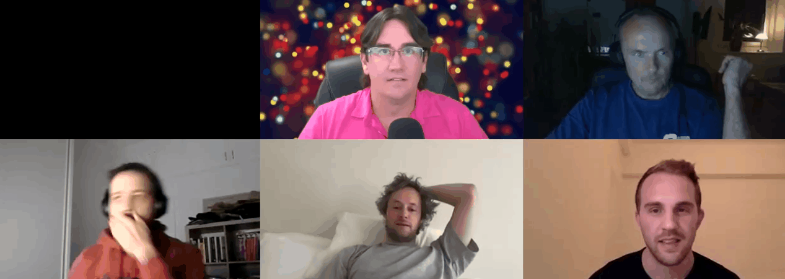

# OHwA S02E08

For episode eight, Arbitrage interviewed [Bouwe Ceunen](https://twitter.com/BouweCeunen), Numerai [tournament participant](https://numer.ai/ceunen) and creator of the [Numerai Payouts](https://twitter.com/NPayouts) app that was teased in the [previous episode](ohwa-s02e07.md#office-hours-exclusive-preview).

The full interview with Bouwe will be uploaded on YouTube.

### Questions from Slido

**Round 219 looks like a big burn for most models - with just one week difference between rounds, do we have any clue as to why that might be?**

Arbitrage noted that many models, including [Integration Test](https://numer.ai/integration_test), had a bad burn during round 219 but not everyone. He said one of his models performed better than Integration Test that round, adding, "I just don't want to burn as much as Integration Test... if you don't draw down as much, then you've outperformed." 

Regarding the one week time between rounds, Arbitrage said that there would be similarities week to week. This means that tournament participants are making predictions on potentially the same group of stocks with only a week's space between the data. If the same conditions are present within the data, you'll probably get the same result.

> "But what really matters is how \[the round\] resolves." - Arbitrage

**When** [**Wigglemuse**](https://numer.ai/wigglemuse)**?**

**Wigglemuse:** I don't know, I've never been invited.

**Arbitrage:** Consider this your formal invitation, sir, will you join me next week for Office Hours with Arbitrage as my special guest?

**Wigglemuse:** Yeah, sure.

_Author's note: **\[He did.\]\(link to Episode 9\)**_

**When do we get the Corr + MMC leaderboard?**

This question refers to the leaderboard changes discussed with [Mike P](https://twitter.com/easymikep) during the [previous Office Hours](ohwa-s02e07.md#discussion-with-mike-p).

**Slyfox:** It's going to come closer to when the reputation bonus gets phased out.

**Arbitrage:** So like six / seven weeks it sounds like. Cool.

**Slyfox:** There might be a secret combination of keys and clicks that you can do to bring it forward, though.

**Is MMC performance indicative of future MMC performance?**

> "I'm going to go with a partial 'yes' on that." - Arbitrage

If the models are stable, then yes. But if a significant percentage of users are changing their models, then potentially no. Arbitrage said that, given how much effort is required to create ten unique models, the models are generally stable and past performance is going to be fairly indicative of the future.

**Are you happy with how your** [**Leverage account**](https://numer.ai/leverage) **is doing since you changed it?** 

Arbitrage said yes and no.

Yes: During burn periods, he's outperforming [Integration Test](https://numer.ai/integration_test). The model is still burning, but not as bad. In round 219, Leverage was down 0.025 while Integration Test was down 0.04. Then in Round 220, Leverage's MMC and Corr were both positive while Integration Test remained negative.

No: Leverage isn't burning as much, but it's **just straight burning** 🔥. The consistent burns started when he changed his model. For now, he's okay with that because the model is still beating Integration Test in the same time frame. 

Arbitrage's goal with the Leverage model was strictly to not burn as much as Integration Test, which is working. He's waiting to see how Leverage performs with Corr + MMC during an earn period to gauge whether or not his upside is constrained as well.

**There's a global stake limit of 200,000 NMR- if we exceed this, payouts will be reduced. I suppose burns and negative payouts would be reduced, too, is that right?**

**Slyfox:** What we do every Thursday is look at everyone's stake and add it up. If it's above 200,000, then we pro-rata everyone so that your stake value is a little bit lower than what you actually stake. The amount that we pay or burn is pro rata'd in the same way... so if one day we wake up and there's 400,000 NMR at stake, then everybody's stake value would be half of what they actually put down. The value we use to calculate burns and payouts would be half of what you put down.

**Instead of reducing payouts, could it be an alternative to define individual stake limits \(e.g. 10,000 NMR per user\).** 

Arbitrage pointed out that this runs the risk of people fraudulently creating new accounts.

**Why such a big difference in rank between** [**Integration Test**](http://numer.ai/integration_test) **and** [**Integration Test 7**](https://numer.ai/integration_test_7)**?**

**Wigglemuse:** I know that one! There was a glitch last week where Integration Test didn't submit and it's late and now it's go a penalty. If you look a week ago, they were the same rank, same score, now they're diverging in the last five days.

**Any tips on how to lower auto correlation? What is a good / reasonable value?**

> "If you try to target all of the metrics, you're going to fail on all of the metrics." - Arbitrage

Arbitrage urged caution, and noted that there has to be some sacrifice somewhere. When Arbitrage was testing his most recent iterations, his process involved scoring the models and when one had a low auto correlation, if all of the other metrics looked good, he kept that model. He didn't try to target auto correlation because he firmly believes if you try to target all the metrics, you'll fail on all the metrics.

Arbitrage's advice is to focus on one metric and run the model multiple times, changing the random seed a few times until you find one that makes everything a little bit better. He added that if your model consistently has high auto correlation, that might be a sign that something is wrong.

**For each model, would having the beta coefficient to the meta-model variance of accurate target predictions be a useful metric to have? Similar to smart beta to the SPY.**

As [Joakim](https://numer.ai/joakim_arvidsson) explained, this is similar to beta two for the market but instead of returns it focuses on how accurate you are to the targets.

Arbitrage pointed out that, because everything is neutralized, the targets are zero so he isn't sure how the matrix would look. He isn't sure it would work because data scientists don't have a proxy for the meta-model and if it only marginally wins, he doesn't think it would give a strong metric. Arbitrage also encouraged Joakim to open a discussion in the [Numerai forum](https://forum.numer.ai).

**What could be a reason for sudden MMC greater than correlation?**

This could be caused by your model identifies signal in a regime that it didn't pick up during previous rounds. Arbitrage suspects this is a likely cause because MMC scores tend to increase gradually for most people \(so far\), and a sudden change suggests to him that there was a change in the signal your model identified. "Either the market changed or the balance of the models changed," he said, "and you've caught the signal and you're giving a good contribution."

**Did Numerai once experience a user replacing a model for something worse while it actually was the best based on test set performance?**

Arbitrage thinks he did something similar with [Arbitrage 4](https://numer.ai/arbitrage4), which he thought would be a poor performer based on his testing, but the model has been doing better than Integration Test.

**Is it prohibited to have two x10 accounts?**

Yes, you can only have ten models total in the tournament.

_If you’re passionate about finance, machine learning, or data science and you’re not competing in_[ _the most challenging data science tournament in the world_](https://numer.ai/tournament)_, what are you waiting for?  
  
Don’t miss the next Office Hours with Arbitrage : follow_[ _Numerai on Twitter_](http://twitter.com/numerai) _or join the discussion on_[ _Rocket.Chat_](https://community.numer.ai/home) _for the next time and date.  
  
Thank you to_ [_Slyfox_](https://twitter.com/ansonschu)_,_ [_Keno_](https://numer.ai/wander)_, and_ [_Wigglemuse_](https://numer.ai/wigglemuse) _for contributing to answers during this Office Hours, to_ [_Bouwe Ceunen_](https://twitter.com/BouweCeunen) _for being interviewed and his work on the Numerai payouts app,_ _and to_ [_Arbitrage_](https://numer.ai/arbitrage) _for hosting._

