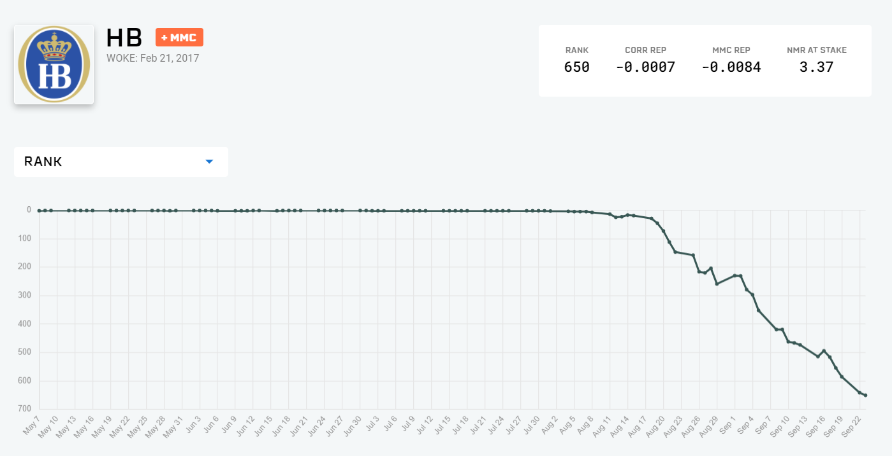

# OHwA S03E01

To kick-start Season 3 of Office Hours, Arbitrage interviewed one of the most requested users, NASA JPL scientist [HB](https://numer.ai/hb).

The full interview with HB will be published on YouTube.

### Questions from Slido

_Author's note: these are the data-related questions from this episode; most questions were for HB about his work._

**HB: are there any similarities between the data that you work on and the Numerai data set?**

> "There's definitely lessons to be learned from both." - HB

HB explained that what he does for work is mostly phenomenological modeling (physics modeling, trajectories) and geological uncertainty in the event of a crash landing. Rather than looking for a signal in his data, HB is mostly running simulations.

There is a statistical analysis side to his work which has more crossover with the Numerai tournament. "I learned a lot about quantifying uncertainties," HB said, "and being able to understand the Numerai data set has made me able to communicate the statistics and the likelihoods and probabilities about my work to the rest of the community at JPL better than I would be otherwise."

**Bor asks: can you tell me more about your work? Specifically the probabilistic risk assessment part? And do you translate part of that to your Numerai models?**

HB said he doesn't think anything has flowed backwards. "The Numerai problems are typically harder," he said. "Numerai is a harder problem, but in my JPL work there's more uncertainty." He explained that Numerai provides a ton of data with no signal, whereas his work data has to operate under a lot of assumptions in order to keep moving forward.

On the topic of risk assessment, HB referenced as examples: achieving the team's science goals, the likelihood of contaminating a Europa ocean, and the likelihood of completing the Jupiter orbit insertion burn.

> "That's a big, long burn where we have to change our velocity by hundreds of meters per second ... that's the one event (besides launch) that we have no backup opportunity for on the whole mission. It's the one critical event. We look at the likelihood of achieving that critical event."

The way they address that probabilistically is through reliability modeling of each component of the spacecraft (historical fault rates and likelihood of being upset by radiation), piecing that together into a single spacecraft-level model that also understands and factors in backup systems and components, and using that model to figure out the likelihood of completing the insertion burn.

_If you’re passionate about finance, machine learning, or data science and you’re not competing in_[ _the most challenging data science tournament in the world_](https://numer.ai/tournament)\_, what are you waiting for?

Don’t miss the next Office Hours with Arbitrage : follow\_[ _Numerai on Twitter_](http://twitter.com/numerai) _or join the discussion on_[ _Rocket.Chat_](https://community.numer.ai/home) \_for the next time and date.

Thank you to\_ [_HB_](https://numer.ai/hb) _for returning to the Earth's surface to be interviewed_ _and to_ [_Arbitrage_](https://numer.ai/arbitrage) _for hosting._
