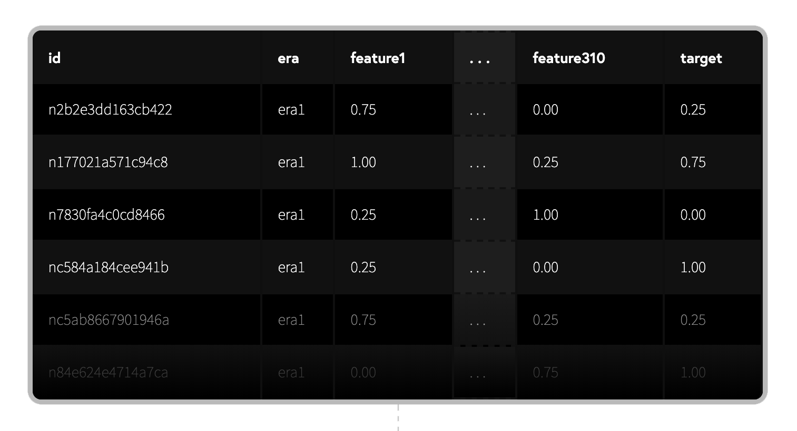

# The Structure of Numerai

_This page was last updated March 26, 2021_

This page is part of [_Understanding Numerai_ ](./)by **wigglemuse**.  
 

**Hey you! New user!**  

Are you perplexed, bewildered, flummoxed?  

_**Are you just trying to figure out what the heck is going on here?**_

You've come to right place. Let's break it down and figure it out!

Here's what the official docs say in the introduction:

> _The Numerai Tournament is where you build machine learning models on abstract financial data to predict the stock market. Your models can be staked with the NMR cryptocurrency to earn rewards based on performance._
>
> _The staked models of Numerai are combined to form the Meta Model which controls the capital of the Numerai hedge fund across the global stock market._

Ok, but _huh_?

**Numerai** is made up of three quite different but interdependent components. Think of the points of a triangle: each connected to the others, and all are needed to complete the whole.

## The Numerai Triangle

```text
HEDGE FUND ____________________  USER MODELS
           ╲                  ╱  AI
            ╲                ╱   DATA SCIENCE
             ╲              ╱    MACHINE LEARNING
              ╲            ╱ 
               ╲          ╱     
                ╲        ╱      
                 ╲      ╱     * ed. note to self:
                  ╲    ╱      replace lo-fi triangle
                   ╲  ╱       w/ snazzy illustration
                    ╲╱ 
               REWARDS/STAKING
               CRYPTO/ERASURE
               NUMERAIRE (NMR)
```

### 

### Hedge Fund

The Hedge Fund \("the HF"\) is the reason for all of this. Numerai \(the company\) operates a hedge fund. This is a traditional quantitative hedge fund, operating in and regulated by the United States. They take long and short positions on stocks of real-world companies in the traditional financial markets, just like any other hedge fund. The Numerai fund is market neutral -- the aim is to profit in any market condition and not be exposed to market swings or any major risk factors.

#### HF common questions

**Do they trade crypto?**   
No. The HF itself has nothing to do with cryptocurrencies or blockchains. We will get to that point on the triangle below.

**Can I invest in the hedge fund?**  
No. Well, a qualified no anyway. I suppose if you are an institutional or accredited investor and really wanted to invest in the HF, maybe you could, but I really have nothing to say about that here. _The typical Numerai user is not and will never be directly invested in the HF_. Hedge funds are highly regulated and they would not be allowed to just open up investment to users even if they wanted to.

**How is the hedge fund doing?  Is the performance good?**  
The HF performance is not disclosed. If and when the hedge reaches a certain size of AUM \(assets under management\), they will be required to register with the SEC, and periodically file reports of certain types of their holdings, etc. But in general, any performance data is reserved for investors and potential investors. This is par for the course in the industry.

**Then what is the relationship of the HF to a Numerai participant? What do they need us for?**  
This is the part of the HF that is not traditional, and is the _cornerstone innovation_ of this whole enterprise. A hedge fund needs to figure out what stocks to buy and sell, right? A normal hedge fund has a small army of analysts, quants, and traders working on that. Numerai has us instead. Which brings us to the next point on the triangle.


### User Models 

#### AI / Data Science / Machine Learning

This is the "AI" part of NumerAI, and is where we come in. Again, Numerai's HF has to determine what positions on which stocks it is going to take. You'll see the word "signal" quite often around here, and that's what we as participants provide: numerical predictions of where we think individual stocks are going to go in the in next days and weeks -- that's a signal.

Because Numerai does not have that small army of quants, they need signals: predictions of future market behavior.  And they crowdsource those predictions from us.  However, we're not just "picking stocks", we are creating _machine learning models_ to evaluate and predict thousands of stocks weekly. Specifically, we are ranking stocks relative to each other, rather than trying to predict specific price values \(or any specific values\).

So all of us users create all these predictions and submit them to Numerai. Numerai then combines them all into one big ensemble model which is referred to as the **Meta Model**.  \(I'm just gonna go with the single word "metamodel" from now on.\) And this metamodel -- the combined predictions/signals of the users -- are what they use to make trading decisions for the Hedge Fund.

There are two ways to participate and provide signals to Numerai:

1. Numerai Tournament
2. Numerai Signals

The main \(or "classic"\) Numerai Tournament has been around for several years now, and has gone through a few major transformations. It has maintained the basic form that it presently has since about mid-2019.  However, it is still under active development, so some of the rules and data gets adjusted from time to time.

On the other hand, Numerai Signals is quite new having only gone live a couple of months ago \(late 2020\), and as of this writing is not quite fully mature with rapid changes and constant improvements. I'm mostly going to be talking about the main Tournament here, as Signals is for more "advanced" users. You will find Signals much easier to understand once you've got a solid understanding the classic Tournament.

What's the difference? In the main Tournament, Numerai provides us with a large training data set. Our task is then to take that data and make machine learning models which are capable of predicting unseen data of the same format, a new batch of which is released every week.

The data set is cleaned, regularized, and most importantly: obfuscated. That means we don't know what it represents! So the data itself is essentially a black box. It has rows of feature columns along with a target for your model to learn to predict. But we are given \(almost\) no information about what the features actually are. So even though the each row represents a stock market security, there is no way for the user to discover which real-world stocks they represent.

Why is all this information hidden? The main reason is that they couldn't give you the data otherwise! High-quality financial data is _very_ expensive, and because of license restrictions they cannot just give it to you for free. But, if the data is obfuscated so that you can't tell what the stocks or the features are, they've worked it out so they can freely give away the data for you to make models.



There are a ton of common questions and confusions about the data set and what is expected of your models. A few of the most common ones are below. But many more ~~are~~ \[will be soon\] covered in detail in the following pages. For now, it is enough to know that for you to participate in the Tournament, you don't need to bring anything but your data science and machine learning skills. \(And if you don't have those skills, this is a great project to work on in order to learn them.\)

  
**So what's Signals?**  
Numerai Signals is for those participants that have access to or can acquire their own data.  And then they make models and submit predictions based on that.  Signals is more of a free-for-all, and is going to be more difficult for most users.  As I said, I'm not going to get into Signals details too much as it is pretty new, undergoing changes quite rapidly, and I myself am not participating yet so I just have less ability to explain it. However, even if you are only interested in Signals \(or think you are\), take some time to at least understand the basics of the main Tournament as it will make much easier to understand Signals.  The basic structure is much the same.

#### 

#### User Models common questions

Congratulations, you are now a data scientist!

New users often come to Numerai with a lot of assumptions about how it must work. A lot of these assumptions are wrong, so here are a few of the questions that almost always come up immediately for new participants.

**In the main Tournament, how can this possibly work if I don't know what the features represent?**  
If you already have some background in finance/trading or working with stock data, you probably have some ideas about how this should be tackled, what features you want to look at, etc etc. It is best to forget all that when making models with this data -- domain knowledge is not likely to help you here. Some people really bristle at this, but I assure you that there are many users competing quite successfully using the given data.

**Why does Numerai even do this? If it had that small army of quants using the "real" data, couldn't they make better predictions that us?**  
Well, that's what they are finding out. Numerai's bet is that a large army \(thousands, anyway\) of "citizen data scientists" from all over the world, all with different skills and ideas, can -- when combined -- beat that small army of quants, who tend to come from similar backgrounds with similar training.  The vast majority of Numerai participants are not employed in finance, and are not expert traders. Although it is true we don't currently know how the HF is performing, we have gotten feedback that the team is pretty happy with the metamodel that our predictions creates.  _So it seems to be working._  The wisdom of the crowd.

**Stock market prediction requires time-series analysis.  How can I do that with this data?**  
There you go again with your assumptions. I'm afraid to inform you that basically, you can't. Although there is _some_ temporal ordering to the data as it comes in blocks of rows called eras, it is a tabular format with each row representing some real-world equity for that time period. But none of these rows are identified, so there is no way to match up a row that represents a particular stock to another row from a different time period that represents the same stock. However, if you are really dying to do time-series analysis, then you can certainly do that in Numerai Signals \(but you gotta acquire your own data\).

**I've already got a stock trading model.  Can I use it for Numerai?**  
In the main tournament, definitely not, for reasons that should now be obvious. For Signals, maybe. It has to be the right kind of model. If your model just "picks stocks", or only deals with a very small number of stocks, it probably won't be suitable. Models for Signals need to quant models that _rank stocks_. It is all about relative comparison. The minimum number of predictions that must be included for a valid submission is only something like 10 stocks, but if you seriously want to compete in Signals you probably want submissions that are predicting at least dozens of stocks, if not hundreds or thousands.  Signals predictions also are subjected to a mysterious "neutralization" procedure that may make your existing model unsuitable. _**Signals is hard.**_ That's almost all I'm gonna say about Signals here. Check out the Signals docs and linked resources there.

**Do I need to be an expert programmer?  
Do I need to be a math whiz?  
Do I need a super computer?**  
Not gonna lie, these things are all very helpful. Coding especially. Stats background is useful. And the more computing resources you have access to, the less hassle certain aspects are are going to be. _However_, we do have users \(some quite high-profile\) that came to Numerai with little to no coding skills or machine learning experience and used Numerai as a learning project. As far as computing resources, things like online Colab notebooks are enough to get you started if you don't have a system with enough capabilities. If you just dive in, it will quickly become apparent which skills and resources you might need to shore up. But for most, the main thing that is required no matter where they are starting out is the willingness to learn. ****_Numerai is a challenge for **every** participant._ But a fun and rewarding challenge for many.

**Isn't Numerai just going to steal my model?**  
Nope. Numerai never has access to your model, or the code that generated it. You only submit predictions.

**Then what's in it for me? Why do I want to help the hedge fund if I can't invest in it?**  
That brings us to the third point on the triangle. Read on.


### Rewards / Staking

#### **Crypto / Erasure / Numeraire \(NMR\)**

The third point on the triangle is what holds it all together and makes it work for everybody.  

Consider the problem that Numerai created for itself when it decided to crowdsource its intelligence:

They needed to entice people to provide signals/predictions, i.e. they needed a reward system that would somehow pay the users for their signals. But since they are using those signals to make real-world trading decisions for the hedge fund, and obviously not every signal from every user would be great or even good, they needed a way to decide which of those signals they could trust.

There is an important distinction here. _Trust_ is not the same as "being right".  _Being right_ is you made some predictions and then they turned out to be accurate. Obviously that's what they ultimately want to reward you for: accurate predictions.  But...you can be right at least some of the time just by accident, just by randomness. And if they accept all predictions from anybody, it doesn't take long for bad actors to figure out that they can submit good predictions at least some of the time by exactly that method: just submit a bunch of random predictions \(or opposing predictions\), some of them will turn out well, get paid, repeat.  So Numerai has to figure out which predictions are made in "good faith", i.e. which are real predictions  they can _trust_ and not "bad faith" garbage predictions that just happen to be right sometimes. Trusted good faith predictions can be sometimes inaccurate and still be trusted -- no model will deliver only good predictions all the time.  We are predicting the stock market: _it's not easy_.

* There has to be a _**reward**_ for accurate predictions.
* Numerai has to know which predictions it can _**trust**_, and it has to know that _before_ it relies on them for hedge fund trading.
* The system must be _**immune from abuse**_ by bad actors \(or at least highly resistant to it\).

How to reconcile these requirements?  Well, what if there was a _punishment_ for poor predictions?  Enter **staking**.

Staking uses the "skin in the game" principle.  In order to be eligible for rewards, you must put up something yourself that is at risk.  So you put up a **stake** on your model. And then if your predictions turn out to be accurate, your stake remains and you earn additional rewards. But if your predictions turn out badly, you lose some of your stake. We call that "burning".


**STAKING IS OPTIONAL.** You do not have to stake in order to make models and submit predictions to Numerai.  If you aren't staked you won't earn rewards, but you won't be at risk of losing anything either.  In fact, it is recommended that new users do not stake \(or stake very little\) for a while until they make some models and get some feedback on their performance. Some users never stake -- they just want to learn machine learning. Unstaked models are evaluated/scored just like any other, but they are not used by the hedge fund for making trading decisions.


Before we get into how all that is implemented, let's continue on with the _why_ for a bit.  Why should users be at risk?  Because it creates that _trust_ mentioned above.  If you are willing to risk losing some of your stake in order to earn rewards, it ensures to Numerai that you are submitting good faith predictions. When implemented correctly, it gets rid of the bad actors who would game the system with nonsense predictions that attempt to earn without having any true predictive value. \(In earlier versions of the Tournament, this was a real problem.\)


Your actual performance score that determines the amounts of your earns and burns is based on correlation with the prediction target. So the difference between earning and burning is whether or not that correlation is positive \(good, earn\) or negative \(bad, burn\). Details of the exact scoring method ~~are~~ \[will be soon\] covered in the following pages of this section.


**Sounds like gambling.  Are we just making bets and gambling?**  
If we consider the staking mechanism and the earns and burns solely from the user point-of-view as a risk vs reward math problem, then yes, it fits into that framework. But that's a unnecessarily disingenuous label to put on it, because the same basic equation applies to so many other things we wouldn't dismiss as "mere gambling". Stock market investment for one! Or any kind of investment like buying real estate, starting a business, even things like getting married, etc etc. No risk, no reward is a basic truism everywhere in life. Also, in true gambling-type gambling, there is a "house" hoping for you to lose -- someone that will gain by your loss. Not so here. Everybody wants you to win! Staking at Numerai is about establishing that trust relationship as I mentioned, but the amount you stake is also a indicator of the confidence you have in your predictions -- the more you stake, the more weight your signal is given in the metamodel that determines the trading decisions for the hedge fund. In fact, from what we understand from the team, stake value is actually the _only_ thing that they use to determine how much weight to give to a user model in the metamodel ensemble. \(You'll often hear the longer term "stake-weighted metamodel" used, because that's how it is created.\)

**So if I suffer a burn and lose some of my stake, where does that lost portion go?  Who gets it?**  
_This is where it gets a bit weird._ Nobody gets it. It is just destroyed.

**What do you mean it is just destroyed? What is this sorcery?**  
I haven't yet discussed _what_ you are actually staking. For staking on Numerai, we use a cryptocurrency token called Numeraire, or NMR. This is an ERC-20 token on the Ethereum \(ETH\) blockchain. NMR powers a protocol called Erasure. The Erasure Protocol can be used to create smart contracts that enable such things as... surprise, the Numerai staking mechanism! _Numerai staking runs on the ETH blockchain using the Erasure Protocol powered by the token NMR._ Wow!


I'm not going to attempt to explain the technical bits of smart contracts or Erasure or the NMR token.  I couldn't if I wanted to. However, there are some links at the bottom of this section to read more about the NMR token and Erasure.


Ok, this part is super confusing for anybody that isn't a smart contract/cryptocurrency/blockchain expert.  Which is not me.  I'm not even sure the above paragraph is completely correct, but it is close enough to understand that staking is the "crypto" part of Numerai.  And that the Erasure Protocol implements what we've been talking about in terms of staking.  

Basically, we are on one side of the smart contract as the stakers and providers of predictions, and Numerai is on the other side as the receiver of the predictions as well as the arbiter of their quality \(i.e. they are the scorekeepers\).  A key part of the Erasure Protocol is the so-called "griefing" mechanism, which is what we call "burns" here.  What that means is that by staking, we are giving Numerai permission to grief/burn a portion of our stake if our predictions are poor. Grief/burn = destroy.  So when we suffer a burn, that NMR that is burned is gone forever -- nobody gets it. This is key.

_**No part of your stake ever goes to Numerai \(or to anybody else\).**_

I just want to be clear about that because sometimes new users have the mistaken idea that our stakes are somehow used/spent by Numerai \(like to buy stocks for the hedge fund -- nope nope nope\), or that other users win what you lose \(nope nope nope\).  As long as we are staked, that stake is locked up on the ETH blockchain -- we don't have access to it but nobody else does either.  \(In practice, under the current system, it is automatically re-staked for the each round with any earns added to or burns subtracted from the stake, and so it just grows or shrinks until you unstake it.\)  It is true that Numerai is the custodian of the NMR wallet that is associated with your account, but any NMR in that wallet is yours.  So again, under no circumstance does anybody else gain ownership over your stake or any amount that is burned, i.e. _**your stake is not a loan to Numerai and no one gains from your loss**_. All those details \[will be\] covered in following pages.


I don't want to give the impression that it is likely that your entire stake will be destroyed.  It is technically possible it could happen if you suffer some _really bad_ scores for several rounds in a row, but under the current scoring mechanism \(which has caps on the proportions of earns/burns for a single round of the tournament\), it would be pretty tough to lose the entire amount of any significant stake.  It would take a long time anyway, and there is no requirement to continue staking round-to-round.  All that ~~is~~ \[will be\] covered later.  When talking about the amounts earned and burned, we are generally talking about relatively small proportions of your stake.


**Enough about burning.  What about earning?**  
That's what everybody wants!  If you've listened to Numerai founder and head visionary Richard Craib in an interview, it is highly likely you've heard him use the phrase "aligned incentives".  That's what the staking/reward mechanism does: gets all parties rowing the boat in the same direction. Let's look at the situation again.

* Numerai needs the hedge fund to thrive and profit in order to survive and attract more investors.
* Numerai doesn't have in-house quants. We are their intelligence department.  Therefore, to survive and thrive, they need good predictions from us. 
* Numerai needs to know which predictions are likely more reliable than others in order to make the best metamodel possible.  \(Again, the metamodel is the grand ensemble of user predictions, which controls which positions they take in the market.\)
* Numerai is therefore strongly incentivized to reward us for good predictions as their existence depends on them, but it is also must protect itself from scammers looking to game the system.

The staking/reward system takes care of all of that.  What about the user side?  Users need to be rewarded for their predictions, and the reward must be great enough to keep them interested and submitting those good predictions.  

As I said above, Numerai doesn't gain from your loss. Numerai only benefits when you benefit.  If your predictions are bad, the metamodel suffers and thus so does the hedge fund. When your predictions are good, the metamodal improves, the hedge fund benefits, and you get rewards. All incentives aligned towards the same goal.

**What about the other users? It is called a "tournament" after all. Isn't this a competition?**  
It is possible the word "tournament" has become something of a misnomer. In the earliest version of Numerai, it really was a tournament with a winner, and in further iterations there were a number of competitve aspects to it based on rank, etc \(there was a bonus system for high-ranked users, for instance\).  But it has undergone a few major and a bunch of minor transformations to the scoring/staking/reward structure that we currently have, and the fact is that _most_ of the competitive aspects simply do not exist any more.  So while we still call it a "tournament", it isn't the most accurate term anymore.  However, there is one component of the scoring/reward system which still has a "you vs everybody else" relative structure to it, which is something called MMC \(short for "metamodel contribution" -- explained along with the rest of the scoring details in the next part\).  But participating in MMC is optional.  Your main base score is a correlation score that is somewhat like a golf score -- it is strictly about how your predictions did against the real stock market in a absolute sense, and it doesn't matter how anybody else did on the same round.  We do have a leaderboard, but it is mainly for bragging rights at this point, and just something to look at to see how different users and different types of models are doing.


Over time, as the competitive nature of the Tournament has lessened, the collaborative nature of the Numerai user community has grown. And this is in all our interests -- the better models we help each other create, the more rewards we get back, and the better the metamodel becomes and thus the hedge fund.  That's a positive feedback loop we want to keep going.


**The NMR token.  How do I get some?**  
NMR is like any other cryptocurrency such as bitcoin -- you get it on a crypto exchange. Of course, what most people want to know is how you go from fiat \("real money" like USD\) to NMR and then later back again to fiat with your earnings.  To go from fiat to crypto and back again you pretty much have to sign up with an centralized, regulated exchange, i.e. a company like CoinBase.  But which exchange exactly you might use depends mostly on the country you live in. So if you don't have an account at any exchange you'll have to sign up for one in your region and probably have to provide ID and banking details, etc. I will just point out that even though not every exchange will have NMR \(although many do and that number is growing\), since it is an ETH-based token all you actually need to be able to acquire is ETH \(which all exchanges have\). And that's because NMR is also available on the decentralized Uniswap exchange platform which can be used with a decentralized crypto wallet like MetaMask -- those are crypto-only services that anybody can use without providing id or creating a centralized account with some company.  There are tutorials on how to navigate this, but bottom line is that any reputatble crypto exchange in your region from which you can buy ETH will give you a pathway to acquire NMR even if they don't directly offer a market for it.

You can also get small amounts of NMR directly from Numerai. You might find a tiny amount given to you when you create a model for the first time.  They also offer bounties for bug reports and other things, but for most users wishing to stake any significant amount, they'll need to acquire it on a crypto exchange.

**The price of NMR itself can change.  Isn't that risk too?**  
Yes, it definitely is.  The NMR token is traded in crypto markets, and is subject to the same ups and downs as Bitcoin, Ethereum, etc.  And this so-called "currency risk" could be quite significant as a big drop in NMR price might not have anything to do with Numerai specifically, but just crypto trends in general.  Of course the reverse is also true, and NMR has had a general upward trend for the last year or so as of this writing.  So when making decisions about how much risk you are willing to tolerate, currency risk must definitely be considered.  _Never risk more than you can afford to lose_, as they say.

**I don't want to make models -- I just want to stake and generate earnings. Can I stake on other people's models?**  
Not at this time, not officially anyway. However, this is a popular topic. While there is nothing preventing you and a user from making a private arrangement for you to provide staking/backing for one of their models, there is no mechanism provided by Numerai for this and there probably will not be for the foreseeable future. So any such arrangements would be private and the risk would be 100% yours between you and such a user. \(There are experiments and work going on in this area from users trying to figure out the best way to facilitate such arrangements. Check out RocketChat and the Forum about that.\)

**But why this way instead of that way? Seems like they should do X, Y, & Z -- that'd be smarter and work better.**  
In this document, I'm trying to stick to _the way things are_. Questions about why isn't it some other way are a bit too much into the weeds for now, but I will tackle some of those questions and concerns in the next \[upcoming\] pages.  \(But the short answer for most of those questions is usually "they tried that already".\)

**Here are some links to more info about NMR and Erasure:**  
[Erasure World](https://erasure.world/) \(Erasure home page\)  
[NMR 2.0 is now live!](https://medium.com/numerai/nmr2point0-66a45a9a5e70) \(article\)  
[The Erasure Protocol Awakens on Ethereum Mainnet](https://medium.com/numerai/the-erasure-protocol-awakens-48a34cc4b5d0) \(article\)  
[Numerai Terms of Service](https://numer.ai/terms) -- the TOS actually has a fair bit of good info about the token and about everything -- worth _actually_ reading  
  
\* note that "Erasure Quant" is dead -- Numerai Signals is the replacement

## Triangle Revisited

Let's look at the Numerai Triangle again with slightly altered labels. 

```text
            direct links
               data --> 
           <-- predictions         
NUMERAI ____________________  USERS 
(THEM)  ╲                  ╱  (US)
   ┊     ╲                ╱     ┊
   ┊      ╲              ╱      ┊
   ┊       ╲            ╱       ┊   
   ┊        ╲          ╱        ┊
   ┊         ╲        ╱         ┊
   ┊          ╲      ╱          ┊   *ed. note
   ┊           ╲    ╱  indirect ┊    to self:
   ┊            ╲  ╱     links  ┊     jazz this
   ┊             ╲╱             ┊     one up also
   ╰┄┄┄┄┄┄┄ STAKING/NMR ┄┄┄┄┄┄┄┄╯
        (EARN/BURN INTERFACE)
```

Numerai and the Users, and the relationships between them.  Data flows directly from Numerai to the Users, and predictions/signals flow directly back. But when it comes to staking and earning/burning, that relationship is indirect and runs through the interface of staking, governed by the smart contract running on the ETH blockchain using NMR as currency.  So simple now.

**Got it?  Good.**

On the following pages \[coming soon!\], I'll cover more "how to do it" details and answer all your questions. 

‌ _This page was last updated March 26, 2021 by **wigglemuse**_

## 

#### Official Disclaimer‌

While this page forms part of Numerai's official documentation, Numerai is not involved in the development or maintenance of this page at this time.‌

If you need any verification or clarification of any of Numerai's rules, reach out to us at the [`#support channel`](https://community.numer.ai/channel/support) or email `support@numer.ai`.

