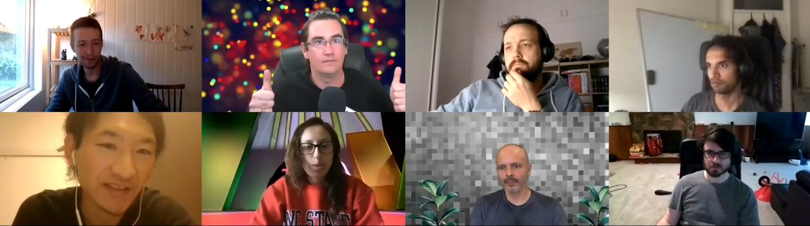

# OHwA S02E05

For the fifth episode of Season 2, Arbitrage was joined by [Yuki](https://twitter.com/blog\_uki), a machine learning trader based in Japan and who recently wrote [an outstanding article on the Numerai tournament](https://towardsdatascience.com/numerai-tournament-blending-traditional-quantitative-approach-modern-machine-learning-67ebbb69e00c).



You can check out [the full interview after the Slido questions below](ohwa-s02e05.md#interview-with-yuki).

### Questions from Slido

**If Numerai hires a few more top competitors from the leaderboard do they even need all other users anymore?**

> "Yes! They still need us!" - Arbitrage

Groupthink is real and can be a problem. Arbitrage used the example of [Michael Oliver](https://numer.ai/mdo) and [Mike P](https://numer.ai/master\_key), both top competitors who now work for Numerai. He pointed out that the differences in their learning has converged now that they're in the same environment, so Numerai gets the immediate benefit of hiring a highly skilled outsider but over time that new hire converges to confirm with their peers.

Ultimately Numerai will still need other data scientists because everyone who competes has different life experiences influencing their modeling and how they look at the problem set. "That's how we're going to move the meta-model forward," Arbitrage said, "by having a very diverse user base that's just trying to solve the problem in a different way. Numerai could never hire enough data scientists to get the meta-model just right, because once you get the data, you overfit."

**What sort of basic tuning would you recommend for a neural net on this data set?**

Arbitrage's advice is to keep it simple. He believes that you can build a very performant model using some type of ensembling. Arbitrage thinks about it as a mean variance optimization problem. "What do you need in a portfolio to maximize your return? Uncorrelated assets! A lot of them! So I look for models that are not correlated and I put 'em all together."

He also stressed the importance of optimizing your sharpe: minimize your downside variance in the validation data. Arbitrage doesn't have any production models that don't have at least one burn era in their validation data.

Do your own evaluation and look at what your return would be if you had on average 2% positive correlation and a minimum burn of 1.3% where you burn 5% of the time. Compare that to models at the top of the leaderboard to see how you would be performing.

**What's the strangest thing you've done in the tournament and did it work?**

K-nearest neighbors is, by his admission, one of the weirdest things Arbitrage has attempted with the tournament. "It was strange because it was right on the edge of completely melting my computer," Arbitrage said. It was when the tournament data only had 21 features (Arbitrage recalled that when they upped the features to 51 he couldn't run this model anymore), and he found that overall it was pretty good but he wouldn't use it now (especially with 310 features).

Arbitrage also admitted to uploading and staking on a simple logistic regression, which was surprisingly performant for a period of time. "I thought that was goofy but it worked," he said, adding, "in fact for a few months, I put \[that model] in [Arbitrage](https://numer.ai/arbitrage). This was like, two years ago, but it was doing so well I figured I might as well put it on my main model."

**What is the most notable hedge fund in Japan?**

Arbitrage asked Yuki to help answer this one.

**Yuki:** In Japan, most people don't invest with hedge funds... but in recent years I think roboadvisors have become very popular.

**Where do you see Numerai and its userbase in a few years?**

Arbitrage sees it expanding but hopes that as more new people join, they'll stick around longer. "There's too much churn," he said. More users help because they bring more eyes onto the problem.

**How sad is it that most of us can't seem to beat the** [**example predictions**](https://numer.ai/integration\_test)**?**

According to Arbitrage, the example predictions have really high correlation but they're not optimizing for sharpe. That means staking on the example model is risky (as someone pointed out in [Rocket.Chat](https://community.numer.ai), the example model fell below rank 500 for a period of time).

Arbitrage's current hypothesis is that if you can beat the example predictions' Numerai sharpe ([explained in Season 2 Episode 4](https://app.gitbook.com/@numerai/s/numerai-tournament/\~/drafts/-MBk52zVAW8rxh18b6UM/office-hours-with-arbitrage/office-hours-recaps-season-2/ohwa-s02e04)), your model is likely to beat the example model.

**Are MMC and correlation so different such that we would never see a single model be ranked in the top 50 for both tournaments?**

> "If people stop staking on XGBoost." -Arbitrage

There are so many models chasing correlation that it's pushing the performance of the meta-model in that direction. If all of the data scientists tried to have high Numerai sharpe instead of correlation, the meta-model itself may not swing as wildly and its own sharpe would be better. Arbitrage thinks that this would improve the meta-model's alpha.

**Joakim asks Yuki: Are people skeptical about blending machine learning with a traditional quantitative approach?**

Yuki believes there's still a lot of skepticism out there for integrating machine learning into quantitative finance. He referenced the surplus of firms that claim to be AI-based but don't actually employ any AI as a contributing factor to the skepticism.

**Any news on more metrics? Live sharpe? Drawdown length / depth? Others' validation performance?**

Mike P pointed out that because you can train on the validation set, making participants' validation performance publicly viewable wouldn't necessarily be informative that often.

Arbitrage agreed with Mike that it probably wouldn't be useful, but he also doesn't care if anyone can see his validation performance.

**Any thoughts on the negative skew of the correlation distribution of recently resolved rounds?**

Arbitrage doesn't think it means anything, adding that we're going to see oscillations and a variety of different market regimes effecting overall performance. He would love to see a cluster analysis that only looked at the linear or tree based models, for example.

**How well does MMC correlate with actual usefulness of the current/new meta-model?**

Mike P explained that over a long period of time, MMC has high correlation with usefuless to the meta-model. "It's really hard to see it in any single week, though," Mike said.

**When do you think there will be the next heavy burn period where Example Predictions burns 5% for a few weeks in succession? Would that result in a crash of the NMR price?**

No because if people are adjusting their risk appropriately, they'll be selling when they do well and buying when they're not performing well.

**The meaning of "target" as it relates to the Numerai tournament data set changed between Bernie and Kazutsugi, from something to a 'residual' something- can you explain that?**

\*\*\*\*[**Richard**](https://twitter.com/richardcraib)**:** By "residual" we mean the part of the return that's not explained by the other things that explain return. So, if Apple goes up 10% in one month but the US tech industry is up 8% that month, then the residual return is just the 2%. If we're going to be US technology neutral, we care about the residual piece because we're going to be short something that ideally went up a little bit less than 8%; we would want to be long Apple. That's a big change. If you look at returns of stocks, really a lot of the returns can be explained by sectors and countries and other factors. By taking all of those out, you make a problem that's a bit harder but also can tend to be a bit more stable. If we left the Bernie return in, the previous returns were, without the residualization, you might end up making a model that's really just a long bet on one sector. That's bad for you because you might be right in-sample, but it's very unlikely that that sector bet would be the main thing driving the market for the rest of its life.

**Do you also residualize to a standard set of borrow factors? Or are those among the features?**

**Richard:** Yeah, we do. Country and sector play a large part in explaining returns and so do factors. Factors like the value factor, or momentum, are important to neutralize out as well.

\*\*\*\*[**TheMicon**](https://numer.ai/themicon)**:** Ah cool, so those are not in the Kazutsugi target value set?

**Richard:** Well ... \[long pause] ... Some of our features might be things to do with value. But that doesn't mean that we can't neutralize to some other measure of value. You can think about it as very much inspired by the [Barra model](https://www.msci.com/www/research-paper/barra-s-risk-models/014972229) where the major Barra factors are country, sector, and factor returns. We are trying to take all of those out.

**Arbitrage:** Well you have to be neutral to all of that for your investors, right? Because otherwise, they could just buy exposure to all of that on their own, they wouldn't need to pay you to do it.

**Richard:** Right. What we thought we could do in previous versions of the tournament was give you all data to model the raw returns and then in our optimizer we could just pull out all of the factor returns and the sector returns and neutralize to them. But there was very little left. Having the target match what we actually want is much better, so that's why \[the Kazutsugi] targets were a bigger help.

**TheMicon:** Do you think that's why we're doing so well on the data set? Or do you think that's a coincidence and the markets are just juicy for quant funds?

**Richard:** I don't think the markets are that good for quant funds, one of the market neutral funds is down 20% for the year. Even the ones that don't take factor exposure haven't done well. I think there's also some interplay between having a target that's residual and then the models tending to generalize more. I think the targets are a big reason, but also that if you're going to do machine learning problems in the same format that we've set them up, it really is quite well designed for residual targets. It wouldn't make as much sense to have the problem set up without them. The other approach we could have done was given the users all of the sector and factor data and said, "here's the country category and the value category," or something like that, and had them think about the whole problem. But I think this approach is a lot better because you're building things that tend to be much more robust and generalize better because anything you're learning on this data set is something that applies to all sectors, countries, and regimes (ideally).

**Arbitrage asks Richard: can you expand a bit on Numerai Sharpe?**

**Richard:** Yeah I talk about this thing to look at if you want to get an estimate of what the costs would be (costs are a big factor in a quant fund with a lot of leverage), so there's nothing theoretical about what I said, it's just a kind of experimental thing.

**Arbitrage:** But you would our calculated Numerai sharpe to be as high as possible, that would be more beneficial than something with a very high average correlation, true or false.

**Richard:** I'm not going to answer true or false to that question. Here's how I'll say it: if we were only trading your model, we might ask you to optimize for Numerai sharpe, the one I shared.

_From the previous Office Hours:_

```
Richard Craib : Numerai Sharpe = (mean(era_scores)-0.010415154)/std(era_scores)
Richard Craib : *sqrt(12)
```

**Richard:** By itself, that means your model is cost aware and things like that. But, that isn't the situation we're faced with and you **could** have a model with a correlation of 0.02 or 0.01 on the test set that actually is additive to us, and that's the important thing about what we're doing. The trick is, we only have to pay the cost once and none of our users have to pay the cost. So we can make a better meta-model even if you have a model that performed extremely badly after costs. If it was helpful pre-costs, we can add it to our model after costs. It definitely is helpful to have all sorts of models.

**Arbitrage:** There it is, you definitely don't want everybody chasing the same thing like correlation or Numerai sharpe. But I think that the models that have good Numerai sharpe will do well and have positive MMC in burn periods solely because they're not trying to hit home runs on correlation.

**Richard:** Yeah, you can't have it all. One of the things that we gave out before subtracting the cost, is that if you ever optimize for sharpe without doing that subtraction, it would somehow tend to favor minimizing volatility rather than maximizing correlation. And if you have this little penalty of costs, you tend to make models that maximize it in a more balanced way. You can think about it, even in a normal sharpe calculation it's the return minus the risk free rate.

### Interview with [Yuki](https://numer.ai/uki)

**Arbitrage:** So Yuki, where do you live? I think I gave it away but I'll ask anyway.

**Yuki:** I live in Japan near Nagoya city. It's located in the central part of Japan between Tokyo and Kyoto. Have you ever visited Japan?

**Arbitrage:** I've been meaning to make it over there- if you give me an invitation I'll put it on my calendar! So Yuki, what do you do for a living?

**Yuki:** I have my own company. It's an investment company, like a private fund. The assets under management is not so much, about $1 million, and it's lead by just the two of us: my partner and me.

**Arbitrage:** So you're in finance - that makes a lot of sense why [your article](https://towardsdatascience.com/numerai-tournament-blending-traditional-quantitative-approach-modern-machine-learning-67ebbb69e00c) was written like a finance professional. I think that's why I liked it so much, it's in my language! Maybe you can help us a little bit: how would your parents describe what you do for a living?

**Yuki:** My parents would say that, "My son has his own company and is working for it." They know it's an investment company, but they don't know the details. I don't think they can describe it well.

**Arbitrage:** I think a lot of the people that I ask that question say the same thing: what they do is complex and their parents try their best. What do you do for fun?

**Yuki:** I have a lot of hobbies. Maybe the best one is trading and market analysis. I also take my kids around, and in my free time I do a lot of market analysis.

**Arbitrage:** So you're a workaholic like the rest of us. How did you find out about Numerai?

**Yuki:** I think it was in 2016, I saw Numerai's [article in Wired](https://www.wired.com/2016/12/7500-faceless-coders-paid-bitcoin-built-hedge-funds-brain/) and I was very excited.

**Arbitrage:** Do you remember when in 2016?

**Yuki:** I think it was February?

**Arbitrage:** Uh oh, you might have got me. What's your tournament username?

**Yuki:** [U-K-I](https://numer.ai/uki).

**Arbitrage:** So you read the Wired article, you started in 2017 - what do you wish you had known when you started out?

**Yuki:** When I started in 2017, the rankings changed so much so quickly and I didn't know how to evaluate my submissions. So I just stopped. I came back in April of this year (2020) after the COVID shock, and recently the participants have been performing really well. If I had known that, maybe my modelling apparatus would be different now, I think.

**Arbitrage:** Yeah, maybe a little more stability would have helped and a longer evaluation window for yourself.

**Yuki:** Yes. I like raw MMC, but recently the meta-model is performing really well. I would make a model not too concerned with MMC, I think.

**Arbitrage:** Okay. So many people believe that the tournament is too challenging, that it becomes overwhelming and too much to handle. Why do you think people feel that way?

**Yuki:** Hmm. I've been researching the stock market for years but the market data is just **too noisy** I think. It's easy to overfit and difficult to get the right features in the future. Now, most participants have good performance in \[the tournament] - I think this is awesome!

**Arbitrage:** Yeah that's interesting. The run that we've had is pretty extraordinary - we've never had such a good sequence of positive correlation for the majority of users. I do think that it's certainly drawing in more people and giving them the confidence to participate and hopefully stick around! What programming language do you use and why do you use it?

**Yuki:** I used to C, but now I use Python. I'm actually not a programmer. I used to be a hardware engineer. To be honest, I'm not good at programming.

**Arbitrage:** I resemble that comment. I think there's several people on the call right now that would agree with you that they have a quantitative background in the traditional sciences and trying to apply that in this way with Python, they feel a little bit of 'fish out of water' syndrome. I can relate to that as well, I used Numerai to learn how to be a better coder. You have a lot of experience with the tournament - can you tell us your top three tips?

**Yuki:** Alright ... Sometimes, some features have very high correlation just by themselves although they have low meta-model correlation. For example, Dexterity 7; it wasn't good one or two weeks ago and during that time the Charisma feature performed better. A simple combination of these features may be able to reach high MMC.

**Arbitrage:** Alright that was one, can you give me two more tips? I'm going to try to get as much out of you as I can, my friend.

**Yuki:** Sure. Recently I've spent more time with [Signals](https://signals.numer.ai) than the tournament and I realized that just price data alone with momentum can be very good.

**Arbitrage:** One more?

**Yuki:** For right now, I just have the two.

**Arbitrage:** Oh, he's holding back! So here's something fun, I'd like to ask you a fun question. If you could have a billboard with anything on it, what would it be and why?

**Yuki:** I thought about it, but I don't really have any ideas for this. It's really difficult.

**Arbitrage:** It is! It's your own marquee - it can say whatever you want!

**Yuki:** Maybe something advertising for my company?

**Arbitrage:** There you go, good man, advertise to increase AUM. I have another question, this one is controversial, but I ask it of everybody. Who is your favorite team member at Numerai?

**Yuki:** Someone at Numerai or tournament participants?

**Arbitrage:** We're sticking to someone on the team, I don't want to cause fights among my friends.

**Yuki:** Okay, okay. Favorite member of Numerai. It's definitely [NJ](https://twitter.com/tasha\_jade).


**Yuki:** When I write articles, she's very good at helping me out.

**Arbitrage:** Yeah she's amazing. I think she's actually the real boss. Richard's here and he may vouch for that. By the way, this puts NJ in the lead for Season 2. This is the 5th episode and this is the first repeat vote, so NJ's up by one. Yuki, what's your number one feature request or idea to make the tournament better?

**Yuki:** I think the Numerai data set and tournament are very nice. I'm really happy with them. One point: like Validation 2, how about adding your resolved rounds to validation every week? But in my experience, it seems to have better results to add the most recent data.

**Arbitrage:** So more validation data? I would agree. Yuki, do you have ten models in the tournament?

**Yuki:** Actually, I have three right now. One for the tournament, one for Signals, and the last is a monitor for features. I'm thinking of making another model for the tournament. I like models with raw meta-model correlation, but other participants are doing too well so I think I should have much more models.

**Arbitrage:** That's interesting. Like I said, your article inspired me to do a lot more research. Let's go to some fun questions here. If you could turn back time and talk to your 18 year old self, what would you say?

**Yuki:** I would advise to start investing as soon as possible. I started investing when I was 26, I think. I wish I started earlier.

**Arbitrage:** Yeah definitely - compound gains for the win, right?

**Yuki:** That's right.

**Arbitrage:** What advice would you give someone who wants to be a data scientist?

**Yuki:** I'm not actually a data scientist, so I don't think I can give good advice here. The only thing I can say is that the important thing is to make sure the science is interesting to you. You can develop better skills if you have a passion for it.

**Arbitrage:** That's great advice. That's really fantastic advice, I completely agree. You really need to be excited by what you do, or you just won't be successful. I struggled as a younger man with that. I did something I didn't enjoy but thought that it was the best path, right? It took me a while to figure that out. Do some kind of data science in a field that you like and be passionate about it. There's another thing I'd like to ask: if you could step into my shoes, what would you ask yourself that I haven't already?

**Yuki:** It's a difficult question. But, if I were you, I would ask tips for the _real_ market.

.gif>)

**Arbitrage:** I definitely have kind of avoided that. So Yuki, what are your tips for the real stock market?

(_Author's note: this is Yuki's opinion and not financial advice.)_

**Yuki:** I'm investing market-neutral both long and short. It's really good, I think. During the COVID shock, I actually had good returns. The market sometimes goes down, so I think market-neutral is the best way to invest.

**Arbitrage:** Market-neutral - I can buy into that. And I think Richard would 100% agree. And he'd say be neutral to _everything,_ not just the market. Yuki, thank you so much for hopping on and taking my questions. If you'll stick around, there's actually some questions in Slido for you. Are you able to hang out with us for a little while longer today?

**Yuki:** Of course.

**Arbitrage:** Wonderful! I know it's 5:00 am by you so thanks for hanging out.

_If you’re passionate about finance, machine learning, or data science and you’re not competing in_[ _the most challenging data science tournament in the world_](https://numer.ai/tournament)\_, what are you waiting for?

Don’t miss the next Office Hours with Arbitrage : follow\_[ _Numerai on Twitter_](http://twitter.com/numerai) _or join the discussion on_[ _Rocket.Chat_](https://community.numer.ai/home) \_for the next time and date.

Thank you to\_ [_Richard_](https://twitter.com/richardcraib)_,_ [_JRB_](https://numer.ai/jrb)_, and_ _Mike P_ _for contributing to answers during this Office Hours, to_ [_Yuki_](https://numer.ai/uki) _for being interviewed, and to_ [_Arbitrage_](https://numer.ai/arbitrage) _for hosting._

_Take some time to read_ [_Yuki's post on the Numerai tournament_](https://towardsdatascience.com/numerai-tournament-blending-traditional-quantitative-approach-modern-machine-learning-67ebbb69e00c)_._
