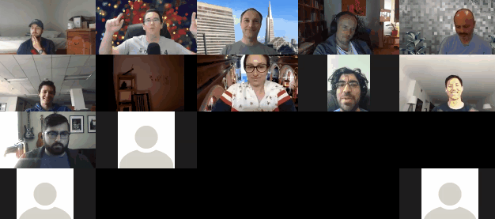

# OHwA S01E10

Arbitrage opened with a brief note on how Office Hours has grown since [number one](ohwa-1.md): we’ve had many people come back week after week, with lots of new faces each time. He noted that about half of the people who visit the Office Hours summaries actually read the post, and each week he sees lots of questions posted on Slido and sent to him directly on Rocket.Chat.

Arbitrage gave a shout-out to Patrick for his work on multi-model accounts, then in beta. This feature had been in the works for a while, first teased by Slyfox during Office Hours with Arbitrage [S01E02](ohwa-2.md).

_Author’s note: one week after this episode was recorded, multi-model accounts were made generally available:_ [_https://forum.numer.ai/t/announcing-general-availability-of-multi-model-account-support-for-all-users/399_](https://forum.numer.ai/t/announcing-general-availability-of-multi-model-account-support-for-all-users/399)\_\_

### Questions from Slido

**Is the quant-quake of August 2007 included in the training set? Asking because market behavior might be similar to market behavior in Validation 2.**\
Because Numerai doesn’t tell us the dates covered by any of their data sets, there’s no way to be certain whether or not that time period is included. Arbitrage suspects it is and some nodding of the head from Mike P was all the validation he needed. He pointed out that he would want to make sure that he data on the time before and after that event in 2007, not just the event itself, because the data leading up to and after the event matters.

> “I want as much data as possible, but I don’t only want those very difficult, high correlation eras because that will bias to those kinds of events.” -Arbitrage

Following from that question, Arbitrage asked [Joakim](https://numer.ai/joakim\_arvidsson) to expand on a previous conversation from [Rocket.Chat](http://community.numer.ai) about combining eras.

Joakim explained that he wanted a validation set and a test set that were representative of his training data so he can train his model to generalize on the validation data. To do this, he likes to include eras from a wider variety of different regimes in his training, validation, and test sets. He includes eras from early within the data set, as well as some from the Validation 2 set, so his model will generalize as much as possible.

***

According to Arbitrage, the quickest way to do a spot check on whether a strategy like Joakim’s (or really any training methodology) is working or moving in the right direction is to check the first score after submitting a model: if it shows very high correlation score (positive or negative), that suggests something has gone awry.

> “You can post a big score, but that might be a spurious correlation. I don’t want to see a big score, I want something kind of average. But I want my [MMC](https://forum.numer.ai/t/metamodel-contribution-live/449) to be high, so I want my correlation with the meta-model to be low.” -Arbitrage

In Rocket.Chat, Joakim mentioned that if the eras are time-ordered, applying something early to a later period is not consistent with time-series studies. That would be true if the data Numerai gives the data scientists weren’t already adjusted for the time period.

Arbitrage frames it this way: each era is a bucket of time that’s been neutralized for whatever correlation exists throughout time. That means if you treat each bin separately and don’t train and test on the same bin, your model should be fine. Tournament participants know that some eras are tougher than others, and Arbitrage believes these represent different market regimes. You can’t adjust your model to compensate for the regimes, however, because we don’t know what the regimes are. The difficult regimes become valuable as additional training data and to test out of sample model performance.

**From chat: Can you be more specific with “decent MMC?”**

For Arbitrage, he’s looking for around 2.5% MMC as a target (though he’s unsure whether or not that’s feasible), and is aiming to be above 1%. “That’s not science-based,” he said, “that’s just me picking a number.”

[**Rappenlager**](https://numer.ai/rappenlager) **asks: Many of the tournament data scientists use multiple accounts: do you know or have an idea of how many people are actually competing?**

Prior to the ten account rule, Arbitrage would take the total number of submissions (currently about 1,100 unstaked and 500 staked submissions per week, according to Mike P) and divide it by three (the previous account limit). While not precise, this would give a rough estimate. Arbitrage’s suspicion is that the number to divide by is probably around five now, to account for users who haven’t used up their ten model slots yet.

A quick poll of the audience revealed that most of the Office Hours regulars have ten (or close to ten) accounts.

.jpg>)

Bor mentioned that, with at least 100 people focused solely on data modeling, that would rank Numerai up with some of the top quantitative hedge funds in the world in terms of data resources.

**Is smart sharpe that much better than normal sharpe?**

On Richard Craib’s post on the Numerai forum about [performance stationarity](https://forum.numer.ai/t/performance-stationarity/151), Michael Oliver referenced [smart sharpe](https://forum.numer.ai/t/performance-stationarity/151/2?u=beanstalk), a modified sharpe calculation that accounts for autocorrelation.

The [paper](https://www.keyquant.com/Download/GetFile?Filename=%5CPublications%5CKeyQuant\_WhitePaper\_APT\_Part2.pdf) [Michael Oliver](https://numer.ai/mdo) referenced \[_not endorsement_] posits that smart sharpe leads to better model performance out of sample, which would be an advantage for anyone competing in the Numerai tournament. Michael noted that in model selection, smart sharpe offered tighter parameters than traditional sharpe, meaning it was more clear which models performed best according to smart sharpe.

**Quant revamp is coming soon - what are good data sets to get started?**

Arbitrage prefaced his answer with the caveat that Erasure Quant falls outside the purview of Office Hours but he would take a stab at it because of the likely overlapping interest. “Good data,” he said, “is by far the biggest challenge for Erasure Quant because good data is not free.”

Obtaining good daily or tick-level data on equities is extremely difficult. The best data source candidate, Arbitrage thinks, is the [Quandl Wiki Daily](https://blog.quandl.com/getting-started-with-the-quandl-api) data followed by [Big Charts](https://bigcharts.marketwatch.com/default.asp). Another recommended platform is [Alpaca](https://alpaca.markets/), and tournament data scientist Keno mentioned that doing his calculations within [Quantopian](https://www.quantopian.com/) has worked for him.

_Author’s note: The Erasure Quant revamp, called Numerai Signals, is in beta as at June 4, 2020. Check out_ [_Numerai Signals_](https://signals.numer.ai/tournament)_, read the_ [_Signals docs_](https://docs.numer.ai/numerai-signals/signals-overview)_, or join the conversation on_ [_Rocket.Chat_](https://community.numer.ai/channel/signals)_. At this point, Arbitrage had a brief interlude to interview Numerai engineer Jason. Transcript below._

**What are good approaches to get started on the Russell 3000?**

If you’re looking for signal using only pricing data, “you’re gonna have a bad time.”\
Arbitrage said that in isolation, equities pricing data is probably the most mined data set in the world. Supplemental data, like weather data, is what gives you a predictive edge. Other sources could be sentiment data from something like [Stocktwits](https://twitter.com/Stocktwits) or accounting data from financial statements like 10-Ks or 10-Qs.

**How can I best take advantage of the new ten accounts limit? Too many of my models are highly correlated with each other.**

This is a challenge Arbitrage is intimately familiar with. He explained that he likes how he built three of his models and they’ve been performant over time, so he trains them on different subsets of the data and lets them coexist even though they’re highly correlated. Arbitrage allocates his stake based on the models in which he has the most confidence.

Breaking it down: Arbitrage has three main models, each of which generates three sets of predictions (one for each subset of training data) for a total of nine submissions. His final slot, the tenth account, is the model he’s using to experiment with MMC. He uses a manual genetic process, killing off his lowest performing model roughly every ten weeks and replaces it with something new.

**I want to start staking, but I’m afraid of recent NMR price increases.**

The longer you wait to stake, the longer it takes to get paid, so if you’re considering staking but are skittish about NMR price volatility, Arbitrage suggested one strategy might be easing in and trying dollar cost averaging, adding small amounts at regular intervals.

Arbitrage mentioned that he’s withdrawing a portion of the profits within his stake to mitigate some of his risk, but he pointed out that doing so also limits his potential future earnings. “That’s the tradeoff,” he said .

**Any chance of Numerai Quant providing basic, free clean data?**

Highly unlikely- that data is very expensive.

**Please discuss future ideas or plans for MMC rep.**

Arbitrage’s first idea: MMC needs its own leaderboard with a rank to brag about and put on resumes. As a fund, Numerai wants stability, so Arbitrage’s suggestion is to reward data scientists for keeping their models consistent by having something like a quarterly payout based on MMC rep tied only to performance, not amount at stake. This would give unstaked models a chance to earn some NMR while keeping payouts non-linear.

**Slyfox (in chat):** No payouts for non-staked models.

.jpg>)

**Arbitrage:** I just got killed on that. But! We can still do what I’m talking about, just on staked models. Payout on stability.

**Mike P:** It’s important to give people long term incentives to submit consistently, so it’s something we’re losing with the leaderboard going away. We’re in a tricky spot right now even with regular reputation: if we have two leaderboards (MMC and regular), it takes some of the meaning away from both of them because there’s not one sole best person. I’m open to ideas, and I’ve said before on Rocket.Chat that if you have any ideas I’m really trying to make the leaderboard meaningful.

**We got lower sharpe numbers with Validation 2 - what exactly is in Validation 2? Would using them generate very specific models which would have high volatility?**

Validation 2 contains the Covid-19 market drawdown, so Arbitrage assumes the data starts around mid-February and ends mid-March which would include the highs from February and the selloff into March.

You get lower sharpes with Validation 2 because that data represents a significant anomaly in market time-series data.

**Does it make sense to make an Erasure Bay data-repo like Quandl? Or are there too many legal/licensing issues with that idea?**

There are too many legal and licensing issues with creating a data-repo like Quandl on Erasure.

But, there is merit to having a blockchain-validated repository of data where you can trust the quality of the data because people are staking on it. “Kind of like proof of stake for data,” Arbitrage said.

### Where Arbitrage unexpectedly interviews Jason

**Arbitrage**: Jason, how long have you been with the team now?

**Jason**: It’s been… over a year now. Last March (2019) I started.

**Arbitrage**: How did you discover Numerai?

**Jason**: I was just looking on AngelList, truthfully. I knew what kind of job I was looking for: something in AI, something at a small, scrappy startup. I had never heard of the Numerai tournament before starting, which is sad because I had a little break between my last job and starting at Numerai and this is something I would have done in my free time.

**Arbitrage**: I’d be scared to compete against you so I’m really glad you didn’t find out beforehand.

**Jason**: My data science knowledge is pretty poor. I’m more on the side of experimenting with the Numerai tournament using anonymous accounts (for now).

.jpg>)

**Jason**: Data science isn’t my forte. It’s certainly something I want to learn more of. I’m sorry - data science I’m good at, a lot of my jobs are data pipelines or data munging jobs. As far as AI goes, I’m lacking. I haven’t done deep AI since college and that was ten years ago. The most complicated things we did were SVMs and neural nets; beginner’s stuff compared to today.

**Arbitrage**: Man, I don’t know, some of the beginner’s stuff is pretty performant.

**Jason**: Totally, and it’s nice to have the simplicity, too.

**Arbitrage**: Unlike Bor over here with his genetic nonsense. I don’t even know what to say about that anymore, but more power to him! So you kind of participate but you don’t, you’ve been with the team for about a year, and you live in San Francisco? Because that’s where the firm is located and I’ve seen you at the office - so I know you live at least close enough to commute… What is your official title at Numerai?

**Jason**: I don’t know if we have titles at Numerai. I would say software developer?

**NJ**: In press we refer to Jason as a Senior Engineer.

**Jason**: Senior Engineer, okay.

**Arbitrage**: Or Chief Problem Solver.

**NJ**: Or the Compute Daddy. We’ve called him Compute Daddy internally.

**Jason**: That’s harder to list to people.

**Arbitrage**: All I know is that when I have some problem, or I think I have a problem, and I tell Jason, he says, “no this actually isn’t a problem, and here’s all you have to do to fix it,” and I think, “oh my god … this guy …”

**Jason**: It’s a feature, not a bug!

**Arbitrage**: Although I did identify that bug when I was in the office in June!

**Jason**: Which one?

**Arbitrage**: When you were doing the smart contracts.

**Jason**: Oh yeah, moving the smart contracts, that was scary stuff.

**Arbitrage**: What programming language do you use and why?

**Jason**: I’m all over the place, but if it’s a small project or a data project I stick with Python. I learned a lot of Go- I was at Cloudflare for almost two years and they’re almost exclusively Go. I love Go for bigger projects where type safety helps and you want a little bit more speed, but for data stuff it’s kind of terrible so I stick with Python there.

**Arbitrage**: But you write Sol(Solidity), don’t you?

**Jason**: We haven’t been doing much contract stuff lately, sadly. We wrote the Erasure tournament contract and that was pretty much the last thing. I was just looking at it again today, I was sad because I want to update it and do things with it. Now that we have multi-accounts, it’s not quite a bug, but there’s a lingering issue there. That’s why daily scores were delayed this morning, by the way, that was me testing multi-accounts with staking.

**Arbitrage**: Can you tell us your top three tips for the tournament?

**Jason**: A lot of them have been said already in different forms, but basically don’t aim for maximum returns or correlation or whichever metric. You want to maximize your sharpe or things that take into account volatility. It’s going to be much more consistent. We are seeing volatile periods, even in Kazutsugi where we didn’t expect them to happen as much.

**Arbitrage**: So you’re working on Erasure Quant now, that’s your current project taking up all of your time?

**Jason**: Yeah, that’s 100% of my time now, although I still get pulled onto things. Like last week we redid the website.

**Arbitrage**: Well it’s a scrappy startup, you get to do all kinds of things. Who’s your favorite team member? Let’s throw that gauntlet down.

**Jason**: \[Pauses] It’s got to be Anson because Anson’s been around the longest -

**Arbitrage**: Oh! That’s three for the slyest of foxes!

**Arbitrage**: He’s got a commanding lead, by the way.

**Jason**: I will say though I was a little hesitant because Patrick’s been great. It’s nice having another senior developer on the team where he just takes a project and gets it done. And they’re huge projects, too - multi-account’s been a huge thing. It’s almost here and it’s looking good.

**Arbitrage**: Just a reminder, if you’re in Zoom (even if you came late) just send a message to Patrick in [Rocket.Chat](http://community.numer.ai) and he’ll add you to the multi-account beta. A very nice “airdrop” of sorts that we can do. Very cool, thanks for that. So Jason- should I quit my PhD program now?

**Jason**: Before we got rid of the leaderboard bonus, maybe. It was getting there.With MMC - if your model is high performing on MMC, you’re going to do just fine. It’s just a question of where you fall on that MMC leaderboard.

**Arbitrage**: I think you misheard me but technically your answer still counts. I think you’re saying I can make enough with MMC that I can quit my PhD, go all-in on my model development, and then just peel off some NMR any time I want to do something fun.

**Jason**: Yeah, I mean, that’s the idea - that you could make a job out of Numerai. We’re not quite there, we’re close.

**Arbitrage**: I just did a quick number crunch and if this payout level sustains, I’d be on pace for about a thousand a week if I were to withdraw just the profit, and you know in some parts of the world that is a lot. I think that’s amazing. But you have to be very diligent about how you run this stuff, and you have to try not to overfit! Jason that’s all I have for you - thank you so much for answering my questions and for all of the hard work you’re doing. I want to see you back next week and you should try the hair tie.

_If you’re passionate about finance, machine learning, or data science and you’re not competing in_[ _the most challenging data science tournament in the world_](https://numer.ai/tournament)\_, what are you waiting for?

Don’t miss the next Office Hours with Arbitrage : follow\_[ _Numerai on Twitter_](http://twitter.com/numerai) _or join the discussion on_[ _Rocket.Chat_](https://community.numer.ai/home) \_for the next time and date.

Thank you to\_ [_Mike P_](https://twitter.com/EasyMikeP)_,_ [_Patrick_](https://twitter.com/pschork)_, and_ [_Joakim_](https://numer.ai/joakim\_arvidsson) _for contributing to answers during this Office Hours, and to_ [_Arbitrage_](https://numer.ai/arbitrage) _for hosting._

\*\*\*\*
