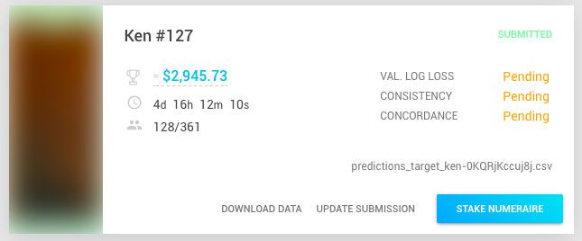

# Getting Started

- For an overview of the project please visit our LEARN page: [numer.ai/learn](https://numer.ai/learn).
<br/>

## Step by step.

### 1. Download Data

After you have created an account and logged in, the latest data can be found at the [Tournament Page](https://numer.ai/rounds) :  


!!! cite "Note:"
    You only need to download the data once per week, it includes information from all our Tournaments.

Our current download folder 📁  `numerai-datasets` includes the following files:

```
example_model.py
example_model.r
example_predictions_target_bernie.csv
example_predictions_target_charles.csv
example_predictions_target_elizabeth.csv
example_predictions_target_jordan.csv
example_predictions_target_ken.csv
numerai_tournament_data.csv
numerai_training_data.csv
numerox_example.py
```  

??? info " What's in each file ?"

    - **`example_model.py`**,  **`example_model.r`** : A heavily commented interactive example of how to read the dataset, train a model, make and create submissions and other details in python and r.
    <br/>    
    - **`example_predictions_target_bernie.csv`**, **`example_predictions_target_charles.csv`**, **`example_predictions_target_elizabeth.csv`**, **`example_predictions_target_jordan.csv`**, **`example_predictions_target_ken.csv`** : Example predictions for each of the 5 tournaments & targets, we expect you to upload predictions in this format.
    <br/>
    - **`numerai_training_data.csv`** ❗ : Our training dataset, use it to train your model.
    - **`numerai_tournament_data.csv`** ❗ : Once your model is trained, use this dataset to generate your predictions.
    - **`numerox_example.py`** : Numerox is a 3rd party toolbox for submitting and evaluating models, this is a basic use example.


### 2. Create Predictions

Once you have downloaded the dataset and familiarized yourself with it, you can start creating your own models and generating predictions.

A good place to start is the **`example_model.py`** or **`example_model.r`** files which use a [logistic regression classifier](https://en.wikipedia.org/wiki/Logistic_regression) as a starting point.


!!! warning "Targets"

    Be aware of the different targets and submit in the correct file format to the correct tournament, for example ( _in python_ ):

    **Training:**
    ``` python
    Y_train = training_data["target_ken"]        
    ```
    **Predicting:**
    ``` python
    y_prediction = model.predict_probabilities(validation["features_target_ken"])    
    ```
    **Submission File: predictionsKen.csv**
    ```csv
    id,probability_ken
    nc89137dfd782464,0.4942169804417248
    n5f7abc0a8646441,0.5040417878616712
    n0268070abecb419,0.5119778573460162
    ndaea9db3f8384dc,0.5041644642593843... etc

    ```
    **Note:** You can of course use targets from different tournaments as part of your models, check the example files for full examples and other relevant information.


### 3. Upload your predictions.


Make sure you upload the correct prediction targets with the right file format to the correct tournament or your submission might fail.

You can call your submission file anything you like, but the id's and column names need to be the correct ones, so for instance if you wanted to upload to the Bernie tournament your file, let's
say you named it `predictions_bernie.csv`, it should have matching id's with our provided dataset:  `numerai_tournament_data.csv` and the correct column names :

``` csv
id,probability_bernie
nc89137dfd782464,0.49348768765828444
n5f7abc0a8646441,0.5161787424278924
n0268070abecb419,0.5158960837554011
ndaea9db3f8384dc,0.5032981123372411... etc
```


### 4. Validate your predictions

Upon successfully uploading your predictions, they will be automatically validated and your submission file name will appear.



Once validated ( you might need to refresh the page ) your submission score will appear :


### 5. Stake

You can only stake when:

**1.** Staking is open ( _currently the first 2 days after the round / tournament opens_ )
<br/>
**2.** Your model has achieved certain metrics.

The UI will display your current stake eligibility along with the required metrics and your score:

<p align="center">
  
</p>

!!! info "You will also need NMR to Stake !"
    - You can acquire NMR at [Shapeshift](http://shapeshift.io/), [Bittrex](https://bittrex.com) or other exchanges.
    - Numerai also provides NMR to users which models beat certain metrics, ( currently 0.1 NMR for models that achieve Log Loss under 0.693 paid upon round resolution ).

You can then stake via the staking screen:


!!! tip "Quick guide to Staking:"
    - The minimum you can stake is 0.1 NMR.
    - Probability signifies your estimate for your model passing benchmark (logloss < 0.693 ) and the minimum value is 0.1 (10% probability).
    - You can stake multiple times but your NMR Stake or your Probability needs to be greater than your previous stake.
    - Your Earning Potential depends on the current rules and other factors, currently stakes with probability below the moving cutoff probability are not considered for payouts or burns.
    - Carefully review both fields before staking or updating your stake,once submitted they are final !

Once submitted, your stake will appear in the corresponding tournament ( _you might need to wait for it to be included in the blockchain and refresh your page_ ).


### 6. Results

Your submitted predictions will be used internally as part of our meta model over a period of time and graded on how well they perform, after that period ( currently 31 days ), your result along with that of others will be made public and you will receive a payout 💰 if you staked and performed well or burn 🔥 ( loose your stake ) if you performed poorly ( else your stake will be returned ), submitted models that did not stake are also graded and might be given NMR if they perform well (currently 0.1 NMR if their logloss is < 0.693 ).

You can see how your model performed in the resolved tournament table:


<br />


Please consult the rest of this documentation for more details.

## GOOD LUCK !
