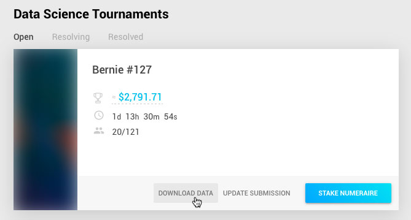

# Getting Started

- For an overview please visit our LEARN page: [numer.ai/learn](https://numer.ai/learn).
<br/>

## Step by step.

### 1. Download Data

After you have created an account and logged in, the latest data can be found at the [Tournament Page](https://numer.ai/rounds) :  




!!! cite "Note:"
    You only need to download the data once per week, it includes information from all our Tournaments.

Our current download folder 📁  `numerai-datasets` includes the following files:

```
example_model.py
example_model.r
example_predictions_target_bernie.csv
example_predictions_target_charles.csv
example_predictions_target_elizabeth.csv
example_predictions_target_jordan.csv
example_predictions_target_ken.csv
numerai_tournament_data.csv
numerai_training_data.csv
numerox_example.py
```  

??? info " What's in each file ?"

    - **`example_model.py`**,  **`example_model.r`** : A heavily commented interactive example of how to read the dataset, train a model, make and create submissions and other details in python and r.
    <br/>    
    - **`example_predictions_target_bernie.csv`**, **`example_predictions_target_charles.csv`**, **`example_predictions_target_elizabeth.csv`**, **`example_predictions_target_jordan.csv`**, **`example_predictions_target_ken.csv`** : Example predictions for each of the 5 tournaments & targets, we expect you to upload predictions in this format.
    <br/>
    - **`numerai_training_data.csv`** ❗ : Our training dataset, use it to train your model.
    - **`numerai_tournament_data.csv`** ❗ : Once your model is trained, use this dataset to generate your predictions.
    - **`numerox_example.py`** : Numerox is a 3rd party toolbox for submitting and evaluating models, this is a basic use example.


### 2. Create Predictions


### 3. Upload Data
### 4. Stake
### 5. Evaluate
