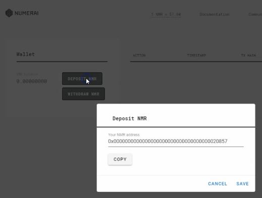
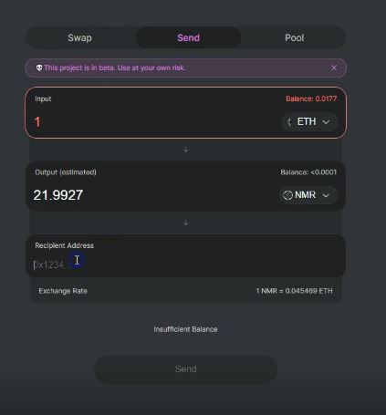
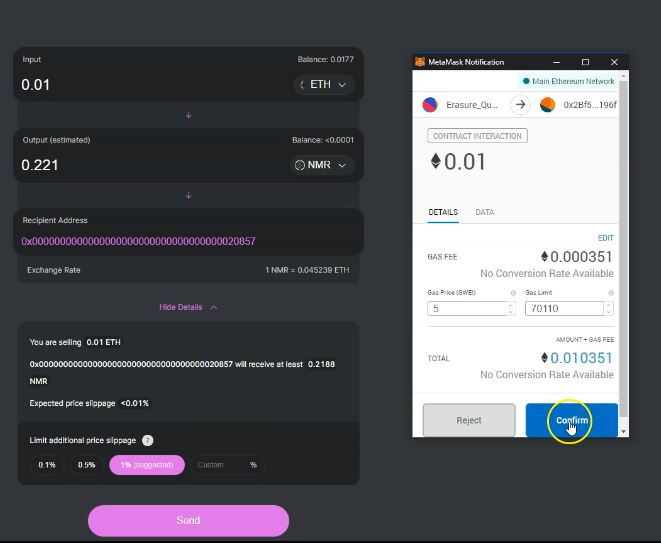

# Uniswap Tutorial

Video link: [https://www.youtube.com/watch?v=q4462zibrec](https://www.youtube.com/watch?v=q4462zibrec)

This tutorial assumes that you already know how to obtain Ether and that you’ve installed Metamask. By following this tutorial, you will understand how to swap Ether for Numeraire using [Uniswap](uniswap-tutorial.md), which will also transfer Numeraire into your Numerai account wallet to be used for staking.

First, visit [Uniswap](https://uniswap.io) and familiarize yourself with the documentation. Uniswap is a protocol for automated exchange of ERC20 tokens. You use metamask to interact with a smart contract that executes your exchange.

\(0:39\) Click Swap Tokens to get started.

\(0:44\) Click "Connect"

\(0:58\) Then click "Connect" in MetaMask. 

\(1:08\) Click "Send"

\(1:16\) Click select a token and scroll down to Numeraire.

\(1:27\) As a test, type 1 into the Input field. You’ll see your actual balance in the top right of this cell and the estimated amount of Numeraire you’ll receive in the output cell. Below that, the exchange rate is displayed.

\(1:50\) We need to obtain our Numerai account address. Visit the tournament website and click the menu pull-down in the top right corner, then click "Wallet."

\(1:56\) Click "Deposit NMR" and then click "Copy" to copy your NMR address to your clipboard.

\(2:04\) Go back to the Uniswap page and paste your account address in the "Recipient Address" field.

\(2:15\) Click the expansion to view the advanced information area. Here, you’ll see the exchange rate information in more detail. Your estimated slippage is displayed as well. Larger orders cause more slippage, so be mindful of that as you contemplate an exchange of Ether for Numeraire. You can place a limit on further slippage; you are encouraged to do so. 1% is probably sufficient for most users.

\(2:55\) Once you are satisfied with the terms of the exchange, click 'Send'.

\(3:04\) Click 'confirm' and wait for the transaction to confirm.

\(3:10\) MetaMask will show a swirling circle in the top right of the Uniswap page which shows you the transaction is pending.

\(3:40\) When the transaction clears, your account balances will update on the page. You can see that my Numeraire balance has increased on my Numerai Wallet page as well. I’ve successfully swapped Ether for Numeraire!


That’s all you have to do to obtain Numeraire. Certainly, there are other ways to obtain Numeraire, however this method has the least friction. Your mileage may vary, and you should do your own due diligence prior to exchanging cryptocurrency with any entity; cryptographically or not!

