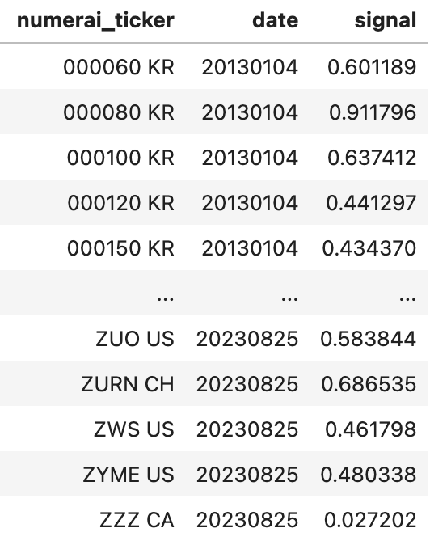

# Scoring

There are two main scores currently used for payouts

* [Feature Neutral Correlation](../../numerai-tournament/scoring/feature-neutral-correlation.md) (FNCv4): Your [neutralized](./#neutralization) prediction's correlation to the target
  * The target used for this is `target_factor_feat_neutral_20` (returns [neutralized](./#neutralization) to common features and factors, yielding "residual return")
* [True Contribution](../../numerai-tournament/scoring/true-contribution-tc.md) (`TC`): Your predictions contribution to the hedge fund
  * On March 30, 2024, this will be replaced by [Meta Model Contribution](../../numerai-tournament/scoring/meta-model-contribution-mmc.md) (`MMC`).

We also have informational scores not used for payouts:

* [Correlation](https://docs.numer.ai/tournament/correlation-corr) (`CORRv4`): Your prediction's correlation to the target
* Information Coefficient (`ICv2`): Your prediction's correlation to raw returns
* Residual Information Coefficient (`RIC`): Your prediction's correlation to residual returns (returns [neutralized](./#neutralization) to common factors)

For a full list of detailed explanations please see the [definitions docs](definitions.md).

## Neutralization

A signal or target is considered "neutral" when it has zero correlation with some set of existing signals. The point of the neutralization is to isolate the original or orthogonal component of the signal that is not already present in existing signals.

 (1).png>)


If you submit a simple linear combination of a few well-known signals, there will be little to no orthogonal component after neutralization.


Numerai has a variety of existing signals including Barra factors (like size, value, momentum, etc), country and sector risk factors, and custom stock features. These existing signals are not provided to you, which makes this process "blackbox". The code used to neutralize a signal is open source and you can learn more about the neutralization process in [this example notebook](https://numer.ai/tutorial/feature-neutralization).

By neutralizing your signal before scoring, Numerai aligns it with the neutralized target which may improve its performance against the target without Numerai having to give out the data used for neutralization. For example, if your signal is not neutralized to country risks, Numerai Signals will neutralize your signal against country risks before scoring. This allows you to focus on creating an original signal without having to worry about country risk neutralization.

A signal may have strong predictive when considered alone, but could score poorly on Numerai Signals due to this neutralization. This highlights the key unique aspect of Signals: **Numerai Signals is not about predicting stock returns, it is about finding original signals that Numerai doesn't already have.**

To understand broader implications of feature exposure and neutralization, read [this forum post](https://forum.numer.ai/t/model-diagnostics-feature-exposure/899).

## The Target

Signals are evaluated against a custom blackbox target created by Numerai. This target is also a [20D2L](../../numerai-tournament/scoring/#live-scoring) target like the Numerai Tournament, but are neutralized against our existing signals.

We do not use shorter time horizons because signals that only work on short time horizons are difficult or impossible for large hedge funds to implement. For example, even if a signal can accurately predict the 1 hour return of stocks, it is not very useful if it takes a hedge fund 24 hours to fully trade into that position. Signals that are most useful to large hedge funds have predictive power over a long time horizon which is also known as having "low alpha decay".

## Grandmasters

**Grandmasters** place first

**Masters** place in the top 10

**Experts** place in the top 25%

**Researchers** place in the top 50%

**Contributors** place in the top 75%

**Apprentices** place in the bottom 25%

**Novices** have not yet made 20 qualified submissions

## Canon Scores

In the context of the Signals tournament, Canonical Scores (or “Canon Scores”) are particularly relevant. For example, the FNC score, which is a payout metric, has undergone updates. Initially, the payout score was 'CORR20' until round 498. It evolved into 'FNCv4' starting from round 499. The 'Canon FNC' score accounts for these changes by combining them into a unified score — it is 'CORR20' for rounds up to and including 498 and 'FNCv4' for rounds thereafter.

The 'TC' score has remained consistent throughout the tournament's history, meaning 'Canon TC' and 'TC' are equivalent.

## Diagnostics

you can use the historical diagnostics of your signal to check performance and estimate the impact neutralization may have on your signal in the future. It’s important to note that signals with strong scores over the historical period may not score well in any current or future round.

The diagnostics tool can be opened using the beaker next to your model on the [scores](https://signals.numer.ai/scores) page. Upload a signal over a historical `validation` time period and it will calculate `validation` metrics including performance, risk, and potential earnings. The `validation` time period starts on `20130104` and ends on the latest date in the `validation` data.

Uploads over the `validation` time period must include one extra column:

* A `date` column - historic data is weekly and the diagnostics tool assumes your predictions for a given week are made using market close data of the latest Friday

<figure><figcaption></figcaption></figure>

Once your upload is validated, diagnostics will start running. This usually takes 5-10 minutes depending on the number of weeks and tickers that span your submission.

<figure><figcaption></figcaption></figure>

These diagnostics serve as a guide for you to estimate whether your signal is good enough to be worth staking on. It is important to note that signals with strong diagnostics over the historical `validation` period may not score well in any current or future `live` periods.


Using this historical evaluation tool repeatedly will quickly lead to overfitting. Treat diagnostics only as a final check in your signal creation process.


## What is Churn?

Churn is a statistic describing how much a signal changes over time. We open-sourced the code we use to calculate churn in Signals. You can find it [here](https://github.com/numerai/numerai-tools/commit/f58990854c81eb870cf9a252f1d72aace1a34857#diff-8ff14dc2bf7de3c1800d64eec9d066618b1ab49243bfc99f1bd8c7f3fe307d56R12-R43). In short:

_churn(t0, t1) = 1 - correlation(s(t0), s(t1))_

Where _**s(t)**_ is Signal's submission at time _**t**_.

### Why calculate churn?

If a Signals submission has high churn, then Numerai can’t trade the signal. Many models built on the original Numerai tournament data have low churn organically, but Signals churn is very high. Most Signals models have high churn by default.

We know that this negatively impacts the churn of the Signals Meta Model because the average churn across individual Signals models is highly correlated with the churn of the Signals Meta Model. This means Numerai must disallow high churn Signals models.

### The Churn Threshold

Any model that has not submitted in the previous week will have it’s stake set to 0. This is because any model that does not submit weekly will naturally cause high churn in the Meta Model.

If your model has submitted within the last week, when you upload a new submission we calculate maximum churn with respect to this model’s submissions from the previous week. So if we treat the current upload period as time _**t**_, the max churn would be:

_max\_churn = max(\[churn(t, t-1), churn(t, t-2), ..., churn(t, t-5)])_

If **max\_churn** >= 15%, then this submissions stake is set to 0.
