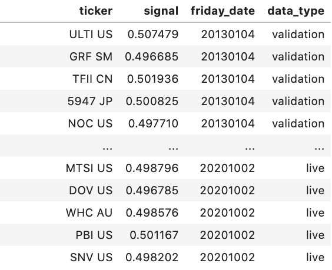
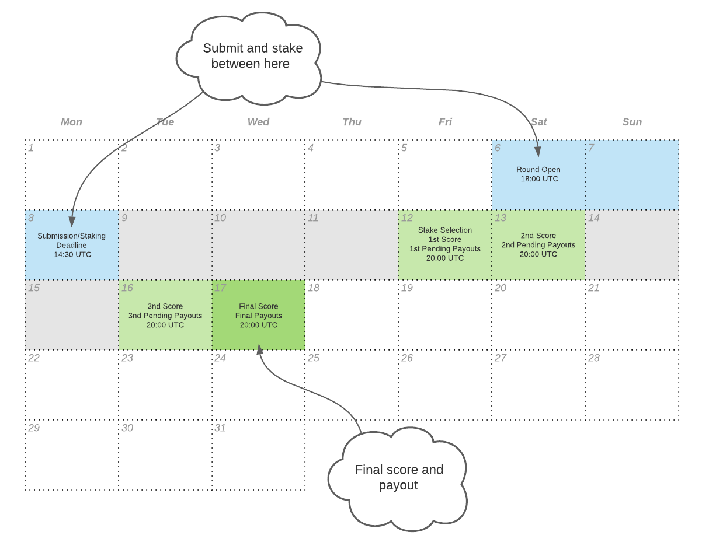

# Numerai Signals Overview

[Numerai Signals](https://signals.numer.ai) lets you upload stock market signals and find out how original they are compared to all other signals on Numerai. Signals can be staked with the NMR cryptocurrency to earn rewards. The best most original signals are used in Numerai's hedge fund.

Numerai Signals is a part of the Numerai master plan to build the world's last hedge fund. Read the [Medium Post](https://medium.com/numerai/building-the-last-hedge-fund-introducing-numerai-signals-12de26dfa69c) and watch [the short film](https://youtu.be/GWeC2PK4yXQ) to learn more about how it all fits together.

## Summary

1. Sign up to [Numerai Signals](https://signals.numer.ai) or sign in with your existing Numerai tournament account.
2. Upload your signal on Numerai's stock universe to receive performance, risk, and profitability diagnostics over the historical portion of your signal.
3. Stake NMR on the live portion of your signal to earn or lose NMR based on your performance relative to Numerai's custom targets.
4. Automate the weekly upload of your signal by connecting directly to our API and grow the value of your stake over time.

## What are stock market signals?

Stock market signals are feeds of numerical data about stocks used by quantitative hedge funds like Numerai to construct portfolios. 


Examples of stock market signals include:

* [Fundamental signals](https://www.investopedia.com/terms/f/fundamentalanalysis.asp)  \([P/E ratio](https://www.investopedia.com/terms/p/price-earningsratio.asp), [dividend yield](https://www.investopedia.com/terms/d/dividendyield.asp), [analyst ratings](https://www.investopedia.com/terms/r/rating.asp#:~:text=A%20rating%20is%20conducted%20by,this%20action%20for%20the%20stock.)\)
* [Technical signals](https://www.investopedia.com/terms/t/technicalindicator.asp) \([MACD](https://www.investopedia.com/terms/m/macd.asp), [RSI](https://www.investopedia.com/terms/r/rsi.asp), [MFI](https://www.investopedia.com/terms/m/mfi.asp)\)
* [Alternative data signals](https://en.wikipedia.org/wiki/Alternative_data_%28finance%29) \([credit card transactions](https://secondmeasure.com/), [satellite images](https://www.theatlantic.com/magazine/archive/2019/05/stock-value-satellite-images-investing/586009/), [social media sentiment](https://www.swaggystocks.com/dashboard/wallstreetbets/realtime)\)
* [Blended signals](https://www.investopedia.com/terms/m/multifactor-model.asp) \([Barra risk factors](https://www.investopedia.com/terms/b/barra-risk-factor-analysis.asp#:~:text=The%20Barra%20Risk%20Factor%20Analysis%20is%20a%20multi%2Dfactor%20model,turnover%20and%20senior%20debt%20rating.), [Fama French factors](https://www.investopedia.com/terms/f/famaandfrenchthreefactormodel.asp)\)

While the underlying data used to generate these signals can be very different \(audited financials vs images of parking lots\), the signals themselves all come in the same basic format - a list of stock tickers each with an associated numerical value.

## Signal Creation

### Data and Tools

To create your own signal, you will first need to acquire some stock market data.


Data scientist with no stock market data? Participate in the [Numerai Tournament](https://numer.ai/) instead. 


If you do not already have access to stock market data, there are a number of free or cheap data providers on the internet such as [Yahoo Finance](https://finance.yahoo.com/), [Quandl](https://www.quandl.com/), and [Koyfin](https://www.koyfin.com/). 

There are also platforms that make it easy to create signals such as [QuantConnect](https://www.quantconnect.com/), and [Alpaca](https://alpaca.markets/). 

Check out this [forum thread](https://forum.numer.ai/t/free-or-cheap-data-for-erasure-numerai-quant/350) for a list of sources popular data sources, platforms, and tools used by our community. 


Finding unique and differentiated datasets is key to creating original signals.


### Universe

The Numerai Signals stock market universe covers roughly the top 5000 largest stocks in the world. 

The universe is updated every week, but in general only a couple low volume stocks will move in or out on a given week. 

You can see the latest universe by downloading the [latest universe file](https://numerai-signals-public-data.s3-us-west-2.amazonaws.com/universe/latest.csv).

You can see the historical universe by downloading the [historical targets file](https://numerai-signals-public-data.s3-us-west-2.amazonaws.com/signals_train_val_bbg.csv). This file has data up to the third most recent Friday, due to Signals rounds resolving two Wednesdays \(11 days\) after they open. In the fourth week of the month, data from the first Friday of the month will be the date with the most recent available data.

### Submissions

When you submit a signal to Numerai Signals, you must include at least two columns:

* A `cusip`, `sedol`, or `ticker` column - values must be valid tickers associated with the ticker type in the header.     
* A `signal` column - values must be between 0 and 1 \(exclusive\).

Additionally, for a submission to be valid:

* There must be at least 10 rows with predictions for tickers in the Signals stock market universe for the current `live` time period.
* A ticker cannot appear in the current `live` time period more than once.

Submissions with only two columns are assumed to correspond to the current `live` time period.

You may also to upload your signal over a historical `validation` time period to receive diagnostics metrics on your performance, risk, and potential earnings. The `validation` time period spans `374` weeks from `20130104` to `20200228`. 

Submissions that include the `validation` time period must include two extra columns: 

* A `friday_date` column - values must be Fridays as week periods begin on Friday in Numerai Signals.  
* A `data_type` column - values can only be `live` or `validation`. Rows with `data_type` of `live` must contain the date of the most recent Friday. 



Download the latest example submission [here](https://numerai-signals-public-data.s3-us-west-2.amazonaws.com/example_signal/latest.csv).

### Diagnostics

Once your submission has been accepted, it will be queued for diagnostics. This usually takes 10-15 minutes depending on the number of weeks and tickers that span your submission.


These diagnostics serve as a guide for you to estimate whether your signal is good enough to be worth staking on. It is important to note that signals with strong diagnostics over the historical `validation` period may not score well in any current or future `live` periods.


Using this historical evaluation tool repeatedly will quickly lead to overfitting. Treat diagnostics only as a final check in your signal creation process. 


All of the historical targets used to calculate diagnostics is available [here](https://numerai-signals-public-data.s3-us-west-2.amazonaws.com/signals_train_val_bbg.csv).

### API and Automation


You must submit your latest signal to Numerai every week


You can automate your submission workflow by using [Numerai Compute](https://docs.numer.ai/tournament/compute) and either our [GraphQL API](https://api-tournament.numer.ai/) or the official python client.



## Signal Evaluation

### Neutralization

Numerai has a variety of existing signals. Our existing signals include Barra factors \(like size, value, momentum, etc\) country and sector risk factors, and custom stock features. 


**Definition**: A signal or target is considered "neutralized" after Numerai transforms it to have zero correlation with any of Numerai's existing signals such as Barra factors, country, sector factors and other custom stock features.


Every signal uploaded to Numerai Signals is neutralized before being scored. The point of the neutralization is to isolate the original or orthogonal component of the signal that is not already present in known signals.



If you submit a simple linear combination of a few well-known signals, there will be little to no orthogonal component after neutralization. 


The targets used to evaluate signals are also neutralized. The targets are in effect Numerai's custom "specific return" or "residual return".

The data that is used to perform neutralization is not provided, which means the process is a "blackbox". However, you can use the historical diagnostics of your signal to estimate the impact neutralization will have on your signal in the future although it’s important to note that signals with strong scores over the historical period may not score well in any current or future round.

The code that is used to implement neutralization is open source. You can learn more about the neutralization process in this example notebook:



Or check out this forum post to understand broader implications of feature exposure and neutralization.  



Signals with very high correlation with subsequent stock returns may score very badly on Numerai Signals and signals with weak correlation with subsequent returns might score well. 

In other words, “good” signals with strong predictive value when considered alone may score poorly on Numerai Signals. This highlights the key unique aspect of Signals: Numerai Signals is not about predicting stock returns, it is about finding original signals that Numerai doesn't already have.

### **Six Day Neutralized Return Targets**

Signals are evaluated against a custom blackbox target created by Numerai. This target is based on 6 day neutralized subsequent returns \(ignoring the first 2 days\). 

The reason why signals are evaluated on a 6 day horizon \(minus the first 2 days\) is because signals that only work on short time horizons are impossible for large hedge funds to implement. For example, even if a signal can accurately predict the 1 hour return of stocks, it is not very useful if it takes a hedge fund 24 hours to fully trade into that position. Signals that are most useful to large hedge funds have predictive power over a long time horizon which is also known as having "low alpha decay".      

For more information on the exact market days that make up the 6 days of subsequent neutralized returns, see the following section on dates and deadlines. 

### Scoring

Before scoring, signals are first ranked between \[0, 1\] and then neutralized. Finally the score is computed by taking the Spearman correlation between the neutralized signal and the target. This score is simply referred to as `corr` throughout this doc and the website.

By neutralizing your signal before scoring, Numerai aligns it with the target which improves its performance against the target. Since the target is also neutralized, the neutralization step effectively optimizes your signal for best performance without Numerai having to give out the data used for neutralization.

For example, if your signal is not neutralized to country risks, Numerai Signals will neutralize your signal against country risks before scoring so you can focus on creating an original signal without having to worry about country risk neutralization.

If you only have signals on a subset of the universe \(eg only signals on US stocks\), you can still submit to Signals and still perform well. For each stock in the universe where you have missing signals, Numerai will automatically fill those in with the median value after the signal is ranked.

### Meta Model Contribution

If `corr` is a measure of how well your signal correlates to a target that is neutralized to all signals known to Numerai, Meta Model Contribution \(MMC\) is a measure of how well your signal correlates to a target that is neutralized to all signals known to Numerai _and all other staked signals on Numerai Signals._ This score is simply referred to as `mmc` throughout this doc and the website.

The `mmc` of a signal is computed by first constructing a special signal called the Signals' Meta Model,  which is defined as the stake weighted average of all the \(ranked and neutralized\) signals on Numerai Signals for a given round. The `mmc` of a signal is the correlation of the signal to the target after being neutralized to the Signals' Meta Model.


High and consistent MMC on Signals is doubly impressive because it means your signal has an edge over all of Numerai's data and the combination of all other signals on Numerai Signals as well.


MMC is a concept that is taken from the main Numerai Tournament and the scoring system is very similar. See the  [metamodel contribution](https://docs.numer.ai/tournament/metamodel-contribution) section in the Numerai Tournament docs for details on how we compute MMC on Numerai.

Note the computation of Numerai Signals' MMC is completely separate from that of the Numerai Tournament. Specifically, only submissions to Numerai Signals are used to construct the Signals' Meta Model.

## Staking <a id="staking"></a>

You can optionally `stake` [NMR](https://www.coinbase.com/price/numeraire) on your model to earn or burn based on your `corr` and/or `mmc` scores. 

Staking means locking up NMR in a [smart contract](https://github.com/numerai/tournament-contracts) on the [Ethereum](https://ethereum.org/en/whitepaper/) blockchain. For the duration of the stake, Numerai is given the permission to add payouts to or burn from the NMR locked up.


It is important to note that the opportunity to stake your signal **is not** an offer by Numerai to participate in an investment contract, a security, a swap based on the return of any financial assets, an interest in Numerai’s hedge fund, or in Numerai itself or any fees we earn. Payouts will be made at our discretion, based on a blackbox target that will not be disclosed to users.  Fundamentally, Numerai Signals is a service offered by Numerai that allows users to assess the value of their signals, using NMR staking as a way to validate “real” signals. In return, Numerai uses the staked signals and related data in the Numerai hedge fund. Users with different expectations should not stake signals.

**Please read our** [**Terms of Service**](https://numer.ai/terms) **for further information.**


You can manage your stake on the website. When you increase your stake, NMR is transferred from your wallet to the staking contract. When you decrease your stake, NMR is transferred from the staking contract back into your wallet after a ~4 week delay. You can also change your stake type, which determines which scores \(`corr` and/or `mmc`\) you want to stake on.


## Payouts

### Payout function

Payouts are a function of your stake value and scores. The higher your stake value and the higher your scores, the more you will earn. If you have a negative score, then a portion of your stake will be burned. Payouts are limited to ±25% of the stake value per round.

```python
payout = stake_value * payout_factor * (corr * corr_multiplier + mmc * mmc_multiplier)
```

The `stake_value` is the value of your stake on the first Friday \(scoring day\) of the round.

The `payout_factor` is number that scales with the total NMR staked across all models in the tournament. The higher the total NMR staked above the 100K threshold the lower the payout factor.


The `corr_multiplier` and `mmc_multiplier` are configured by you to control your exposure to each score. You are given the following multiplier options.

| **corr multiplier options** | **mmc multiplier options** |
| :--- | :--- |
| 2.0x | 0.0x, 0.5x, 1.0x, 2.0x |


The payout factor curve and available multiplier options may and will be updated by Numerai in the future alongside major tournament releases.


Here are some example payout calculations. The first 2 examples show the impact of adjusting score multipliers. The 3rd example shows how a negative score can cause a burn. The 4th example shows how the payout is capped at ±25% of the stake value.

| stake value | payout factor | corr | corr multiplier | mmc | mmc multiplier | payout |
| :--- | :--- | :--- | :--- | :--- | :--- | :--- |
| 100 NMR | 0.8 | 0.02 | 2.0x | 0.002 | 2.0x | 3.52 NMR |
| 100 NMR | 0.8 | 0.02 | 2.0x | 0.002 | 0.0x | 3.2 NMR |
| 100 NMR | 0.8 | -0.03 | 2.0x | 0.002 | 0.5x | -4.8 NMR |
| 100 NMR | 0.8 | 0.15 | 2.0x | 0.07 | 2.0 | 25 NMR |

### Stake growth

With every daily score, a new daily update on your payout is also computed. These daily payouts are also just updates and only the final payout of a round counts. Final payouts are paid into your stake at the end of the round \(Wednesday\).

Your stake value will grow as long as you continue to have positive scores. Here are some example payout projections assuming that the model gets the same positive scores every week for 52 weeks.  


## Dates and Deadlines

### Data Date vs Effective Date

There are two types of dates in Numerai Signals 

* `data_date` - dates corresponding to the underlying stock market data. All `data_dates` refer to the market close of that date and do not include a time. For example, values in the `friday_date` column of submissions are of type `data_date`.
* `effective_date`- dates corresponding to actions or events that take place on Numerai Signals and may include a time which is always specified in UTC. There is usually a delay between the `data_date` and the `effective_date` because of time zones and the time it takes for stock market data to be processed. Unless otherwise specified, all dates mentioned in the website and this doc are of type `effective_date`. 

### Rounds

Submissions, stakes, scores and payouts are grouped into numbered `rounds` to make them easier to talk about.

A new `round` begins every `Saturday at 18:00 UTC`. The deadline for submissions and staking is at `Monday at 14:30 UTC`. Late submissions will not be scored and will not count for payouts. Stake changes made after the deadline will apply to the next round. 

On-time submissions will be scored and pending payouts will be calculated on Friday, Saturday, Tuesday and Wednesday. Stake values are locked by Friday during "stake selection", which means payouts from the previous round compound into your stake value for the next round. The score and payout on Wednesday is taken as the final score and payout for the round.



The universe of the `round` is defined by the `data_date` of the prior Friday. The 4 days of scoring and payouts are based on `3day-2day`, `4day-2day`, `5day-2day` and `6day-2day` neutralized returns. There is a 2 day lag between market close for a day and when the data becomes available for scoring. For example, the `6day-2day` neutralized returns are up to Monday market close, but only become available on Wednesday.


## Leaderboard

The leaderboard can be sorted by the reputation of model's `corr`, `mmc`. [Reputation](https://docs.numer.ai/tournament/reputation) is the weighted average of a given metric over the past 20 rounds.

Keep an eye on the leaderboard to see how your models compare to all other models in terms of performance and returns from staking.


## Support

We are here to help.

Find us on [RocketChat](https://community.numer.ai) for questions, support, and feedback!

