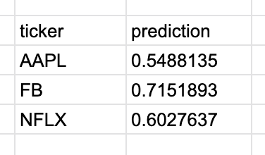

# Signals Overview

Numerai Signals allows anybody to upload signals, build a verifiable track record, and earn money.

### **How Numerai Signals Works**

1. Sign up to [Numerai Signals](https://signals.numer.ai). Accounts are shared with the main Numerai tournament, and you can just use your email/password from there if you've already made an account with Numerai.
2. Upload signals on stocks in our universe \(it's roughly the Russel 3000, plus some other markets, see [example signals](https://numerai-signals-public-data.s3-us-west-2.amazonaws.com/example_predictions/latest.csv)\)
3. \(Coming Soon\) Prove you believe in your signals by staking them with cryptocurrency
4. \(Coming Soon\) Earn money if your signals get bought by Numerai’s hedge fund
5. \(Coming Soon\) Lose money if your signal quality decreases

### **Signals**

Stock market signals are feeds of data that can be used by hedge funds like Numerai to improve their performance. A count of the number of tweets mentioning ticker symbols in the Russell 3000 universe every day could be a signal. By itself, it might not be very predictive but taken together with other signals, it might improve performance a lot. Other examples of signals include: signals produced from quant models such as those created on Quantopian, raw high quality data about stocks such as P/E ratios, executive compensation data, signals based on public filings or earnings calls, etc.

Format your signals as a CSV, with tickers on one column and signals, expressed between 0 and 1, on the other. Your CSV upload must contain at least 100 predictions to be considered a valid submission.



An example CSV is [here](https://numerai-quant-public-data.s3-us-west-2.amazonaws.com/example_predictions/latest.csv). This CSV includes an up to date universe that is generated daily.

### **Creating Signals**

Unlike websites such as Numerai which provide clean training data to build your model, Numerai Signals provides no data. This is because Numerai Signals is a tool for people who have already built their own models or already have access to data they believe might produce good signals. However, there is a lot of free or low cost data available on the internet and a number of tools such as Quantopian and Alpaca that provide data or make it easy to turn data into signals.

Quantopian has a hosted IDE, with tightly integrated data sources and backtesting engine. Unfortunately, it’s tricky to export orders from that IDE. One strategy:

1. Publish your algorithm for live trading
2. Copy the live trading ID in the URL \(ie, ...live\_algorithms/\[your\_ID\]\)
3. Go to their research notebook \(Research &gt; Notebooks\)
4. Run this command:

```text
bt = get_live_results(‘[your_ID]’)
bt = bt.pyfolio_positions.to_string()
print(bt)
```

Alpaca has a freely available set of scripting tools, including data, with a broker backend to place trades once designed. [Alpaca built a tool to export from Alpaca to Erasure](https://github.com/alpacahq/alpaca-erasure).

Users also have a thread on the forums discussing potential data sources. [Check it out](https://forum.numer.ai/t/free-or-cheap-data-for-erasure-numerai-quant/350), and add what works for you.

### Universe

The stock universe is updated daily, but in general only a couple, low volume stocks will move in/out on a given day. You can see today's universe by downloading the [latest example predictions](https://numerai-signals-public-data.s3-us-west-2.amazonaws.com/example_predictions/latest.csv).

You can see the historical universe by downloading old example predictions files directly from s3, with urls like so: [https://numerai-quant-public-data.s3-us-west-2.amazonaws.com/example\_predictions/20200519.csv](https://numerai-quant-public-data.s3-us-west-2.amazonaws.com/example_predictions/20200519.csv)

### Signal Scoring Frequency

Signal uploads will be scored daily \(see Evaluating Data below\). Your submission is valid for 60 days from the time of submission. After that, you will no longer be eligible for payments and will be removed from the leaderboard. You will still receive scores, and as soon as you submit again, you will be eligible for payouts.

If you submit before NYSE market close \(4pm EST most days\), then you will be scored for the next day. If you submit after the close, then you will be scored 2 days in the future.

### **Staking \(Coming Soon\)**

To be eligible to receive payouts from Numerai, Numerai Signals users are required to stake the NMR cryptocurrency on their signals. If you don't have NMR, there are exchanges where you can trade ETH for NMR. For example [Uniswap](https://uniswap.io/).

### **Why Staking**

Without staking, users could create hundreds of accounts in the hopes of getting lucky and Numerai would not be able to determine which signals are worth buying. By staking money, users express confidence in their signals to Numerai which gives Numerai confidence to buy the signals.

### **How Staking Works**

By staking NMR you enter into an agreement with Numerai and give Numerai a special right to destroy your entire stake for any reason \(known as “griefing”\). When you stake, Numerai doesn’t receive your money, it just gets locked up on the Ethereum blockchain. And if Numerai destroys your stake, it gets destroyed on Ethereum forever.

### **Blackbox Payments**

Numerai does not state how they choose people to pay people or how much they pay and it changes all the time. This is because Numerai can’t predict what data they’ll want to buy in the future so they can’t define upfront how much they will pay. Even the highest quality signal can become worthless or become crowded. So submit signals that you think are high quality, and we’ll email you when we start buying your signals.

### **Broad Themes For Good Signals**

Numerai looks for consistency where the signal is high quality over a long period. Numerai looks for low correlation with other users on the platform \(if you create a signal that’s the same as a signal we’re already buying, we won’t want to buy yours too\). Numerai also looks for signals that are not obvious \(eg if a signal is just a big factor exposure to value\). Quantopian descriptions on the kinds of models they like give some good insights as to what would make a good signal as well. See [https://www.quantopian.com/get-funded\#the-constraints](https://www.quantopian.com/get-funded#the-constraints) and [https://www.quantopian.com/risk-model](https://www.quantopian.com/risk-model)

### **Reputation Is Forever**

Even if Numerai never buys your signals or doesn’t pay enough, our vision is to have other hedge funds buy data on Erasure as well. At the moment, very few people understand crypto so it may take time for other buyers to show interest but the reputation you build on Erasure is forever because all your data will be available on Ethereum and IPFS--your track record is not on Numerai’s servers. And your most recent submission is always encrypted and hidden even from Numerai. If you create and maintain a set of signals with incredible quality and performance for a long period, there’s a good chance you’ll catch the attention of all the best hedge funds in the world over the long term.

### **Leaderboard**

We use the historical sharpe of your daily returns as the primary metric for the leaderboard. Your daily returns are calculated by taking the average returns for the top half of your predictions and dividing it by the average returns for the bottom half of your predictions. You need to have at least 20 scores before you can be considered for the leaderboard. This will typically take around 4 weeks.

High placements on the leaderboard based on this metric does not imply that your signals will be bought or that you won't be griefed and the leaderboard metric may change.

### **Evaluation Data**

We are using [Quandl’s stock adjusted price data](https://www.quandl.com/data/EOD-End-of-Day-US-Stock-Prices) to determine stock returns to calculate your signal’s daily correlation. Returns for a given day are from the market close to the next day’s market close. You can submit at any time but you will always be scored against your last submission before the previous close. For example, if your last submission was at 1pm ET on Tuesday, your score at the close of trading on Wednesday will be the return from Tuesday’s close to Wednesday’s close. If you submitted on Tuesday at 1pm and Tuesday at 10pm, we would use your Tuesday 1pm submission to score you for Wednesday as that submission came in before the close but we will use your 10pm Tuesday submission to score you on Thursday \(provided you made no additional submissions on Wednesday before market close\).

## **Calculating Daily Returns**

We take the top half of your prediction by its score and consider them "longs". Then we take the bottom half of your predictions by its score and consider them "shorts". If there is an odd number of stocks predicted on, we make the middle stock a long.

For example in the prediction set below, AAPL and GOOG are longs and FB is a short.

* AAPL, 0.56
* FB, 0.5
* GOOG, 0.8

To calculate the "long short portfolio return" for each day, we calculate the average returns of the longs and the average returns of the shorts and then the long short portfolio return is \(1+average\_long\_return\)/\(1+average\_short\_return\)-1.

If the subsequent daily return of each stock is as follows:

* AAPL, +4%
* FB, +1%
* GOOG, +2%

Then the long portfolio return is \(4% + 2%\)/2 = 3% and the short portfolio return is 1%. Then the long short portfolio return is 1.03/1.01 - 1 = 1.98%.

