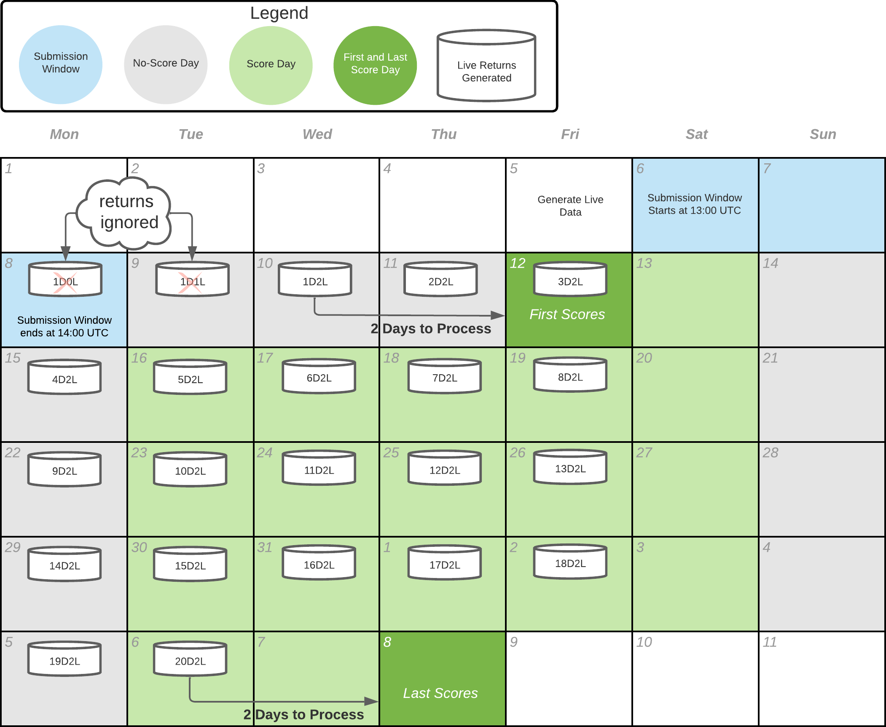
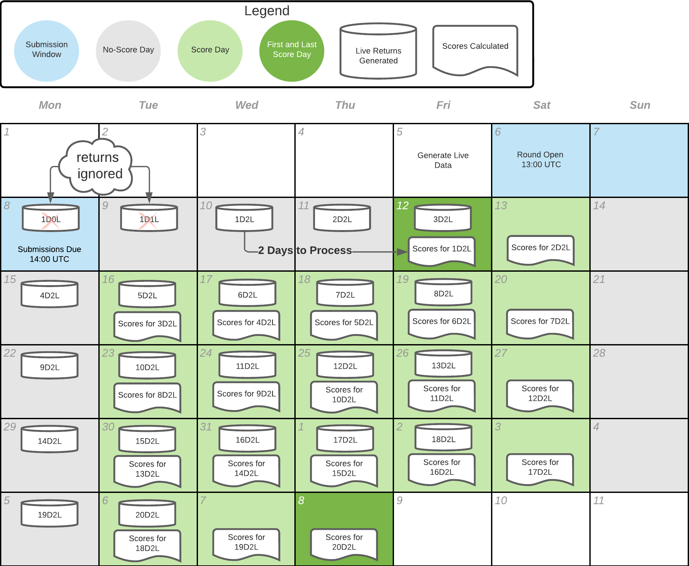

# Scoring

## Scores

There are two main scores currently used for payouts

* [Correlation](https://docs.numer.ai/tournament/correlation-corr) (`CORR`): Your prediction's correlation to the target
* [Meta Model Contribution](meta-model-contribution-mmc.md) (`MMC`): Your predictions contribution to the Meta Model

We also have informational scores not used for payouts

* [Feature Neutral Correlation (FNC)](feature-neutral-correlation.md): Your prediction's correlation to the target after neutralizing against all features &#x20;
* Correlation with the Meta Model (CWMM): Your prediction's correlation to the Meta Model (stake weighted average of all predictions).
* Benchmark Model Contribution (BMC): Your prediction's correlation to the target after neutralizing against the stake-weighted Benchmark Models.

## Live Scoring

Within a single round, submissions will receive 20 score updates until the final score of the round is computed. Let's look at the example of a weekend round:

<figure><figcaption></figcaption></figure>

The round opens on Saturday the 6th and closing on Monday the 8th. The first day of scoring is on Friday 12th (4 days later), with daily updates every day, Tuesday through Saturday. The final score is released about a month later, on Thursday the 8th.

Scoring is done over these 20 days because the main target is calculated using 20 days of total returns. It takes 4 days to get the first score because it takes 2 days to process data and the main target lags 2 days behind trading - this means we ignore 2 days of returns before starting the 20 day clock. This timeline is commonly referred to as "**20D2L**" - **20** **D**ays of returns after **2** **L**ag days:

<figure><figcaption></figcaption></figure>

The first day of scoring on Friday the  12th uses a 1D2L target, which includes returns from Wednesday 10th only. The second day of scoring on Saturday 13th uses a 2D2L target which includes returns from Wednesday 10th through Thursday 11th. The final day of scoring 4 weeks later on Thursday 8th of next month uses a 20D2L target which includes returns starting from Wednesday 10th through Tuesday 6th of the next month. Take a look at the full scoring timeline:

<figure><figcaption></figcaption></figure>

## The Leaderboards

Only the final scores for count towards a model's live performance. We rank you both on an account level and on a model level. The primary aggregate score is called your `reputation`.

Your model's `reputation` is just it's 1 year average score. This directly determines the rank of models on the model leaderboard.

Your account's `reputation` is determined by the Stake-Weighted-Average Score of your models. Each round, we multiply each of your model's scores by it's proportion of stake relative to your account and add them together. This means if you have a single model with no stake, your account score is the same as your `reputation` of your model.

<figure><figcaption>
<a href="https://numer.ai/leaderboard">numer.ai/leaderboard</a>
</figcaption></figure>

## Diagnostics

The diagnostics tool computes and charts your scores over the validation dataset.

<figure><figcaption>
An example diagnostics report
</figcaption></figure>

If you uploaded your model via [Model Upload](../submissions/model-uploads.md), then Numerai will automatically run your model over the validation dataset to generate diagnostics. If you wish, you may also manually run diagnostics by heading over to [numer.ai/scores](https://numer.ai/scores) and clicking on the Run Diagnostics button.  &#x20;

&#x20; &#x20;

<figure><figcaption></figcaption></figure>

A word of caution: past performance is no guarantee of future performance. This is especially true in the domain of financial machine learning. Take care not to rely too heavily on validation metrics during your research process to avoid overfitting to the validation dataset. If you train on the validation dataset, then don't expect your in-sample validation metrics to generalize out-of-sample.
