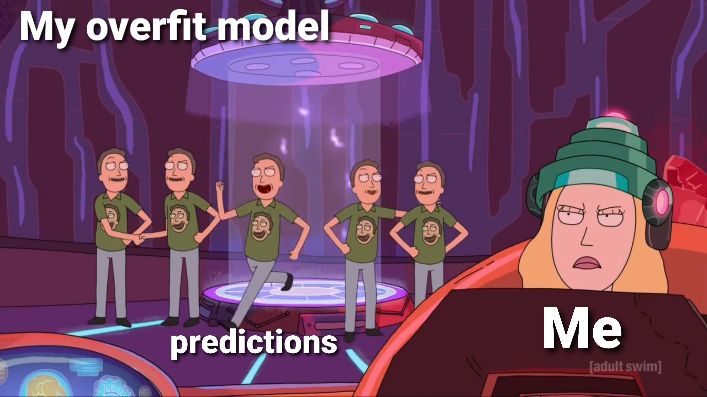

# OHwA S02E01

**Arbitrage:** So, how did you first hear about Numerai?

\*\*\*\*[**Joakim**](https://numer.ai/joakim_arvidsson)**:** I think it was through Quantopian. I've been an active user on Quantopian for a couple of years now and I think it was through a forum post there. Or I was looking up Quantopian's competitors. Then I found Numerai, and it looked really difficult so I didn't try it, but I actually just started a couple of months ago. Early on I wanted to build my own stock market prediction strategy, and Quantopian is good for that, but now I want to learn machine learning and data science, and Numerai is just perfect for that.

**Arbitrage:** Can you talk to me a little bit about how Quantopian prepared you for Numerai or maybe Numerai enhanced your skills for Quantopian? While they're related, they're completely, totally different.

**Joakim:** Yeah, well first of all, I had to learn Python in order to compete in either Quantopian or Numerai. You could use other programming languages with Numerai, but Python is the one for data science, I think. There are courses online on UDemy, Coursera, and there's also YouTube and videos in general. If I didn't learn Python for Quantopian I wouldn't have been able to compete in Numerai, and Numerai teaches me about machine learning and data science. They benefit from each other.

**Arbitrage:** I think they're complements, for sure. When I started coding, I was looking for domain-specific applications of Python and I found Quantopian and to me it was a perfect fit. But then I realized I don't really know how to code. At the time I didn't know enough core Python to even get started, I would find some example script and hack it. It was awful and I quit. But then in the Quantopian forum somebody mentioned Numerai, and that's what brought me over. I went all-in on Numerai because of the machine learning aspect. I thought that was the wave of the future, that it was a good thing for me to do \(and it's worked out quite well\). Now I know the Python, I don't have time to try anything new. I can't be a baller like you and be highly successful in both. You're regarded as one of the top users on Quantopian - have you always been near the top or did you kind of learn as you go?

**Joakim:** I considered myself a newbie for a long time on Quantopian, probably at least 6 months, and I definitely consider myself a newbie here. I don't know when I started to consider myself a more experienced user on Quantopian, but it was at least six months. It took me three months just to figure out a strategy.

**Arbitrage:** I can kind of tell by your coffee that you're on the opposite side of the world - where do you live these days?

**Joakim:** We live in Brisbane, Australia. I'm Swedish originally, but I haven't actually lived in Sweden since '94 - so I'm a bit above average age for this group, I think.

**Arbitrage:** I don't know what I can ask you about your Quantopian stuff, but like I said you're one of their top users. How did you get there, and what makes you one of their top users? I'm trying to ask you a question without really asking the question so you don't have to give things away.

**Joakim:** Really just participating in their contests and the challenges they've been having lately and having success there. One key lesson for me has been learning not to overfit because it's **so** easy to overfit. 



**Arbitrage:** Awesome. What do you do for a living? Are you doing full-time quant gig work?

**Joakim:** That's what I'm trying to do, yeah. My career has been in finance, I studied finance in school, but when my son was born three years ago I quit my corporate job and tried to venture out as a freelance quant. That's what I'm trying to achieve now and I'm having mixed success, I think. It would be nice to live off the profits from Numerai, but at this point it doesn't seem to be too realistic \(for me, anyway\).

**Arbitrage:** I think we'll get there. A lot of things need to go right - mostly Richard needs to raise a ton of money so that AUM goes up 🚀 well beyond the filing threshold so we can all bask in the glory of the meta-model. So, you're a new user, but I bet you still have three tips for the tournament.

**Joakim:** The tips that have already been mentioned are definitely the best ones, but I think I can mention something. One key thing for me is to divide up the data in a good way between train, validation and test so you can develop a good model on the train and validation data, and test on the test set. In my [forum post](https://forum.numer.ai/t/what-is-a-good-sharpe-ratio-and-validation-correlation/419/2), I described one of the ways I try to do it, but that's one lesson: **have a validation set that's representative of your training set.** Two is something simple, maybe combining models where you have a number of different models that are each predictive but different from each other. Averaging them might be a good idea. There are other ways of combining, but -

**Arbitrage:** That's probably the easiest way to combine models.

**Joakim:** Yeah, and that's what I'm doing.

**Arbitrage:** It's super robust - by the way I tell my students to do that. One of my students is ranked 15 overall on the leaderboard, 11 out of staked models. It's a really powerful method.

**Joakim:** Yeah. And for number three, when I have a model that I'm happy with, instead of just going live with it I train it on all of the data that I have. The drawback is you don't have test performance to compare live performance with, but I don't see that as too much of an issue.

**Arbitrage:** That's exactly what I do: fit it on your subset of data and once you have your parameters right, lock them in and train on everything. You can include Validation if you so choose. So we have a really important question. We had a tie in the last season for who the favorite team member is, and we can't have that this season. We should start out with your vote for favorite team member!

**Joakim:** I'm going to have to go with someone who I don't think anyone has voted for yet. I'm going to say Jason.

**Arbitrage:** Jason! 

**Jason:** Thanks - feels good!

**Arbitrage:** Yes, Jason, the unsung hero of compute. The new hero of Erasure Quant. I can't tell you how helpful he is - I've bugged him countless times and he's patient and kind with me and I appreciate it greatly. What is your number one feature request or request for improvement related to the tournament?

**Joakim:** I don't really have a feature request, but I have a complaint if that works? It's not really a complaint... The thing I struggle with the most is that I'd like to be able to stake more, but I'm also too afraid to buy NMR because I'm afraid it's going to drop by 90% tomorrow. So I think doing something around the volatility of the token we're staking with \(if that's possible\) ... if something could be done with that, that would be my number one request.

**Arbitrage:** That's totally valid- it's something I've talked about with the team a lot. It's about as difficult a question as this being the most difficult data science competition in the world. Solving that volatility question is extremely complex - I haven't really figured out a mechanism for that. People have tried! I think [OF\_S](https://numer.ai/of_s) has a pretty decent proposal related to an option strategy. It is complex, but it's sound from an empirical and quantitative perspective through the finance lens that I look at it. Thank you for taking my questions, Jo, and for your attendance! You're always on!

**Joakim:** Thank you for having me on!

Arbitrage then gave Richard and the team a shout out for [another successful round of fundraising](https://www.theblockcrypto.com/post/67223/numerai-3-million-token-sale-staking-protocol) before unveiling a project he worked on in the time between Seasons 1 and 2.

### Arbitrage wants to save your memory

Arbitrage prefaced his demo by saying one common frustration among tournament participants is the intense memory usage. So, he tried to see how he could get the data types to be fixed.

One way to do that is to download the data, capture the features in a list, combine those elements, and format the whole thing by setting the data type with the  `read.csv` function. Arbitrage explained that if you tell pandas what data type you want in advance, it will load the data that way and will be slightly more memory efficient. 

Creating the dictionary from the training data:

```python
import pandas as pd
import numpy as np
from joblib import dump

#download Numerai training data and load as a pandas dataframe
TRAINING_DATAPATH = 'https://numerai-public-datasets.s3-us-west-2.amazonaws.com/latest_numerai_training_data.csv.xz'
df = pd.read_csv(TRAINING_DATAPATH)

#create a list of the feature columns
features = [c for c in df if c.startswith("feature")]

#create a list of the column names
col_list = ["id", "era", "data_type"]
col_list = col_list + features + ["target_kazutsugi"]

#create a list of corresponding data types to match the column name list
dtype_list_back = [np.float32] * 311
dtype_list_front = [str, str, str]
dtype_list = dtype_list_front + dtype_list_back

#use Python's zip function to combine the column name list and the data type list
dtype_zip = zip(col_list, dtype_list)

#convert the combined list to a dictionary to conform to pandas convention
dtype_dict = dict(dtype_zip)

#save the dictionary as a joblib file for future use
dump(dtype_dict, 'dtype_dict.joblib')
```

Arbitrage proposed using the [feather file format](https://arrow.apache.org/docs/python/feather.html) which works equally well with R and Python. As he explained, his plan is to store the training data as a feather file, preserving the float32 dtype for the feature columns and significantly reducing memory usage and storage space. Initially, pulling and preparing the data required 1.2 GB for the training data and 3.7 GB of RAM for the tournament data. 

After creating the list from the data and storing it as a feather file, the new memory usage was 606 MB for the training data and 1.8 GB for the tournament data. And, because feather files are language agnostic, they work the same for Python and R, which captures the majority of tournament participants \(sorry, [Bor](https://docs.numer.ai/office-hours-with-arbitrage/office-hours-recaps/ohwa-5)\).

[JRB](https://numer.ai/jrb) suggested [parquet](https://parquet.apache.org/) as another option due to its popularity with enterprise data science teams. As an alternative method, JRB said you could also save the numpy array to disk with something like `numpy.save` and then instead of loading it, pass a flag saying use `mmap` which essentially means the file is memory mapped and doesn't use any physical memory from your machine.

[Slyfox](https://twitter.com/ansonschu) was on the call and said that he's currently collecting feedback about the Numerai tournament data  API to see how they could improve it or make it more functional. He didn't believe it would be prohibitively difficult to generate the data sets in pretty much any format the data scientists would want, and said he is open to delivering it in multiple formats. "Not now, though," he said.

### Questions from Slido

**Is it possible to create an external service to enable staking with leverage up to 4x on Numerai?**

While this isn't something the team could work on, it's technically possible for someone to build a service to do this. It would have to exist independent of the tournament, but it's possible. 

Richard explained that the way you hedge anything is by selling exposure to the same thing. Using a $100,000 stake on Numerai, for example, you could go to a service where you could borrow NMR with collateral and lock up $500,000 worth of DAI. Then you could borrow NMR against that. Your first $100k is already staked, the next $100k you could sell on the open market. This creates a situation where you don't really have NMR exposure **but** you have an NMR stake.

The thing with schemes like this, Richard said, is that the risk is in other places. 

> "This would all be perfectly good if DAI were extremely safe [but maybe it's not](https://blog.makerdao.com/recent-market-activity-and-next-steps/), or if the smart contracts powering this were perfect and couldn't be hacked. So for now I do think the risk of taking on the volatility and staking as much as you want to with that volatility is probably better. Loaning, leverage, and other things, would work in a similar way where you would put up this collateral, borrow a lot of NMR against it, and then stake more than your means. 
>
> I think all of these things will happen, and there's many companies doing these things and I think some of them do them for NMR. It's just a question of how much liquidity is there really, how much do you really trust it. I would think it's worth ignoring this whole thing for like another year, and then looking at it again. The markets will become better and denser and there will be more proof that this works.

Arbitrage had the thought that someone could start a hedge fund that holds a large volume of NMR and with the sole purpose of funding successful data scientists competing in the Numerai tournament at a high level. That fund could then add to the stake and make money through the payouts. Arbitrage noted that he believes there was a group who purchased NMR early on with the goal of trying something like this, but it didn't pan out.

**Why are Michael Oliver's accounts \(**[**MDO**](https://numer.ai/mdo)**,** [**Niam**](https://numer.ai/niam)**,** [**NMRO**](https://numer.ai/nmro)**\) still on the board? Isn't this a conflict of interest?**

Longtime tournament participant and frequent guest of Office Hours [Michael Oliver](https://twitter.com/the_moliver) announced in a [previous episode](https://docs.numer.ai/office-hours-with-arbitrage/office-hours-recaps/ohwa-s01e09) that he would be joining the Numerai team full time as a data scientist.

"It's an _alignment_ of interests," Richard said.

Richard said that they still need to talk about it more internally, but ultimately, if there's a prize like the former reputation bonus \(where only the top _n_ participants are paid out\), then it's bad for Numerai to have their own models on the top of the leaderboard. But if there are no rewards like that, Richard doesn't see the harm in Numerai team members staking on models in the tournament. 

When [Mike P](https://numer.ai/master_key) joined the Numerai team earlier in the year, while the reputation bonus was still active, they requested that he withdraw his stake. But now, without the reputation bonus, Richard said they want Michael Oliver to keep managing his models the way he has been so that Michael can keep that link to the perspective of what it's like to be a tournament participant. 

Richard wants to ultimately implement something to make it more clear which models are Numerai team members \(or [Integration Test](https://numer.ai/integration_test)\) when looking at the leaderboard by greying those models out or otherwise altering their appearance. 

Arbitrage explained that, as someone who has helped the Numerai team with several projects, any insight to the tournament data does not help. Arbitrage said he hasn't seen the data and doesn't want to see the data because that would only bias how he uses it. The same applies to anyone at Numerai: peeking at the data isn't an advantage so much as a detriment because it introduces bias that needs to be overcome. He referenced [Sugaku](https://numer.ai/sugaku), a model by another Numerai team member experimenting with [era boosting](https://forum.numer.ai/t/era-boosted-models/189). Despite access to the Numerai data, Sugaku still couldn't beat Integration Test \(which simply submits the example predictions each week\). "Even with this tremendous amount of insight that we all don't have," Arbitrage said, "it still didn't help."

Arbitrage also explained that in order to best help the people who are participating in the tournament, you also need to participate in the tournament. Considering that, Arbitrage agrees with Richard that keeping Michael Oliver in the tournament is the right move \(especially now that there are no more rank-based payouts\). 

**What will replace the reputation bonus come September? Should burn insurance be tied to reputation?**

Richard pointed out that MMC replaced reputation. Someone could have a performant model with high correlation and an MMC-staked model that performs well during high burn periods, effectively mitigating some of the risk and simulating a bonus payout. 

The team isn't planning any new bonus payments at the moment. Richard said it's not out of the question, but as they've said before, any payout mechanisms that are basically free money will be "We want the tournament to be as hard as the stock market," Richard said, "so any time someone earns money, it should be because of some edge, not because we made some rule that makes it easier to earn money."

**Good MMC models: do they tend to do well in burn periods? What's the ratio between earn and burn periods?**

Arbitrage has done extensive empirical research on the difference between earn and burn periods. Over the life of the tournament, he said, you're more likely to burn than to earn by a small margin. However, with the introduction of the Kazutsugi targets earlier this year, you're far more likely to earn than burn. Arbitrage speculated that it might be more relevant to only look at performance during Kazutsugi, not the entire tournament. 

Regarding MMC model performance during burn periods: the MMC calculation was [changed](https://forum.numer.ai/t/mmc2-announcement/93) from its original version, so Arbitrage doesn't believe there's enough data at the moment to say whether or not high-MMC models do any better during burn periods. 

Richard suggested that now that the Validation data set is expanded with Validation 2, data scientists can find periods with several burn eras in a row. "Those are the drawdowns," Richard said, "that's representative of the test set. But the previous 12 months of validation data were not representative so you won't do well there. The idea of having 0.04 correlation isn't right - in the test set, a lot of people were more like 0.02."

> "All of that is to say: be really careful, take your time. It's okay to wait. We know how correlation works, so stick with that, track your performance over time, and make a decision that works best for your risk tolerance."

**When, roughly, did the Numerai fund start trading in the live market with real capital?**

**Richard**: It was December of 2015.

He told us that on that first day they were relying heavily on his model and weren't quite set up for trading globally yet. They work with UBS as their prime broker so they can make more interesting trades in more markets. "Things started to get more real two years ago," Richard said, "and when we launched Kazutsugi, that's when things got really real because we felt like we were at the stage where we really liked the fund. And then the first two months weren't that good."

**Arbitrage:** Yeah Kazutsugi opened with two months of major burns.


**What does the reputation column on** [**numerdash**](https://numerdash.com/) **stand for? Is it a new scoring metric?**

Keno noted that the reputation column was just removed as it was tracking an old scoring metric.

**For new participants, is it better to focus on MMC or correlation? MMC seems to be the future and the most useful for Numerai, right?**

"When you're first starting out, MMC might be a little strange to think about," Arbitrage said. "I would recommend for somebody new, maybe not to an astrophysicist, focus on correlation. It's more intuitive, you can directly measure it, and you don't have to worry about the effects of other people impacting your MMC." Starting straight with MMC, Arbitrage doesn't think new data scientists will get enough traction to encourage them to continue participating in the tournament. [Richard](https://twitter.com/richardcraib), [Rudi](https://numer.ai/themicon), [Eik](https://numer.ai/rappenlager), and [Michael Oliver](https://numer.ai/mdo) agreed.

Arbitrage also suggested building a candidate model and collecting data on it over time before switching it over to MMC. Or, another option is to build something different from your candidate model that's specifically designed for MMC. 

Regarding the second part of the question, 'MMC seems to be the future and the most useful for Numerai,' Arbitrage said yes because Numerai wants diverse opinions that are weakly good so they can build a strong meta-model. 

_If you’re passionate about finance, machine learning, or data science and you’re not competing in_[ _the most challenging data science tournament in the world_](https://numer.ai/tournament)_, what are you waiting for?  
  
Don’t miss the next Office Hours with Arbitrage : follow_[ _Numerai on Twitter_](http://twitter.com/numerai) _or join the discussion on_[ _Rocket.Chat_](https://community.numer.ai/home) _for the next time and date.  
  
Thank you to_ [_Richard_](https://twitter.com/richardcraib)_,_ [_Michael Oliver_](https://numer.ai/mdo)_,_ [_Keno_](https://numer.ai/wander)_, and_ [_JRB_](https://numer.ai/jrb) _for contributing to answers during this Office Hours,_ [_Joakim_](https://numer.ai/joakim_arvidsson) _for being interviewed, and to_ [_Arbitrage_](https://numer.ai/arbitrage) _for hosting._


