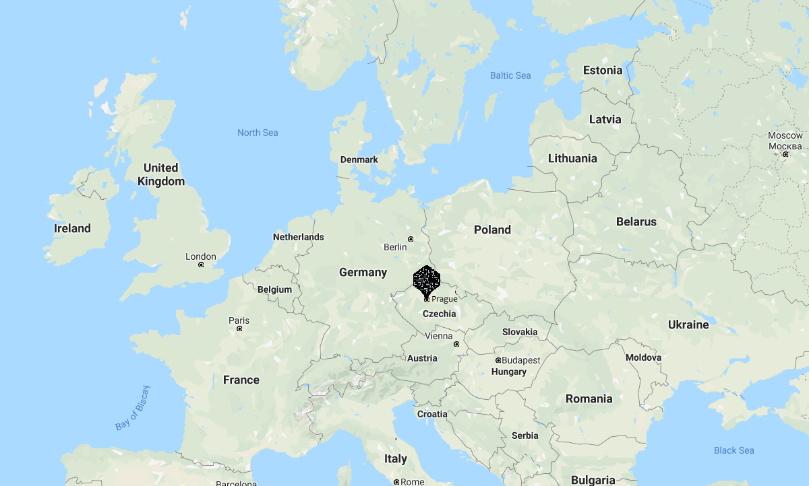
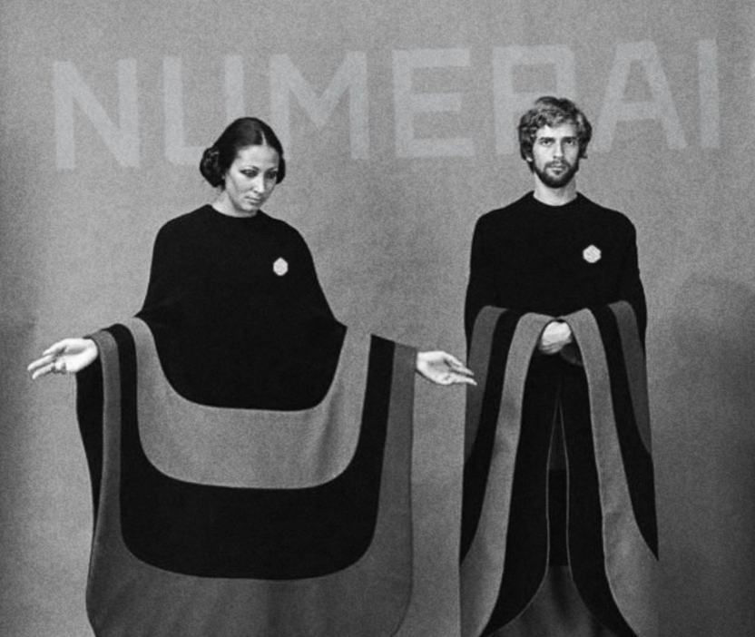
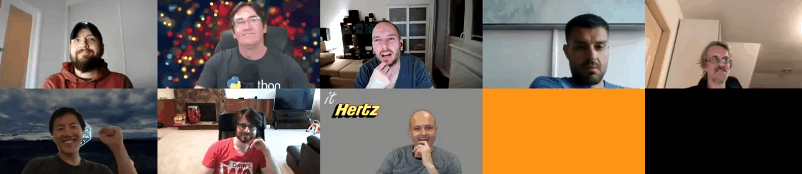

# OHwA S02E04

In this episode, Arbitrage interviewed long-time tournament competitor [Quantverse](https://twitter.com/CarlossVavros) from Prague. You can check out the full interview after the Slido questions below.

### Questions from Slido

**When Doctor?**

Arbitrage should be proposing his dissertation in September, then he has about a year left to finish his program if he stays on track but has already decided to stay an extra year.

**Any basic examples of Keras or TensorFlow for use with the data set? Should we request \(or make\) a boilerplate for the tournament?**

Keno suggested that, because the Numerai data set is already so clean, data scientists would get a lot of use out of some basic templates for using advanced neural nets tools like Keras and TensorFlow, and it would help people with getting started because the API isn't very straightforward. 

JRB advised that early on in your neural net journey, you want to avoid Keras because of some quirks with it's limitations.

Keno, JRB, and Arbitrage all expressed interest in the topic of using TensorFlow for the tournament, and Arbitrage suggested moving the conversation [to the forum](https://forum.numer.ai), where it will pick back up.

**Would it be possible for tournament participants to see net exposure to country?**

Arbitrage speculated that, were data scientists able to somehow find out country exposure, they would run the risk of overfitting. 

> "It goes back to the idea that I don't touch the data, because if I knew more about it, it would bias what's going on." - Arbitrage

Richard added that if they gave out the country category, strange things could happen like users who only trade in countries that are more expensive for Numerai to trade in. "At some point there might be such a thing," Richard said, "but remember that the Kazutsugi targets is very neutral to all of the things we know so you're not missing out on too much." Richard also mentioned that some of this might cross over with [Numerai Signals](https://docs.numer.ai/numerai-signals/signals-overview): someone with a model that's performant in one country might want to put that on Signals. 

**Does flipping a model with positive correlation and negative MMC work to get a model with positive MMC? Is that allowed?**

In a scenario where a submission is 75% long and 25% short with positive correlation because it's long-biased, but negative MMC because it's not very performant, if you take the inverse of that you've inverted your prediction set. The result is more substantially negative correlation and negative MMC. Arbitrage said that isn't universally true, but he believes it's the most likely result.

\*\*\*\*[**Michael Oliver**](https://numer.ai/mdo)**:** If you flip a model to 1 -p, your model is likely to be worse overall. It's probably not going to help. For MMC you have to be both good and different. Just being different isn't enough.

**Any feedback or feature requests for the Numerati Dashboard?**

The [Numerati Dashboard](https://www.jofaichow.co.uk/numerati/) is a project by tournament data scientist [Jo-fai](https://twitter.com/matlabulous) \(Joe\) aka [IA\_AI](https://numer.ai/ia_ai). Joe built the dashboard to easily compare multiple tournament models. You can even select individual models to compare:


**Arbitrage asks Richard: what is the best submission type for the meta-model right now? What does that model look like?**

> "The meta-model contribution is pretty close to what it looks like." - Richard Craib

Richard explained that if the example predictions had a correlation of 0.03 and someone was able to create a model that a correlation of 0.02 _after_ being neutralized against the meta-model, it would suggest that the model found a substantial amount of orthogonal alpha not captured by the example predictions. The only way someone would be able to do that is by taking on feature exposures that are significantly different from the average model.

Getting good performance residual to the example predictions is a good measure. "The more we work on the meta-model," Richard said, "the more we learn about what we really want. Michael Oliver sharing [smart sharpe on the forum](https://forum.numer.ai/t/performance-stationarity/151/2) did give us a new way of looking at things, and autocorrelation seemed like the thing we should be minimizing."

Richard said that he and [Mike P](https://twitter.com/easymikep) want to improve the feedback data displayed when predictions are uploaded. They noticed that as soon as Validation Sharpe was displayed on upload, people started caring about it more and subsequently models improved.

Richard posted this equation in the chat for anyone who wants to calculate what a model's sharpe would look like on an actual backtest:

```text
Richard Craib : Numerai Sharpe = (mean(era_scores)-0.010415154)/std(era_scores)
Richard Craib : *sqrt(12)
```

**Richard asks Arbitrage: Do you think it would be useful to show other peoples' validation scores to everybody?**

Arbitrage thought that would be a good idea because it would make it apparent which models are training on validation data and which ones are not. Data scientists could also use that information to figure out why two models with closely clustering scores might have very different validation sharpe.

> "Anything that makes me question my performance relative to other people is meaningful because it helps me to either generate a new hypothesis or to not change my model." - Arbitrage

### Interview with Quantverse

**Arbitrage:** So Quantverse, thanks for joining - where do you live?

**Quantverse:** I live in Prague, the capitol of the Czech Republic, a small country in Central Europe. It's already like, 10:00 pm now here.



**Arbitrage:** So Quantverse, what do you do for a living?

**Quantverse:** Well I don't have a "regular" job - for now[ I just live off of Numerai, actually](https://numer.ai/quantverse). But I dedicate time to more projects. One is designing automatic trading systems for cryptocurrency markets and market making.

**Arbitrage:** That's amazing!

**Quantverse:** It's still experimental. I'm still finding new strategies, so it's not live yet. But, hopefully it will be live in like, two months probably, for some testing. Before, I was doing arbitrage strategies - pun not intended!

**Arbitrage:** \( ͡° ͜ʖ ͡°\)

**Quantverse:** It was working fine in a time of really high volatility, but in the case of low volatility, it's not really that interesting. It's only when there are like, big moves in Bitcoin, that you really gain something. I think it's more interesting to focus on market making with a single system. Another project I have is a small website called [Pairs Trading](https://www.pairtradinglab.com/). It's a suite of tools to play with equity pairs trading. You can assemble a portfolio of pairs trading strategies, or there's also a really simple automated platform you can download so you can execute your strategies in real-time if you have an Interactive Brokers account - you can just let it go and it will automatically trade your pairs based on your rules. It's a small website, but there are some customers who like it. There was even a small hedge fund using it at one point.

**Arbitrage:** Awesome, post it in the chat so people can check it out. Now I can hit you with the next question: what would your parents say you do for a living?

**Quantverse:** Yeah...  that's a good question! They basically know I'm doing projects related to bitcoin. They kind of know what bitcoin is already. Actually, they think I work for some weird American hedge fund.



**Quantverse:** It was really difficult to explain how the whole Numerai project actually works, so they probably just think I'm an employee or contractor. Pretty much they know I'm doing some stuff related to brokers and exchanges, but they don't really know the details. I think it's enough for them to grasp the principles of what I'm doing.

**Arbitrage:** That's really cool.

**Quantverse:** But yeah, they think I work for an American company.  ¯\\_\(ツ\)\_/¯

**Arbitrage:** I think it's great that your primary income activity comes from the tournament. That's amazing, and I think there are probably several people in here who are striving to achieve that level. It's good to hear somebody is able to pull it off. What do you do for fun? You can't just push code all the time.

**Quantverse:** I also dedicate some time to photography. I have a few cameras and lenses, but lately I've found out it's more fun to actually downgrade back to film. So now I have film cameras, and I've tried to develop black and white photos myself.

**Arbitrage:** Nice!

**Quantverse:** It's neat because there's considerable costs for each frame you make, so it forces you to think about different ways to compose and make photos. I'm also a salsa DJ and salsa dancer- if you know south side and Latin dancing.

**Arbitrage:** Wait, so you DJ south side and Latin music?

**Quantverse:** Yeah.

**Arbitrage:** In Prague?

**Quantverse:** Yeah! There's a big scene actually.

**Arbitrage:** That's **so** cool.

**Quantverse:** There's a big community of dancers - it's fun.

_Author's note: can confirm the salsa dancing scene in Prague is awesome_ 🕺💃

**Arbitrage:** Let's talk about the tournament. When did you start participating? How old's [your account](https://numer.ai/quantverse)?

**Quantverse:** I started submitting in January 2017. It was still the old competition format where your performance was never weighted on live data but on some private holdout set. So that's how I started. I wanted to learn Python back then, I hadn't used it before, and to get some experience with machine learning. But just doing a project or some tutorials isn't very interesting so I wanted some motivation to compete and beat somebody and perhaps be lucky to get some bitcoin \(back then it was paid in bitcoin\). So I learned some Python and some machine learning just from this competition.

**Arbitrage:** It's very interesting how many of us turned to the tournament as a method of learning and then ended up being able to turn it into some profit. I think that's a wonderful part of this whole project. How did you find out about Numerai in the first place?

**Quantverse:** I was already into some quantitative finance blogs and social networks, because of my website, and somebody just shared it as something different, an interesting combination of machine learning, quantitative trading, and cryptocurrency. It caught my attention, and just a few months after I heard about it, I started to dedicate some time to making my first predictions. I found out about Numerai in the second half of 2016, and in January 2017 I started to build some models.

**Arbitrage:** So what do you wish you had known when you started out?

**Quantverse:** When we talk about the modeling part itself, I wish somebody told me that using the official validation data set for validation and choosing my models is not really a good idea. It's just too small to give you really good insights about your model.

**Arbitrage:** I hear from a lot of new users that they believe the tournament is too challenging and it becomes overwhelming and there's too much to handle. Why do you think people believe that?

**Quantverse:** I don't think it's that overwhelming by itself. Anybody can just take the example model and then try to make something better. Maybe people mean something else: the competition is changing so much, it's like every six months is practically a new tournament. Maybe people are just tired of changes. It's hard to guess because I don't really share that opinion myself.

**Arbitrage:** Yeah, if I started the tournament and then two weeks later there was a breaking change, I'd probably throw up my hands and walk away. Fortunately the latest changes haven't been very large. But [Anson](https://twitter.com/ansonschu), aren't we coming up on the one year anniversary of Kazutsugi? 

**Slyfox:** Almost! I think we're like, two months away.

**Arbitrage:** You at least announced it this time last year, if I remember correctly.


**Arbitrage:** And then there was work leading up to launching. So let's call it an 18-month development process with iterations on it live. I think this is the most stable we've seen the tournament. What's changed, of course, is that binary outcome where you have a full loss if you burn. To me, that's been the most welcome change because it's given a lot of stability and confidence in my modeling. 

**Quantverse:** I still remember that when Kazutsugi was introduced, I wasn't initially happy about it because I had to switch my modeling from classification to regression and make a lot of changes and such. But now, after almost one year, it's been the best change that happened to the competition because the data set is much more stable to model so I'm happy we have Kazutsugi.

**Arbitrage:** I'm 100% with you. What programming language do you use and why? You mentioned Python for the tournament but what about in general?

**Quantverse:** In general for me, for other projects I use Rust for almost everything now. These projects are performance-sensitive. You can imagine, for instance, the market making system needs to run fast with very low latency. I also built a simple back tester for that, and I need to run that on low-level crawled data and I need it to run as fast as possible. So I wanted something that was really fast, has some memory safety, good concurrency, and a language that doesn't really have garbage collection. So not Java or .NET. I'm also working on a big project with some friends. Actually, you mentioned that there was a time where you were mining bitcoin on Slushpool...

**Arbitrage:** Yeah.

**Quantverse:** The owners of Slushpool are good friends of mine and we're working on a project together, and they're whole company uses Rust now.

**Arbitrage:** That's amazing! How cool! Can you give us your top three tips for the tournament?

**Quantverse:** I guess the first tip I already kind of mentioned: bring your own reliable validation scheme so you can evaluate your models locally with some confidence. That means run cross validation, basically. Definitely evaluating on the validation set is not really enough - it doesn't really tell you anything. If you have bad results on the validation set, your model most likely sucks. But if the results are okay, it doesn't tell you anything because there's really only one regime there. 

**Arbitrage:** Have you looked at Validation 1 and Validation 2? I would agree with you with the previous validation set that was just Validation 1, and that didn't seem to be very representative. With the addition of Validation 2, do you still stand by your statement that the validation set is not enough if you were to combine Val1 and Val2?

**Quantverse:** Yeah, I do.

**Arbitrage:** It's still not enough?

**Quantverse:** Yeah. I do cross validation - that's my primary source of truth - and I use Validation 1 and 2 as additional holdout sets to take a peek if I'm kind of matching performance. I can already see I have many models that have good results on Validation 1 and 2, but they fail in cross validation. For me to use any model, it has to have good performance on both: cross validation, and Val1 and Val2. 

**Arbitrage:** Are you concerned then that you don't have enough training data?

**Quantverse:** I thought that initially, but I tried an experiment: I trained on only the first half of the training data and the performance on the second half and the validation set is still okay. I was able to find models that performed well on the rest of the data after training on only the first half of the training set. So I think there's plenty of data.

**Arbitrage:** Okay. I usually find that for my purposes, if I subset the data too much, I don't have enough.

\*\*\*\*[**JRB**](https://numer.ai/jrb)**:** You'd have the same amount of training data if you do k-fold cross validation, right?

**Quantverse:** Yeah. I usually take three folds of cross validation so there's enough data.

**JRB:** So one model's validation set is another model's training set.

**Quantverse:** Yeah.

**Arbitrage:** I see what you're saying, JRB. 

**JRB:** Quantverse, do you end up ensembling the results of your k-fold cross validation? Or do you just pick the best one?

**Quantverse:** I average them.

**Arbitrage:** Quantverse I imagine that's probably why we huddle together \[on the leaderboard\] sometimes, because I'm doing that with some of my stuff. We had a huge sidebar on your first tip, which is cross validation; what's your second one?

**Quantverse:** Second tip is mostly for people new to the competition. If you look at the example predictions, it's [actually quite a good model](https://numer.ai/integration_test). So for people just starting, maybe it's okay for them to take that model and try to understand how it works and why, and try to beat it. Use it as a baseline to beat, because if you beat it by just one rank, you're at rank 35 or 34. 

**Arbitrage:** I think some people who are struggling, even after a period of participation, would benefit from doing that too. So what is your third tip, my friend?

**Quantverse:** My third tip ... look at the models your want to build as a multi-objective optimization problem. If you look at the forum, there's a lot of advice on how to optimize sharpe ratio or optimize for sortino ratio; in reality you want to optimize on more dimensions like this. For instance, you also want to optimize for certain low feature exposure or lower correlation with the example predictions. So look at how the multi-objective algorithm works, and when you set your hyper parameter specs, try to do it in the way that your models will improve in all dimensions, not just one. You'll find a lot of interesting models that way.

**Arbitrage:** Thank you for giving us your tips, Quantverse, those are great. Here's a fun question that I asked John [last week](ohwa-s02e03.md): if you could have a billboard with anything on it, what would it be and why?

**Quantverse:** Probably it would be something funny, some kind of meme. Something like, 'already tired of going to church? Join the Jedi!' or something like that. Or, Samuel L. Jackson from Pulp Fiction, that guy saying, "Drive carefully motherf\*\*\*\*\*\*s."

**Arbitrage:** There it is! Ant, that's the one.


**Arbitrage:** Here's a controversial question that I love asking: who is your favorite team member?

**Quantverse:** That's a tough question, but I think I'll vote for Anson actually. I've met him already in Prague.



**Arbitrage:** Yeah, he's a cool dude, I'll vouch for him. 

**Slyfox:** Thanks!

**Arbitrage:** Quantverse, what is your number one feature request or improvement for the tournament?

**Quantverse:** I would really like to have a single page where I can evaluate the daily performance of my models at once. Right now I have to switch between models or tabs with the URLs bookmarked. I would like to see one page where I have all the models with their daily scores and maybe the submission score plot.

**Arbitrage:** Do you have ten models now?

**Quantverse:** No, actually I have four models which are staked now, and four models which are experimental, so I still have two free slots.

**Arbitrage:** If you could turn back time and talk to your 18 year old self, what would you say?

**Quantverse:** "Hey you - stupid! Buy bitcoin!"

**Arbitrage:** Yeah, I'm with you... What advice would you give someone who wants to be a data scientist?

**Quantverse:** Turn it into a game and play with some competitions like [Numerai](https://numer.ai) or Kaggle. Get their hands dirty and play with some data. Just find a project that you can play with, and if you like it, you'll probably be good at it.

**Arbitrage:** If you could step into my shoes, what would you ask yourself that I have not?

**Quantverse:** Probably something like, "what technologies do you use for your modeling?"

**Arbitrage:** What technologies do you use for your modeling?

**Quantverse:** Before Kazutsugi I mostly used neural networks. But now I'm mostly into tree models.

_If you’re passionate about finance, machine learning, or data science and you’re not competing in_[ _the most challenging data science tournament in the world_](https://numer.ai/tournament)_, what are you waiting for?  
  
Don’t miss the next Office Hours with Arbitrage : follow_[ _Numerai on Twitter_](http://twitter.com/numerai) _or join the discussion on_[ _Rocket.Chat_](https://community.numer.ai/home) _for the next time and date.  
  
Thank you to_ [_Richard_](https://twitter.com/richardcraib)_,_ [_JRB,_](https://numer.ai/jrb) _and_ [_Slyfox_](https://twitter.com/ansonschu) _for contributing to answers during this Office Hours, to_ [_Quantverse_](https://numer.ai/quantverse) _for being interviewed, and to_ [_Arbitrage_](https://numer.ai/arbitrage) _for hosting._


