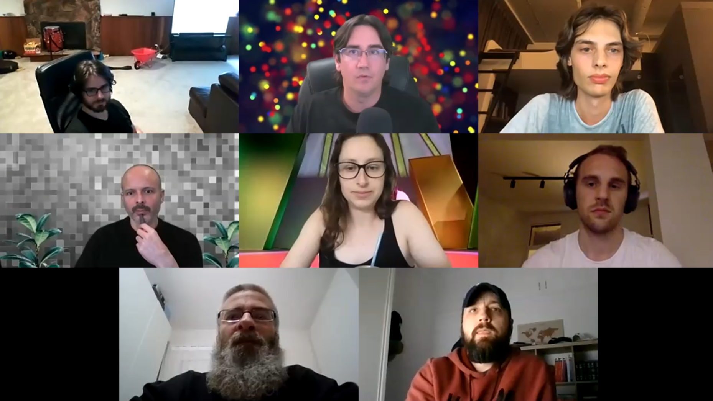

# OHwA S02E11

On episode 11, Arbitrage interviewed Carlo Lepelaars who recently wrote a [guide to competing in the Numerai tournament](https://app.wandb.ai/carlolepelaars/numerai_tutorial/reports/Build-the-World-s-Open-Hedge-Fund-by-Modeling-the-Stock-Market--VmlldzoxODU0NTQ).

The full interview with Carlo will be published [on YouTube](https://www.youtube.com/channel/UCQt3RVSKsDpFgYIm1A-nWbA).

### Questions from Slido

**When** [**Sorios**](https://numer.ai/sorios)**?**

Another request from the community for Sorios to join Office Hours. Sorios, if you're reading, slide into Arbitrage's DMs, he would love to have you as a guest.

**Carlo - would you please share some insights on how you choose and decide between abstraction and elaboration while writing?**

Carlo admitted that one of his biggest challenges while writing is wanting to include as many small details as possible, but he knows that wouldn't make for coherent posts. 

> "What I do is write everything down and truncate it from there." - Carlo

**What if the team use all previous submissions and their metrics to model the relationship between submission stats and live performance and to suggest improvements?**

[Michael Oliver](https://numer.ai/mdo) said that it's technically possible, but the team is definitely not going to give tournament participants any metrics from Numerai's backtesting. Doing so would run the risk of inadvertently leaking information about the test data. He added that they are working on adding new submission metrics based on the validation data, and these should be available soon, saying "obviously these will only be valid if you're not training on your validation data." 

Michael Oliver concluded by saying that he doesn't think data scientists need to train on the validation set and it's probably better used for hypervalidation of different parameters or techniques.

Arbitrage added that any suggestions for improvement from Numerai would also introduce bias and would lead to models being overfit to the data.

**Which is the metric \(or combination of several\) that we should optimize for?**

"There is no one metric to rule them all," Arbitrage said, "you should consider several."

