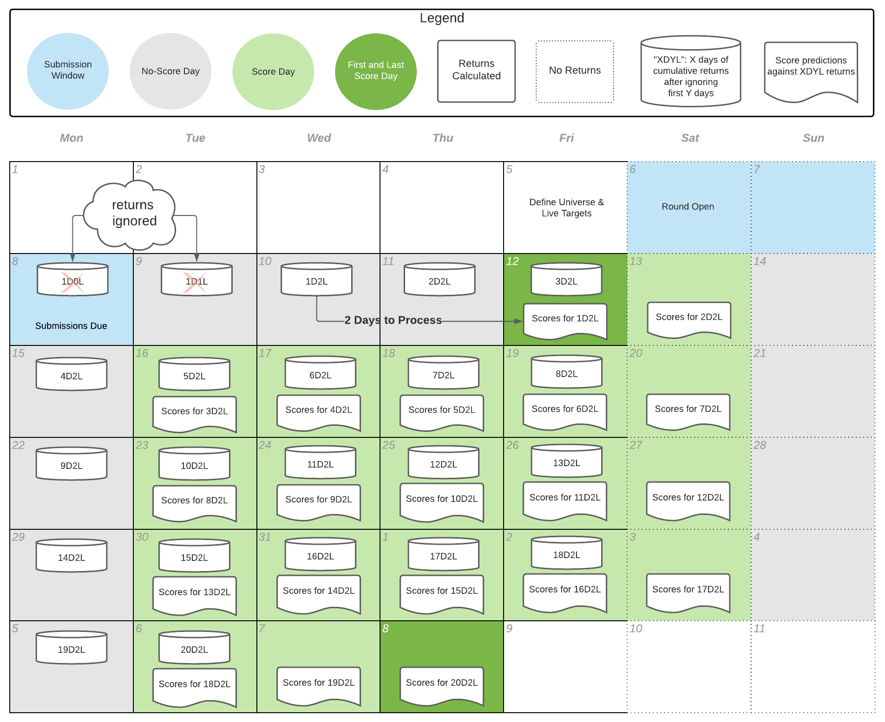

# Correlation (CORR)

## Motivation

In the stock market, if a portfolio is correlated with returns, then the portfolio is more likely to have higher returns. If the returns are then "residualized" (stripping out all common [exposures](https://en.wikipedia.org/wiki/Market\_exposure) to [market beta](https://en.wikipedia.org/wiki/Beta\_\(finance\))), then a portfolio that is correlated with residualized returns is more likely to have returns that are not dependent on common market factors. This same idea could be applied to models; if a portfolio is built on models that are correlated with residualized returns, the resulting portfolio is more likely to have returns not correlated with the market.

## Calculation

CORR is a special variation of [correlation](https://en.wikipedia.org/wiki/Correlation) we call "Numerai Corr" between a model's predictions and the target.  The calculation used is intended to emphasize the lowest predictions and the highest predictions.

```
def numerai_corr(preds, target):
  # rank (keeping ties) then Gaussianize predictions to standardize prediction distributions
  ranked_preds = (preds.rank(method="average").values - 0.5) / preds.count()
  gauss_ranked_preds = stats.norm.ppf(ranked_preds)
  # make targets centered around 0. This assumes the targets have a mean of 0.5
  centered_target = target - 0.5
  # raise both preds and target to the power of 1.5 to accentuate the tails
  preds_p15 = np.sign(gauss_ranked_preds) * np.abs(gauss_ranked_preds) ** 1.5
  target_p15 = np.sign(centered_target) * np.abs(centered_target) ** 1.5
  # finally return the Pearson correlation
  return np.corrcoef(preds_p15, target_p15)[0, 1]
```

&#x20;The target is the cumulative residualized returns of the stocks in our universe. These cumulative residualized returns are calculated using a 20D2L timeline:

* 20D = 20 **D**ays, the total number of business days over which returns are accumulated
* 2L = 2 Days **L**ag, the total number of business days we skip before calculating

For a round that starts Saturday and closes Monday, your predictions will be used to trade that Monday. We ignore returns from Monday and Tuesday (this is the 2L) since our existing portfolio and our trading skew those numbers. We then begin counting returns starting from Wednesday as day 1, ending after 20 total business days (this is the 20D).

In practice, returns numbers from Wednesday are not processed until Friday, which is why weekend rounds start scoring on Fridays and end 20 score days later on a Thursday. Once the final 20D2L target is ready, we calculate your CORR against it and resolve the round. In diagnostics, this metric is calculated the same way, except we use historic targets instead of the newest live target.

For further clarity, here is a diagram:

<figure><figcaption></figcaption></figure>
