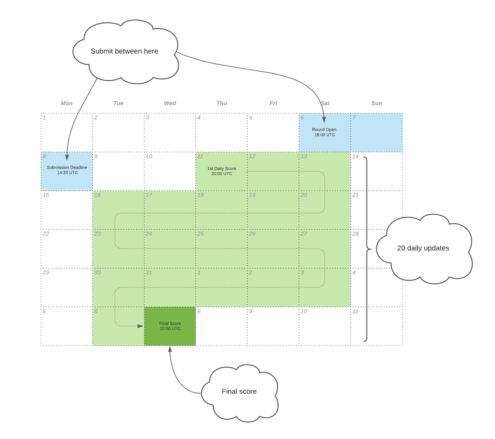

# Numerai Tournament Overview

## Introduction

The Numerai Tournament is where you build machine learning models on abstract financial data to predict the stock market. Your models can be staked with the NMR cryptocurrency to earn rewards based on performance.

The staked models of Numerai are combined to form the Meta Model which controls the capital of the Numerai hedge fund across the global stock market.

Watch this short film to learn how it all fits together:



## Summary

1. Sign up at [https://numer.ai/](https://numer.ai)
2. Download the dataset with training data and example scripts
3. Build your model and submit your predictions back to Numerai
4. Stake NMR on your models to earn/burn based on performance
5. Automate your weekly submissions and grow your stake over time

## Data

At the core of the Numerai Tournament is the free dataset. It is made of high quality financial data that has been cleaned and regularized and obfuscated.


Each `id` corresponds to a stock at a specific time `era`. The `features` describe the various quantitative attributes of the stock at the time. The `target` represents an abstract measure of performance \~4 weeks into the future.

## Modeling

Your objective is to build a model to predict the future target using live features that correspond to the current stock market.

Here is a basic example using XGBoost in Python. We train the model using the historical training data, and make predictions on the live tournament data.

```python
import pandas as pd
from xgboost import XGBRegressor

# training data contains features and targets
training_data = pd.read_csv("numerai_training_data.csv").set_index("id")

# tournament data contains features only
tournament_data = pd.read_csv("numerai_tournament_data.csv").set_index("id")
feature_names = [f for f in training_data.columns if "feature" in f]

# train a model to make predictions on tournament data
model = XGBRegressor(max_depth=5, learning_rate=0.01, \
                     n_estimators=2000, colsample_bytree=0.1)
model.fit(training_data[feature_names], training_data["target"])

# submit predictions to numer.ai
predictions = model.predict(tournament_data[feature_names])
predictions.to_csv("predictions.csv")
```

You can use any language or framework to build your model. Check out our [example-scripts](https://github.com/numerai/example-scripts) for other example models and exploratory research notebooks. Head over to the [forum](https://forum.numer.ai) for the latest research topics from the team and community.

## Submissions

Every `Saturday at 18:00 UTC` a new `round` opens and new tournament data is released. To participate in the round, you must submit your latest predictions by the deadline on `Monday 14:30 UTC`.


You must submit predictions **every week** to participate in the Numerai Tournament!


You can download the latest dataset and submit your predictions manually using the website.

 (1).png>)

You can also connect directly to our [GraphQL API](https://api-tournament.numer.ai) or via the official [Python](https://github.com/uuazed/numerapi) and [R](https://github.com/Omni-Analytics-Group/Rnumerai) api clients. Here is a basic example using the Python api client.

```python
import numerapi
napi = numerapi.NumerAPI("public_id", "secret_key")

# download data
napi.download_current_dataset(unzip=True)

# upload predictions
napi.upload_predictions("predictions.csv", model_id="model_id")
```

You can also deploy your trained model to the cloud and automate your entire weekly submission workflow with the [Numerai Compute](https://github.com/numerai/numerai-cli) framework.

```bash
# setup your cloud infrastructure
numerai setup

# copy the example model
numerai docker copy-example

# deploy the example model 
numerai docker deploy
```

## Diagnostics

Upload your validation predictions to the diagnostics tool to understand the performance and risk characteristics of your model over the historical validation eras.


Using this historical evaluation tool repeatedly will quickly lead to overfitting. Treat diagnostics only as a final check in your model research process.


.gif>)

Read more about model diagnostic in this [forum post](https://forum.numer.ai/t/model-diagnostics-update/902).

## Scoring

You are primarily scored on the correlation (`corr`) between your predictions and the targets. The higher the correlation the better.

```python
# method='first' breaks ties based on order in array
ranked_predictions = predictions.rank(pct=True, method="first")
correlation = np.corrcoef(labels, ranked_predictions)[0, 1]
```

You are also scored on your [meta model contribution](https://docs.numer.ai/tournament/metamodel-contribution) (`mmc`) and [feature neutral correlation](https://docs.numer.ai/tournament/feature-neutral-correlation) (`fnc`). The higher the meta model contribution and feature neutral correlation the better.

Each submission will be scored over the \~4 week duration of the round. Submissions will receive its first score starting on the Thursday after the Monday deadline and final score on Wednesday 4 weeks later for a total of 20 scores.



Since a round takes \~4 weeks to resolve, if you submit new predictions every week, you will receive multiple (up to 4) overlapping scores on each scoring day from the 4 ongoing rounds.


Your model's live scores can be viewed publicly on its model profile page. Here is an example of a model's final scores over the past 20 rounds.

 (1).png>)

You can also zoom in to a specific round and see the 20 daily scores within the round.

 (1).png>)

## Staking

You can optionally `stake` [NMR](https://www.coinbase.com/price/numeraire) on your model to earn or burn based on your `corr` and/or `mmc` scores. You cannot stake on your `fnc` scores.

Staking means locking up NMR in a [smart contract](https://github.com/numerai/tournament-contracts) on the [Ethereum](https://ethereum.org/en/whitepaper/) blockchain. For the duration of the stake, Numerai is given the permission to add payouts to or burn from the NMR locked up.

You can manage your stake on the website. When you increase your stake, NMR is transferred from your wallet to the staking contract. When you decrease your stake, NMR is transferred from the staking contract back into your wallet after a \~4 week delay. You can also change your stake type, which determines which scores (`corr` and/or `mmc`) you want to stake on.

 (1).png>)

## Payouts

Payouts are a function of your stake value and scores. The higher your stake value and the higher your scores, the more you will earn. If you have a negative score, then a portion of your stake will be burned. Payouts are limited to ±25% of the stake value per round.

```python
payout = stake_value * payout_factor * (corr * corr_multiplier + mmc * mmc_multiplier)
```

The `stake_value` is the value of your stake on the first Thursday (scoring day) of the round.

The `payout_factor` is number that scales with the total NMR staked across all models in the tournament. The higher the total NMR staked above the 300K threshold the lower the payout factor.

.png>)

The `corr_multiplier` and `mmc_multiplier` are configured by you to control your exposure to each score. You are given the following multiplier options.

|                             |                            |
| --------------------------- | -------------------------- |
| **corr multiplier options** | **mmc multiplier options** |
| 1.0x                        | 0.0x, 0.5x, 1.0x, 2.0x     |


The payout factor curve and available multiplier options may and will be updated by Numerai in the future alongside major tournament releases.


Here are some example payout calculations. The first 2 examples show the impact of adjusting score multipliers. The 3rd example shows how a negative score can cause a burn. The 4th example shows how the payout is capped at ±25% of the stake value.

| stake value | payout factor | corr  | corr multiplier | mmc   | mmc multiplier | payout    |
| ----------- | ------------- | ----- | --------------- | ----- | -------------- | --------- |
| 100 NMR     | 0.8           | 0.02  | 1.0x            | 0.002 | 2.0x           | 1.92 NMR  |
| 100 NMR     | 0.8           | 0.02  | 1.0x            | 0.002 | 0.0x           | 1.6 NMR   |
| 100 NMR     | 0.8           | -0.03 | 1.0x            | 0.002 | 0.5x           | -2.32 NMR |
| 100 NMR     | 0.8           | 0.15  | 1.0x            | 0.1   | 2.0            | 25 NMR    |

With every daily score, a new daily update on your payout is also computed. These daily payouts are also just updates and only the final payout of a round counts. You can track your daily payouts with the community-built [Numerai Payouts](https://docs.numer.ai/community-content/community-built-products#numerai-payouts) app.

Final payouts are paid into your stake at the end of the round (Wednesday). When you start staking, your stake value will remain constant for the first 4 rounds. Afterwards, your stake value will update every week based on your payout of the round 4 weeks ago.

 (1).png>)

Your stake value will grow as long as you continue to have positive scores. Here are some example payout projections assuming that the model gets the same positive scores every week for 52 weeks.

 (1).png>)

## Leaderboard

The leaderboard can be sorted by the reputation of model's `corr`, `mmc`, and `fnc`. [Reputation](https://docs.numer.ai/tournament/reputation) is the weighted average of a given metric over the past 20 rounds.

Keep an eye on the leaderboard to see how your models compare to all other models in terms of performance and returns from staking.

 (1).png>)

## Support

We are here to help.

Find us on [RocketChat](https://community.numer.ai) for questions, support, and feedback!
