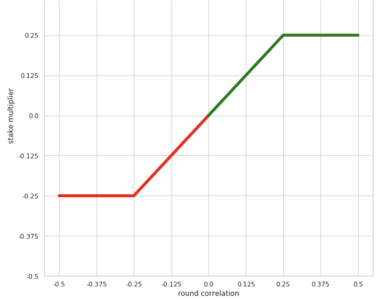

# Tournament Overview

## Tournament Overview

### Introduction <a id="rounds"></a>

Numerai is a data science tournament that powers the Numerai hedge fund. Watch the [meta-model video](https://www.youtube.com/watch?v=dhJnt0N497c) to understand how it works at a high level.

The long term vision of Numerai is to manage all the money in the world with a decentralized network of autonomous AI agents. Read our [master plan](https://medium.com/numerai/numerais-master-plan-1a00f133dba9) to learn more.

This document is a brief overview of the tournament structure and rules. If you are new, start here!

### Data <a id="rounds"></a>

To make good predictions, you need good data. But production grade financial data is not easy to find. Hedge funds spend millions buying and managing this data, so they keep it secret.

Numerai provides this production grade financial data for free. Our data is [obfuscated](https://medium.com/numerai/encrypted-data-for-efficient-markets-fffbe9743ba8) to keep the actual assets and features secret while preserving underlying structure.

This is what our `training_data` looks like. Each `id` represents an asset with some abstract`features` and each `era` is a unit period of time in history. The `target` is an abstract measure of performance.


### Modeling <a id="rounds"></a>

Your task is to train a model to make predictions on the out-of-sample `tournament_data`. This dataset includes `validation` and `test` hold out sets, as well as `live` features of current stock market.

Here is a basic example model.

```python
import pandas as pd
from xgboost import XGBRegressor

# training data contains features and targets
training_data = pd.read_csv("numerai_training_data.csv").set_index("id")

# tournament data contains features only
tournament_data = pd.read_csv("numerai_tournament_data.csv").set_index("id")
feature_names = [f for f in training_data.columns if "feature" in f]

# train a model to make predictions on tournament data
model = XGBRegressor(max_depth=5, learning_rate=0.01, \
                     n_estimators=2000, colsample_bytree=0.1)
model.fit(training_data[feature_names], training_data["target"])

# submit predictions to numer.ai
predictions = model.predict(tournament_data[feature_names])
predictions.to_csv("predictions.csv")
```

To help you get started, we have also written two detailed walkthroughs of the problem in [Python](https://github.com/numerai/example-scripts/blob/master/analysis_and_tips.ipynb) and [R](https://github.com/numerai/example-scripts/blob/master/example_model.r). These guides cover key concepts such as feature importance, cross validation, consistency, overfitting, and how to use `eras`. Whether you are a novice or master level data scientist, we highly recommend that you go through these guides!

If you want to learn more about why we have setup the problem this way, check out the book [Advances in Financial Machine Learning](https://www.amazon.com/Advances-Financial-Machine-Learning-Marcos/dp/1119482089) by [Marcos Lopez de Prado](https://www.linkedin.com/in/lopezdeprado/), who is our scientific advisor.

### Submissions

Every weekend, new `tournament_data` is released and a new round begins. To participate in the round, run the new `tournament_data` through your model and submit your predictions back to Numerai.

Submission files look like this. The `id` column must match the one in `tournament_data` exactly. The `prediction` can be any number between 0 and 1 \(exclusive\).


You can upload your submission at any time before the next round opens. However, only submissions made before `Monday 14:30 UTC` are considered on-time. Late submissions will not count towards your score and will not be eligible for payouts or bonuses.


You can upload your submission to our [website](https://numer.ai/) or[ api](https://api-tournament.numer.ai). You can also use the [Python](https://github.com/uuazed/numerapi) and [R](https://github.com/Omni-Analytics-Group/Rnumerai) client libraries to do this programatically.

For advanced users, check out [Numerai Compute](https://docs.numer.ai/tournament/compute) - a framework to help you automate your submission workflow.

### Scoring

Numerai measures performance based on the `rank_correlation` between your predictions and the true targets.



```python
# method='first' breaks ties based on order in array
ranked_predictions = predictions.rank(pct=True, method="first")
correlation = np.corrcoef(labels, ranked_predictions)[0, 1]
```



### Staking <a id="staking"></a>

You can `stake` on your model to start earning daily payouts.

Staking requires you to lock up [NMR](https://coinmarketcap.com/currencies/numeraire/) in an [Erasure](https://github.com/erasureprotocol/erasure-protocol) smart contract agreement. This gives Numerai the ability to grief \(aka burn\) your stake if your performance is poor. This also known as having "skin in the game".



Your round payout is a function of your `stake_value` and `round_correlation` for each round. The formula for payouts is simple. It's your `stake_value` \* `round_correlation`, with a min/max of +-0.25. For example, if your `stake_value` was 100 NMR, and your `round_correlation` was 0.1, you will be payed 10 NMR. And if your `round_correlation` was -0.3, you will have 25 NMR burned.

At the open of each round, your `stake_value` will be locked in, and you will be payed according to that value at the end of the round.

You can create and manage your stake on the [compute](http://numer.ai) or directly [on the Ethereum blockchain](https://github.com/numerai/tournament-contracts). Below is an example of staking on the website.


You can increase your stake at any time and it will apply next Thursday. Decreasing works similarly except it always takes an additional 4 weeks.

At the beginning of each Thursday, up to `100K NMR` in stakes will be selected and eligible for payouts. If the total amount staked exceeds this, then all stakes will be selected pro rata.

If you don't already have NMR, you can acquire it on the open market. The easiest way is through [ETH](https://coinmarketcap.com/currencies/ethereum/) on [Uniswap](https://uniswap.exchange/swap) or through [BTC](https://coinmarketcap.com/currencies/bitcoin/) on [Changelly](https://changelly.com/), [Upbit](https://upbit.com/exchange?code=CRIX.UPBIT.BTC-NMR), [Bittrex](https://bittrex.com/Market/Index?MarketName=BTC-NMR), [Poloniex](https://poloniex.com/exchange#btc_nmr), and [HitBTC](https://hitbtc.com/NMR-to-BTC).

### Leaderboard

Maintaining a consistent high `round_correlation` over time earns you a place on the leaderboard.


Your `rank` on the leaderboard depends on your `reputation`, which is a weighted average of your `round_correlation`over the past 20 rounds.
The last 20 `round_correlation`s are weighted in a particular way so that new rounds gradually get incorporated into your `reputation` as they resolve.
Here is an example of the round weights on day 3 for round 204.


Since each round is 20 days, and round 204 has had 3 days scored so far, round 204 carries a weight of 3/20 or 0.15. Meanwhile rounds 185 to 188 drop leave the calculation at the same rate that new rounds are being added. This represents older rounds being less relevant to reputation score than more recent rounds are. This symmetrical weighting scheme also keeps a consistent weight to the reputation score at all times.

Users are forgiven of one \(1\) missing round at a time for consideration in the reputation.  
The earliest missing round to be included in reputation will be filled in with the same score that you would have received if you submitted the example\_predictions. Any subsequent missing rounds will receive a very low score of -0.1. This one-missing-week policy is meant to offer some forgiveness so that if you miss one week due to extraordinary circumstance, that you will not have to wait 20 weeks to climb the leaderboard again. However, if you miss more than one week, the penalty is very harsh. We suggest you set up your models to run on [compute](https://docs.numer.ai/tournament/compute) in order to avoid missing weeks.


There is currently no bonus for high leaderboard placement.  The past leaderboard bonus will continue to be payed out until September 9, 2020.  

We reserve the right to refund your stake and void all earnings and burns if we believe that you are actively abusing or exploiting the payout rules.

## Metamodel Contribution

Metamodel Contribution \(MMC\) is a secondary scoring system that rewards uniqueness in conjunction with performance. MMC is scheduled to be released in late Q2 of 2020.

#### Calculation

To calculate a user's \(U\) MMC for a given round we

* select a random 67% of all staking users \(with replacement\)
* calculate the stake weighted predictions of these users
* transform both the stake weighted predictions, and U's model to be uniformly distributed
* neutralize U's model with respect to the uniform stake weighted predictions
* calculate the covariance between U's model and the kazutsugi targets
* divide this value by 0.0841 \(this step is to bring the expected score up to the same magnitude as correlation\)
* the resultant value is an MMC score 
* repeat this whole process 20 times and keep the average MMC score


Read more about MMC calculation [here](https://forum.numer.ai/t/mmc2-announcement/93)!

#### Design Explanations

* Stake weight is necessary to make the system unattackable
* Sampling a random 67% each time is important to incentivize some redundancy.  
A very large staker submitting similar predictions to yours would penalize you too much if we didn't do this.

#### Design Explanations

* Stake weight is necessary to make the system unattackable
* Sampling a random 67% each time is important to incentivize some redundancy.  A very large staker submitting similar predictions to yours would penalize you too much if we didn't do this. 

#### Payouts

* MMC is \(will be\) payed in a very similar way to the  main tournament.
* Your payout each round will be `stake * MMC * 2`.  
* This will be clipped such that you can neither gain, nor lose more than 25% of your stake in any one round.
* MMC will be opt-in.  You can choose to either participate in MMC, or in the primary tournament for each of your models.
* This decision can be changed week to week and model by model at will; but once a round opens, all decisions are final for that round.  

Read more about MMC payouts [here](https://forum.numer.ai/t/mmc-payout-details-and-analysis/220)!


### Support

Need help with anything?

Find us on [RocketChat](https://community.numer.ai) for questions, support, and feedback!

