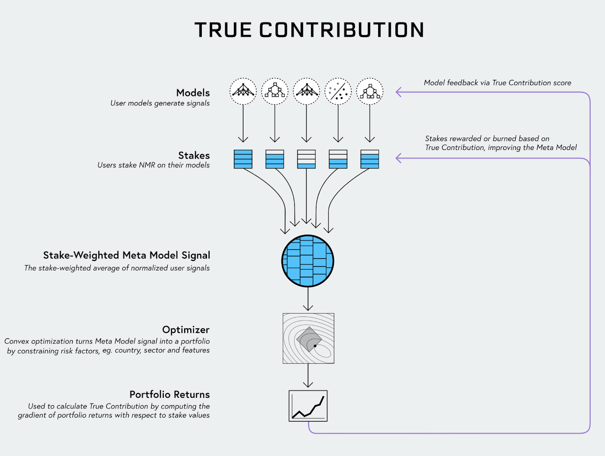

# True Contribution (TC)

## What is True Contribution?

Put simply True Contribution (TC) is a score that represents how a stake should be changed to increase overall returns of a hypothetical portfolio. Each model that submits on-time predictions will receive TC and can choose to be paid (or burned) based on TC.

## **How does TC work?**

We must first describe how Numerai operates end-to-end. The following explanation is adapted from Richard Craib's [Medium Post on Alien Stock Market Intelligence](https://medium.com/numerai/alien-stock-market-intelligence-numerais-true-contribution-6bc7652bd6ac).

1. Numerai combines submitted predictions via the stake-weighted average of every signal to create the Stake-Weighted Meta Model (SWMM). A data scientist who stakes a large amount of NMR on their model will have a larger weight in the Stake-Weighted Meta Model.
2. The SWMM and hundreds of risk constraints (such as market, country and sector risk neutralization) are input into an optimizer. This transforms the SWMM into a realistic hypothetical portfolio.
3. Numerai observes the hypothetical returns of that portfolio and calculates the gradient of the optimized portfolio return with respect to the stake. True Contribution is the magnitude of this gradient for each set of predictions constituting the SWMM.
4. Numerai pays users based on a scaled version of this gradient magnitude. This is akin to Neural Network architecture and the idea of gradient descent.

This is possible using new techniques developed by Stephen Boyd of Stanford University, Brandon Amos from Facebook AI et al (see their paper: [Differentiable Convex Optimization Layers](https://web.stanford.edu/\~boyd/papers/pdf/diff\_cvxpy.pdf))

By using [cvxpylayers](https://github.com/cvxgrp/cvxpylayers), _we can include a cvxpy defined convex portfolio optimization as a layer in a PyTorch model._ This lets us efficiently compute the gradient of the optimized portfolio return with respect to the stake values and determine the True Contribution of every signal submitted to Numerai.

## How do I optimize for TC?

We've found a few metrics seem to act as good indicators for TC. Currently, FNCv3 is the best we currently have. Numerai's Chief Data Scientist Michael Oliver also wrote a [forum post](https://forum.numer.ai/t/true-contribution-details/5128) discussing this topic.

